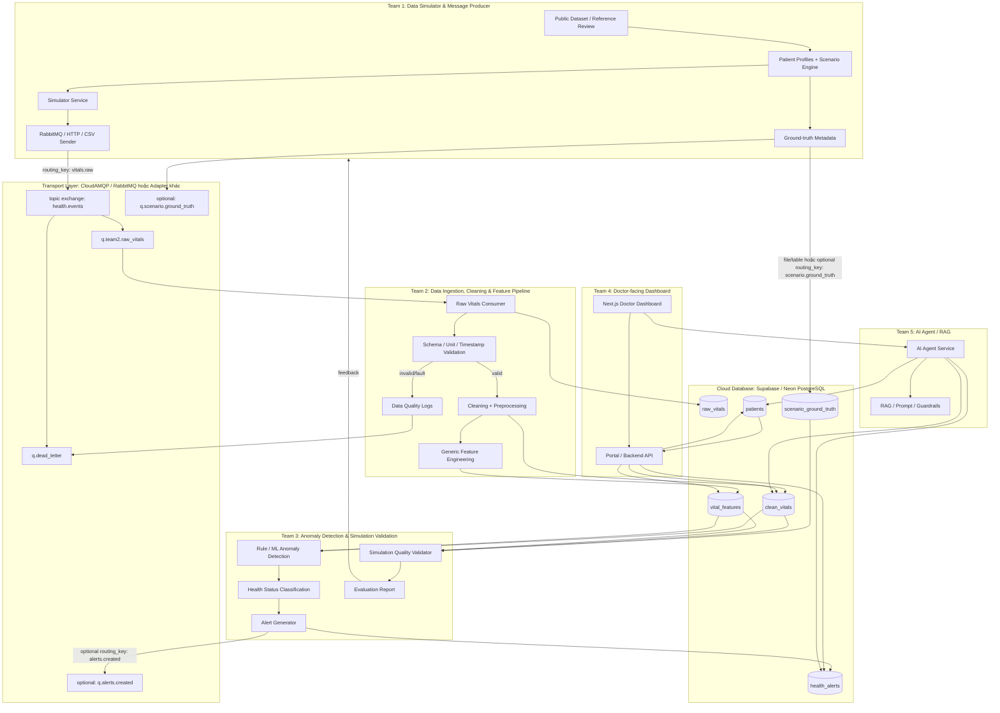

# KẾ HOẠCH TRIỂN KHAI CHI TIẾT DỰ ÁN  
## E2E SIMULATION FOR AI HEALTH  
### AI Health Monitoring MVP with Simulated Wearable Data

Tài liệu này là bản cập nhật sau khi thống nhất lại phạm vi dự án, vai trò các team và cách thiết kế luồng dữ liệu.

Dự án hiện tại là một **AI Health Monitoring MVP** dùng dữ liệu wearable mô phỏng trong bối cảnh chưa có thiết bị và dữ liệu thực tế từ sản phẩm. Tuy nhiên, mục tiêu không phải chỉ làm demo giả lập, mà là xây một kiến trúc có thể mở rộng sang ứng dụng thực tế/doanh nghiệp sau này khi có wearable thật, dữ liệu bệnh viện hoặc dữ liệu người dùng thật.

Điểm quan trọng của bản thiết kế mới:

1. **Team 1 không chỉ tạo random data**, mà là **Data Simulator / Message Producer**: tìm dataset/reference, thiết kế patient profile, tạo normal/abnormal/fault scenarios, setup RabbitMQ/CloudAMQP phía producer và bắn dữ liệu thô vào broker.
2. **Team 2 không gắn nhãn sức khỏe NORMAL/ABNORMAL**. Team 2 chịu trách nhiệm ingestion, schema validation, cleaning, preprocessing, feature engineering cơ bản và gắn trạng thái kỹ thuật như `VALID`, `INVALID`, `FAULT`, `MISSING_VALUE`.
3. **Team 3 mới là nơi gắn health status** như `NORMAL`, `WARNING`, `ABNORMAL`, `CRITICAL`, đồng thời tạo alerts và kiểm chứng chất lượng simulator theo từng scenario.
4. Hệ thống có **2 luồng chính**:
   - **Main Product Pipeline:** Simulator → Broker → Pipeline → Anomaly → Dashboard → Agent.
   - **Simulator Validation Pipeline:** Simulator data + ground truth → Team 3 kiểm tra simulator có tạo data đủ realistic, không quá boring/random, abnormal scenario có đúng pattern không.
5. RabbitMQ/CloudAMQP là **công nghệ đề xuất**, không phải ràng buộc tuyệt đối. Thiết kế simulator cần tách **data generation layer** và **transport layer** để có thể thay RabbitMQ bằng HTTP, MQTT, Kafka, WebSocket hoặc CSV replay nếu cần.

---

# 1. KIẾN TRÚC LUỒNG DỮ LIỆU TỔNG THỂ



---

# 2. HAI LUỒNG CÔNG VIỆC CHÍNH

## 2.1. Luồng A — Main Product Pipeline

Đây là luồng sản phẩm chính để demo/app chạy end-to-end.

```text
Team 1 Simulator
→ RabbitMQ / HTTP / CSV replay
→ Team 2 Ingestion + Cleaning + Feature Engineering
→ Team 3 Anomaly Detection + Alert
→ Team 4 Doctor Dashboard
→ Team 5 AI Agent
```

Mục tiêu:

- Data được tạo liên tục như wearable stream.
- Data được Team 2 kiểm tra kỹ thuật, làm sạch, tính feature và lưu DB.
- Team 3 phát hiện bất thường và tạo alert.
- Bác sĩ xem được trạng thái bệnh nhân trên dashboard.
- Agent giải thích/tóm tắt tình trạng dựa trên vitals, alerts và patient profile.

Ví dụ demo:

```text
Team 1 tạo scenario fall cho P001
→ dữ liệu đi qua broker
→ Team 2 validate/clean/tính acc_magnitude
→ Team 3 detect fall và tạo alert HIGH
→ Dashboard hiện ABNORMAL/Fall Alert
→ Agent trả lời: “Bệnh nhân P001 có dấu hiệu té ngã lúc 10:05...”
```

## 2.2. Luồng B — Simulator Validation Pipeline

Đây là luồng kiểm chứng chất lượng simulator, vì hiện tại chưa có data thật từ sản phẩm.

```text
Team 1 Simulator data + ground-truth metadata
→ Team 2 lưu raw/clean/features, giữ scenario_id
→ Team 3 lấy data theo scenario_id/time window
→ Team 3 kiểm tra simulator có tạo đúng pattern không
→ feedback lại Team 1 chỉnh simulator
```

Mục tiêu:

- Data simulator không quá boring.
- Data simulator không random vô nghĩa.
- Scenario abnormal có pattern rõ: onset → peak → recovery.
- Normal và abnormal phân biệt được nhưng không quá giả.
- Nếu có public dataset/reference thì có thể so sánh thống kê.

Ví dụ:

```text
Ground truth: SCN_FALL_001 là fall từ 10:05:00 đến 10:05:05.
Team 3 query clean/features của P001 từ 10:04:30 đến 10:06:00.
Nếu không có acceleration spike hoặc post-fall low movement,
Team 3 báo: simulator tạo fall chưa hợp lý.
```

---

# 3. PHÂN BIỆT CÁC LOẠI TRẠNG THÁI

Cần phân biệt rõ **data state kỹ thuật** và **health status y tế**.

## 3.1. Data state — Team 2 phụ trách

Team 2 gắn trạng thái cho chất lượng kỹ thuật của dữ liệu:

```text
VALID
INVALID
MISSING_VALUE
DUPLICATE
SENSOR_FAULT
PIPELINE_ERROR
```

Ví dụ:

```text
heart_rate = -20 → SENSOR_FAULT / INVALID
spo2 = 140 → SENSOR_FAULT / INVALID
timestamp missing → INVALID
record duplicate → DUPLICATE
```

## 3.2. Health status — Team 3 phụ trách

Team 3 gắn trạng thái sức khỏe sau khi chạy rule/model:

```text
NORMAL
WARNING
ABNORMAL
CRITICAL
```

Ví dụ:

```text
Glucose giảm dưới threshold và kéo dài → WARNING / ABNORMAL
Fall pattern rõ với acc spike + low movement → ABNORMAL / CRITICAL
HR tăng cao bất thường kéo dài → WARNING / ABNORMAL
```

## 3.3. Ground truth — Team 1 cung cấp cho evaluation

Team 1 tạo ground-truth metadata cho các scenario simulate:

```text
scenario_id
event_type
ground_truth_label
event_start
event_end
expected_severity
expected_pattern
```

Ground truth chỉ dùng để **evaluate và validate simulator**, không được dùng trực tiếp làm input cho anomaly detection.

---

# 4. THIẾT KẾ MESSAGE CONTRACT GIỮA TEAM 1, 2, 3

## 4.1. Vitals stream payload

Team 1 publish dữ liệu sensor thô với `scenario_id`, nhưng không nhất thiết gửi `ground_truth_label` trong từng record.

```json
{
  "message_id": "msg_000001",
  "schema_version": "v1",
  "patient_id": "P001",
  "device_id": "SIM_WATCH_001",
  "timestamp": "2026-05-28T10:05:02Z",
  "signals": {
    "heart_rate": 112,
    "systolic_bp": 116,
    "diastolic_bp": 76,
    "blood_glucose": 5.3,
    "spo2": 98,
    "acc_x": 3.5,
    "acc_y": 2.9,
    "acc_z": 0.6,
    "gyro_x": 0.12,
    "gyro_y": 0.05,
    "gyro_z": 0.02
  },
  "context": {
    "activity_state": "walking",
    "scenario_id": "SCN_FALL_001",
    "event_phase": "peak",
    "source": "simulator"
  }
}
```

## 4.2. Ground-truth metadata

Team 1 cung cấp ground truth qua file, DB table hoặc optional queue riêng.

```json
{
  "scenario_id": "SCN_FALL_001",
  "patient_id": "P001",
  "event_type": "fall",
  "ground_truth_label": "ABNORMAL",
  "event_start": "2026-05-28T10:05:00Z",
  "event_end": "2026-05-28T10:05:05Z",
  "expected_severity": "HIGH",
  "expected_pattern": {
    "acc_spike": true,
    "post_event_low_movement": true,
    "heart_rate_increase": "mild"
  }
}
```

## 4.3. RabbitMQ / CloudAMQP design

RabbitMQ chỉ là transport option. Nếu dùng RabbitMQ, thiết kế tối thiểu như sau:

```text
Exchange:
- health.events
- type: topic

Queues:
- q.team2.raw_vitals        binding_key = vitals.raw
- q.dead_letter             binding_key = dead.*

Optional queues:
- q.team3.raw_vitals        binding_key = vitals.raw
- q.scenario.ground_truth   binding_key = scenario.ground_truth
- q.alerts.created          binding_key = alerts.created
- q.sim.quality             binding_key = sim.quality
```

MVP khuyến nghị:

```text
Team 1 → vitals.raw → q.team2.raw_vitals → Team 2 → DB → Team 3
```

Nếu muốn realtime hơn ở Sprint 3/future:

```text
Team 1 → vitals.raw → q.team2.raw_vitals
                    → q.team3.raw_vitals
```

---

# 5. PHÂN BỔ NHÂN SỰ & VAI TRÒ CHI TIẾT

| Nhóm | Thành viên | Vai trò chính | Trách nhiệm chính |
| :--- | :--- | :--- | :--- |
| **Team 1** | **Nguyễn Thị Thu Hiền**<br>**Nguyễn Trọng Thiên Khôi** | **Data Simulator / Message Producer** | Tìm public dataset/reference, thiết kế patient profile và scenario, tạo normal/abnormal/fault data, setup RabbitMQ/CloudAMQP phía producer nếu dùng, publish raw vitals, cung cấp ground-truth metadata cho Team 3. |
| **Team 2** | **Nguyễn Trần Khương An** | **Data Ingestion / Cleaning / Feature Pipeline** | Consume raw vitals từ broker/API/file replay, validate schema, chuẩn hóa unit/timestamp, cleaning, preprocessing, feature engineering cơ bản, lưu raw/clean/features vào DB, ghi data quality logs. |
| **Team 3** | **Nguyễn Anh Hào**<br>**Nguyễn Bằng Anh** | **Anomaly Detection / Simulation Validation** | Dùng clean data/features để detect abnormal, tạo alerts, gắn health status `NORMAL/WARNING/ABNORMAL/CRITICAL`, đồng thời kiểm chứng simulator theo scenario và feedback cho Team 1. |
| **Team 4** | **Nguyễn Phương Linh** | **Doctor-facing Dashboard** | Xây dashboard cho bác sĩ: patient list, patient detail, vitals chart, trạng thái `NORMAL/ABNORMAL/FAULT`, alert timeline, alert detail và khung chatbot AI. |
| **Team 5** | **Nguyễn Đức Cường** | **AI Agent / RAG / Integration Support** | Xây Agent/RAG để tóm tắt tình trạng bệnh nhân, giải thích alert dựa trên vitals/alerts/profile, trả lời câu hỏi của bác sĩ, phối hợp Docker/integration với Team 2. |

---

# 6. NHIỆM VỤ CỤ THỂ THEO TEAM

## 6.1. Team 1 — Data Simulator / Message Producer

Team 1 là nguồn dữ liệu của toàn hệ thống. Team 1 không chỉ tạo random data mà phải thiết kế simulator dựa trên:

- Use case sức khỏe.
- Public labeled dataset/reference nếu có.
- Domain logic cơ bản.
- Patient profile.
- Scenario timeline: pre-event → onset → peak → recovery.

### Công việc chính

1. Tìm và phân tích public dataset/reference:
   - Fall detection dataset: accelerometer/gyroscope + fall/non-fall label.
   - CGM/glucose dataset nếu có.
   - Vitals/HR/BP/SpO2 dataset nếu có.
   - Wearable activity dataset để hiểu normal movement.

2. Tạo `dataset_review.md`:
   - Dataset name.
   - Link/source.
   - Signals available.
   - Labels.
   - Subject metadata.
   - Sampling rate.
   - Format.
   - Có thể dùng để train, validate simulator hay chỉ tham khảo.
   - Limitations.

3. Thiết kế patient profiles:
   - Người già.
   - Bà bầu.
   - Thanh niên.
   - Baseline HR/BP/glucose/SpO2/activity khác nhau.

4. Thiết kế scenarios:
   - Normal resting.
   - Normal walking/light activity.
   - Fall.
   - Hypoglycemia.
   - Hypertension/hypotension.
   - Abnormal heart rate nếu kịp.
   - Fault/bad data scenario để Team 2 test validation.

5. Tạo simulator:
   - CSV output để debug.
   - Stream mode để bắn data liên tục.
   - Sender adapter: CSVSender, ConsoleSender, HTTPSender, RabbitMQSender.
   - Không hard-code RabbitMQ vào core generator.

6. Setup RabbitMQ/CloudAMQP phía producer nếu team quyết định dùng:
   - Tạo exchange/queue ban đầu cùng Team 2.
   - Publish `vitals.raw`.
   - Đảm bảo message đúng schema.
   - Auto-reconnect nếu broker lỗi.

7. Cung cấp ground-truth metadata:
   - `scenario_id`.
   - `event_type`.
   - `ground_truth_label`.
   - `event_start`, `event_end`.
   - `expected_severity`.
   - `expected_pattern`.

8. Tự check cơ bản trước khi bắn data:
   - Fall có acc spike không.
   - Hypoglycemia có glucose drop không.
   - BP abnormal có trend không.
   - Normal có đủ variability không.
   - Fault scenario có đúng dạng lỗi kỹ thuật không.

### Output Team 1

```text
use_cases.md
dataset_review.md
patient_profiles.yaml
scenario_config.yaml
simulator.py / generator package
sample_normal.csv
sample_fall.csv
sample_hypoglycemia.csv
message_contract.md
ground_truth.json hoặc scenario_ground_truth table
RabbitMQ publisher adapter nếu dùng broker
```

---

## 6.2. Team 2 — Data Ingestion / Cleaning / Feature Pipeline

Team 2 biến raw data thành data sạch và feature dùng được. Team 2 không quyết định bất thường y tế.

### Công việc chính

1. Consumer/API nhận data:
   - Consume từ `q.team2.raw_vitals` nếu dùng RabbitMQ.
   - Hoặc nhận HTTP POST / file replay nếu không dùng broker.

2. Schema validation:
   - Đủ field không.
   - Timestamp đúng format không.
   - Patient ID hợp lệ không.
   - Unit có thống nhất không.
   - Value nằm trong physical range không.

3. Data cleaning:
   - Missing values.
   - Duplicate records.
   - Timestamp disorder.
   - Impossible values.
   - Sensor faults.
   - Data delay.

4. Preprocessing:
   - Chuẩn hóa timestamp.
   - Chuẩn hóa unit.
   - Sort theo patient/time.
   - Resample nếu cần.
   - Smooth noise nhẹ nếu cần.

5. Feature engineering cơ bản:
   - `acc_magnitude = sqrt(acc_x^2 + acc_y^2 + acc_z^2)`.
   - `gyro_magnitude`.
   - Rolling mean/std/min/max.
   - Delta from previous value.
   - Slope theo window.
   - Missing rate.
   - Baseline deviation nếu có patient profile.

6. Lưu DB theo các lớp:
   - `raw_vitals`.
   - `clean_vitals`.
   - `vital_features`.
   - `data_quality_logs`.
   - Có thể lưu `scenario_ground_truth` nếu Team 1 gửi metadata qua DB/broker.

7. API cho downstream:
   - Get latest vitals.
   - Get vitals by patient/time range.
   - Get features by patient/time range.
   - Get data quality logs.

### Output Team 2

```text
consumer.py / ingestion service
schema_validator.py
cleaning.py
feature_engineering.py
database schema
raw_vitals table
clean_vitals table
vital_features table
data_quality_logs table
API docs
```

---

## 6.3. Team 3 — Anomaly Detection / Simulation Validation

Team 3 có 2 vai trò song song:

1. Detect health anomaly.
2. Validate simulator scenario quality.

### A. Health anomaly detection

Team 3 dùng clean data/features từ Team 2 để phát hiện:

- Fall.
- Hypoglycemia/glucose abnormality.
- BP abnormality.
- HR abnormality.
- Low SpO2 nếu có.

MVP nên đi theo thứ tự:

```text
Rule-based detection
→ Statistical baseline
→ ML model nếu có dataset/feature đủ tốt
```

Output alert:

```json
{
  "patient_id": "P001",
  "timestamp": "2026-05-28T10:05:03Z",
  "alert_type": "fall_detected",
  "severity": "HIGH",
  "confidence": 0.91,
  "evidence": {
    "acc_magnitude": 4.8,
    "post_event_movement": "low"
  },
  "health_status": "ABNORMAL",
  "message": "Possible fall detected from acceleration spike and low movement after event."
}
```

### B. Simulation quality validation

Team 3 dùng `ground_truth metadata` từ Team 1 và `clean/features` từ Team 2 để kiểm tra simulator.

Team 3 không check mơ hồ “giống thật không”, mà check theo 4 lớp:

#### 1. Label consistency

Câu hỏi:

```text
Team 1 nói scenario này là fall/hypoglycemia/BP abnormal,
trong data có thật sự xuất hiện pattern tương ứng không?
```

Ví dụ:

```text
Ground truth: fall
Check: có acceleration spike trong event window không?
```

#### 2. Pattern validity

Câu hỏi:

```text
Pattern có đúng logic của scenario không?
```

Ví dụ fall:

```text
pre-event movement bình thường
event có acc spike
post-event movement thấp
optional HR tăng nhẹ
```

Ví dụ hypoglycemia:

```text
glucose giảm dần
có warning phase
có low-glucose duration
có recovery hoặc critical continuation
```

Ví dụ BP abnormal:

```text
systolic/diastolic tăng hoặc giảm có trend
không chỉ là 1 outlier
không random từng giây
```

#### 3. Separability

Câu hỏi:

```text
Normal và abnormal có phân biệt được không?
```

Không nên:

```text
normal và abnormal gần như giống nhau → không detect được
abnormal quá lố → data quá giả
```

#### 4. Realism against reference

Nếu có public dataset/reference, Team 3 so sánh:

```text
mean/std/range
peak magnitude
event duration
slope
correlation
class separability
```

### Output simulation validation

```json
{
  "scenario_id": "SCN_FALL_001",
  "event_type": "fall",
  "quality_score": 0.82,
  "status": "PASS",
  "checks": {
    "label_consistency": "PASS",
    "pattern_validity": "PASS",
    "separability": "WARNING",
    "realism_reference": "PASS"
  },
  "issues": [
    "Post-fall low-movement phase is too short."
  ],
  "recommendation": "Increase post-fall low movement duration from 5s to 20-30s."
}
```

### Output Team 3

```text
rules.py
baseline_detector.py
anomaly_worker.py
simulation_validator.py
alert_schema.md
simulation_quality_report.md
evaluation_report.md
```

---

## 6.4. Team 4 — Doctor-facing Dashboard

Dashboard chỉ dành cho bác sĩ/người theo dõi chuyên môn đọc dữ liệu. Không phải dashboard debug simulator.

### Công việc chính

- Patient list.
- Patient detail.
- Real-time/semi-real-time vitals chart.
- Alert timeline.
- Alert detail.
- Status display:
  - `NORMAL`, `WARNING`, `ABNORMAL`, `CRITICAL` từ Team 3.
  - `FAULT/INVALID` từ Team 2.
- Chatbot panel cho Team 5 agent.

### Output Team 4

```text
Next.js app
patient list page
patient detail page
vitals charts
alert timeline
alert detail component
chatbot panel
```

---

## 6.5. Team 5 — AI Agent / RAG / Integration Support

Agent là lớp hỗ trợ bác sĩ đọc nhanh dữ liệu, không phải chẩn đoán thay bác sĩ.

### Công việc chính

- Tóm tắt tình trạng bệnh nhân.
- Giải thích alert dựa trên evidence.
- Trả lời câu hỏi dựa trên vitals/alerts/patient profile.
- Guardrails để tránh tư vấn quá thẩm quyền.
- Phối hợp Docker/integration với Team 2.

Agent nên trả lời theo hướng:

```text
Hệ thống ghi nhận dấu hiệu bất thường...
Dựa trên các chỉ số...
Cần bác sĩ kiểm tra thêm...
```

Không nên trả lời:

```text
Bệnh nhân chắc chắn bị bệnh X.
```

### Output Team 5

```text
agent_service.py
prompt_template.md
rag_pipeline.py nếu có
summary endpoint
explain-alert endpoint
guardrails.md
docker-compose support
```

---

# 7. LỘ TRÌNH 3 SPRINT

## SPRINT 1 — Foundation, Dataset Reference, Message Contract & Skeleton

**Mục tiêu:** chốt use case, dataset/reference, schema, message contract, simulator mẫu, broker producer skeleton, ingestion skeleton, dashboard mock và agent mock.

### Team 1

- Chốt use case MVP:
  - normal monitoring
  - fall
  - hypoglycemia
  - BP abnormal
  - optional HR abnormal
- Tìm public dataset/reference.
- Viết `dataset_review.md`.
- Thiết kế patient profile v1.
- Thiết kế scenario timeline v1.
- Tạo sample CSV normal/fall/hypoglycemia.
- Đề xuất message contract cùng Team 2/3.
- Setup RabbitMQ/CloudAMQP phía producer nếu team chọn dùng broker.
- Viết publisher prototype bắn `vitals.raw`.
- Tạo ground-truth metadata mẫu.

### Team 2

- Review và chốt schema với Team 1/3.
- Viết consumer/API prototype nhận raw vitals.
- Validate schema bằng Pydantic.
- Tạo DB schema ban đầu:
  - `patients`
  - `raw_vitals`
  - `clean_vitals`
  - `vital_features`
  - `data_quality_logs`
  - `scenario_ground_truth` nếu cần
- Viết cleaning rules cơ bản.
- Lưu raw/clean sample vào DB.

### Team 3

- Chốt alert schema.
- Chốt health status schema.
- Thiết kế rule-based anomaly v1.
- Thiết kế simulation quality criteria:
  - label consistency
  - pattern validity
  - separability
  - realism/reference
- Viết check đơn giản:
  - fall phải có acc spike
  - hypoglycemia phải có glucose downward trend
  - BP abnormal phải có trend
  - normal không quá phẳng

### Team 4

- Setup Next.js/Tailwind/TypeScript.
- Wireframe dashboard bác sĩ.
- Mock patient list.
- Mock patient detail.
- Mock alert panel.
- Mock chatbot area.

### Team 5

- Define agent scope.
- Viết prompt base.
- Mock summary từ JSON.
- Thiết kế response format an toàn.

### Deliverables Sprint 1

```text
use_cases.md
dataset_review.md
message_contract.md
data_schema_v1.json
sample simulator data
ground_truth sample
RabbitMQ/CloudAMQP producer prototype nếu dùng broker
consumer prototype
DB schema v1
dashboard mock
agent mock summary
simulation quality criteria v1
```

---

## SPRINT 2 — Core MVP: Streaming, Cleaning, Features, Anomaly, Dashboard, Agent

**Mục tiêu:** có luồng chạy thật từ simulator → broker/API → DB → anomaly → dashboard → agent.

### Team 1

- Xây simulator real-time.
- Implement scenario:
  - normal
  - fall
  - hypoglycemia
  - BP abnormal
- Thêm patient baseline và noise.
- Bắn data liên tục qua RabbitMQ/HTTP/CSV replay.
- Tạo fault scenarios:
  - missing timestamp
  - duplicate records
  - impossible values
  - sensor offline
- Cung cấp ground-truth metadata đầy đủ cho từng scenario.

### Team 2

- Consumer ổn định.
- Manual ack/retry/DLQ nếu dùng RabbitMQ.
- Validate schema.
- Cleaning:
  - missing values
  - duplicates
  - out-of-range
  - timestamp ordering
- Feature engineering:
  - acc_magnitude
  - gyro_magnitude
  - rolling mean/std
  - slope/delta
  - missing rate
- Lưu raw/clean/features vào DB.
- Expose API cho Team 3/4/5.

### Team 3

- Rule-based anomaly detection:
  - fall
  - glucose abnormality
  - BP abnormality
  - HR abnormality nếu kịp
- Tạo alert với severity/confidence/evidence.
- Gắn health status.
- Chạy simulation validation trên data của Team 1:
  - query theo `scenario_id`
  - so sánh với ground truth
  - tạo quality report v1
- Nếu có public dataset đủ tốt, train/test baseline model đơn giản.

### Team 4

- Kết nối API thật.
- Patient list dùng DB/API.
- Patient detail page.
- Vitals chart.
- Alert timeline.
- Hiển thị `NORMAL/WARNING/ABNORMAL/CRITICAL/FAULT`.

### Team 5

- Agent lấy dữ liệu từ DB/API.
- Endpoint summary.
- Endpoint explain-alert.
- Chat Q&A cơ bản.
- Guardrail chống chẩn đoán quá đà.

### Deliverables Sprint 2

```text
Simulator stream chạy được
RabbitMQ/API ingestion chạy được
Raw/clean/features lưu DB
Rule-based anomaly tạo alert được
Simulation quality report v1
Doctor dashboard đọc được data thật
Agent summarize/explain alert được
```

---

## SPRINT 3 — E2E Integration, Evaluation, Quality Report, Polish

**Mục tiêu:** hoàn thiện demo end-to-end, đánh giá hệ thống, polish UI/Agent và chuẩn bị tài liệu defend.

### Team 1

- Tinh chỉnh simulator theo feedback Team 3.
- Thêm severity cho scenario:
  - mild
  - moderate
  - severe
- Thêm nhiều patient profiles.
- Stress test 100+ bệnh nhân nếu cloud limit cho phép.
- Export demo dataset.
- Hoàn thiện ground-truth metadata.

### Team 2

- Tối ưu consumer.
- Bulk insert nếu cần.
- Logging/error handling.
- DB indexes cho patient/time.
- Data retention policy cơ bản.
- API docs.
- Docker/integration support với Team 5.

### Team 3

- Evaluate anomaly detection:
  - precision/recall/F1 nếu có label
  - false positive rate
  - detection delay
  - alert explanation correctness
- Evaluate simulator:
  - boring score
  - pattern validity
  - separability
  - realism/reference comparison nếu có
- Viết `simulation_quality_report.md`.
- Viết `evaluation_report.md`.
- Unit/integration tests cho anomaly pipeline.

### Team 4

- Polish UI.
- Alert detail view.
- Chart around event window.
- Responsive layout.
- Integrate chatbot UI.
- UX demo flow.

### Team 5

- Improve prompt/guardrails.
- RAG với tài liệu y khoa nếu có.
- Ground agent vào vitals/alerts/profile.
- Hỗ trợ docker-compose/integration.
- Test agent không hallucinate.

### Deliverables Sprint 3

```text
Full E2E demo
Simulation quality report
Anomaly evaluation report
Doctor dashboard hoàn chỉnh
AI Agent tích hợp dashboard
Docker compose / setup guide
API documentation
Final demo script
```

---

# 8. TIÊU CHÍ KIỂM CHỨNG CHẤT LƯỢNG SIMULATOR

Team 3 kiểm chứng simulator theo từng scenario, không kiểm tra mơ hồ.

## 8.1. Normal scenario

Check:

- HR dao động quanh baseline.
- BP không nhảy quá mạnh.
- Glucose thay đổi chậm.
- Acc/gyro phù hợp activity state.
- Không tạo alert giả quá nhiều.
- Không quá phẳng như HR = 80 suốt 1 giờ.

Issue mẫu:

```text
Normal data too boring: HR variance too low.
Normal scenario too noisy: may cause false positive alerts.
```

## 8.2. Fall scenario

Check:

- Có acceleration spike trong event window.
- Peak nằm gần `event_start/event_end`.
- Có post-fall low movement.
- Fall khác walking/running.
- Optional HR tăng nhẹ sau event.

Issue mẫu:

```text
Ground truth says fall, but no acceleration spike detected.
Fall spike exists, but post-fall low-movement phase is missing.
```

## 8.3. Hypoglycemia scenario

Check:

- Glucose slope âm trong onset.
- Glucose xuống dưới threshold.
- Low glucose kéo dài hợp lý.
- Recovery có slope dương nếu scenario có recovery.
- Không random jump quá mạnh.

Issue mẫu:

```text
Hypoglycemia label exists, but glucose does not cross low threshold.
Glucose drops too abruptly; add smoother transition.
```

## 8.4. BP abnormal scenario

Check:

- Systolic/diastolic tăng hoặc giảm có trend.
- Không chỉ là 1 điểm outlier.
- Duration đủ dài.
- Không dao động random từng giây.

Issue mẫu:

```text
BP abnormal scenario looks like sensor noise, not physiological trend.
```

---

# 9. PRODUCTION / MVP CHECKLIST

Hệ thống nên đáp ứng các tiêu chuẩn sau ở mức MVP:

1. **Transport-agnostic simulator:** Simulator tách data generation và sender adapter. RabbitMQ chỉ là một adapter.
2. **Broker reliability nếu dùng RabbitMQ:** Queue durable, message persistent, manual ack, reconnect logic, DLQ nếu kịp.
3. **Schema versioning:** Message có `schema_version` để dễ nâng cấp.
4. **Raw/Clean/Feature separation:** DB tách raw data, clean data và feature data.
5. **Data quality distinction:** Phân biệt rõ `FAULT/INVALID` kỹ thuật và `ABNORMAL/CRITICAL` sức khỏe.
6. **Ground truth separation:** Ground truth dùng cho evaluation/validation, không dùng trực tiếp làm input detection.
7. **Alert explainability:** Alert phải có evidence: chỉ số nào, time window nào, severity nào.
8. **Agent safety:** Agent chỉ summarize/explain dựa trên data, không chẩn đoán chắc chắn.
9. **Security:** API keys, DB URL, broker credentials đặt trong `.env`, không hardcode.
10. **Demo repeatability:** Có script chạy demo normal/fall/hypoglycemia/BP abnormal.

---

# 10. RỦI RO & PHƯƠNG ÁN XỬ LÝ

| Rủi ro | Mức độ | Phương án xử lý |
| :--- | :--- | :--- |
| Simulator tạo data quá random hoặc quá boring | Cao | Team 1 thiết kế scenario theo phase; Team 3 làm simulation quality validation và feedback theo từng scenario. |
| Team 2 bị quá tải vì vừa broker, DB, cleaning, feature | Cao | Team 1 phụ trách producer/broker phía publish; Team 2 phụ trách consumer/pipeline; Team 3 phụ trách semantic validation. |
| Lẫn lộn NORMAL/ABNORMAL với VALID/FAULT | Cao | Quy định Team 2 chỉ gắn data state kỹ thuật; Team 3 mới gắn health status. |
| Team 3 dùng ground-truth label như đáp án khi detect | Trung bình | Tách inference mode và evaluation mode; ground truth chỉ dùng sau khi detect để evaluate/validate. |
| Public dataset không đủ khớp với use case | Trung bình | Dùng dataset làm reference/statistical inspiration; không ép phải train deep model nếu dataset không phù hợp. |
| CloudAMQP/RabbitMQ làm chậm tiến độ | Trung bình | Giữ thiết kế transport-agnostic; có fallback HTTP POST hoặc CSV replay. |
| Dashboard quá thiên về debug simulator | Trung bình | Chốt Dashboard là doctor-facing; simulation quality report để nội bộ Team 1/3. |
| Agent hallucinate/chẩn đoán quá đà | Cao | Guardrail prompt, chỉ trả lời dựa trên DB/alerts, dùng disclaimer và không kết luận bệnh chắc chắn. |

---

# 11. SUCCESS METRICS

## 11.1. Product metrics

- Bác sĩ xem được danh sách bệnh nhân.
- Bác sĩ mở được patient detail.
- Bác sĩ thấy vitals chart cập nhật theo thời gian.
- Bác sĩ thấy alert khi có abnormal scenario.
- Bác sĩ hỏi agent và nhận summary đúng theo data.

## 11.2. Data pipeline metrics

- Tỷ lệ message hợp lệ được lưu DB.
- Tỷ lệ message lỗi được đưa vào data quality log/DLQ.
- Latency từ simulator đến DB.
- Tỷ lệ missing/duplicate/out-of-range được phát hiện.
- Feature không bị NaN/inf sai bất thường.

## 11.3. Anomaly metrics

- Precision/recall/F1 nếu có label.
- False alarm rate.
- Detection delay.
- Alert severity đúng với expected severity.
- Evidence của alert đúng với feature/signal.

## 11.4. Simulation quality metrics

- Normal data không quá phẳng.
- Abnormal scenario có pattern đúng.
- Scenario có onset → peak → recovery.
- Normal/abnormal phân biệt được.
- Data không phi lý về physical range.
- Nếu có reference dataset: distribution/event duration/peak magnitude không quá lệch vô lý.

## 11.5. Demo performance

- Demo chạy liên tục ít nhất 10 phút không crash.
- Chạy được ít nhất 3 scenario:
  - Người già: fall.
  - Bà bầu: BP abnormal.
  - Thanh niên: HR cao khi vận động hoặc normal activity.
- Dashboard và Agent phản ánh đúng alert/data.

---

# 12. DEMO SCRIPT ĐỀ XUẤT

1. Start DB/backend/broker nếu dùng.
2. Start Team 2 consumer.
3. Start Team 3 anomaly worker.
4. Start dashboard và agent.
5. Chạy Team 1 simulator với normal scenario.
6. Dashboard hiển thị trạng thái bình thường.
7. Chạy Team 1 simulator với fall scenario.
8. Team 3 detect fall, tạo alert.
9. Dashboard hiển thị alert và evidence.
10. Bác sĩ hỏi agent: “Bệnh nhân P001 vừa có gì bất thường?”
11. Agent trả lời dựa trên alert/vitals.
12. Team 3 mở simulation quality report để chứng minh scenario fall pass/fail ở điểm nào.

---

# 13. TÓM TẮT ĐỊNH HƯỚNG

Dự án này không chỉ là một dashboard sức khỏe và cũng không chỉ là simulator. Đây là một hệ thống AI Health Monitoring MVP gồm:

```text
Data Simulator
→ Transport Layer
→ Data Pipeline
→ Anomaly Detection
→ Doctor Dashboard
→ AI Agent
```

Vì chưa có real-world data từ app/wearable thật, simulator là nguồn dữ liệu tạm thời. Tuy nhiên simulator phải được thiết kế nghiêm túc dựa trên use case, dataset/reference, patient profile và scenario pattern. Team 3 có trách nhiệm kiểm chứng simulator để đảm bảo data đủ realistic, đủ đa dạng và có giá trị cho anomaly detection, dashboard và agent.

Câu chốt:

> Team 1 tạo data và ground truth; Team 2 biến raw data thành clean data/features dùng được; Team 3 phát hiện bất thường và kiểm chứng simulator; Team 4 hiển thị cho bác sĩ; Team 5 giải thích/tóm tắt bằng AI Agent.
