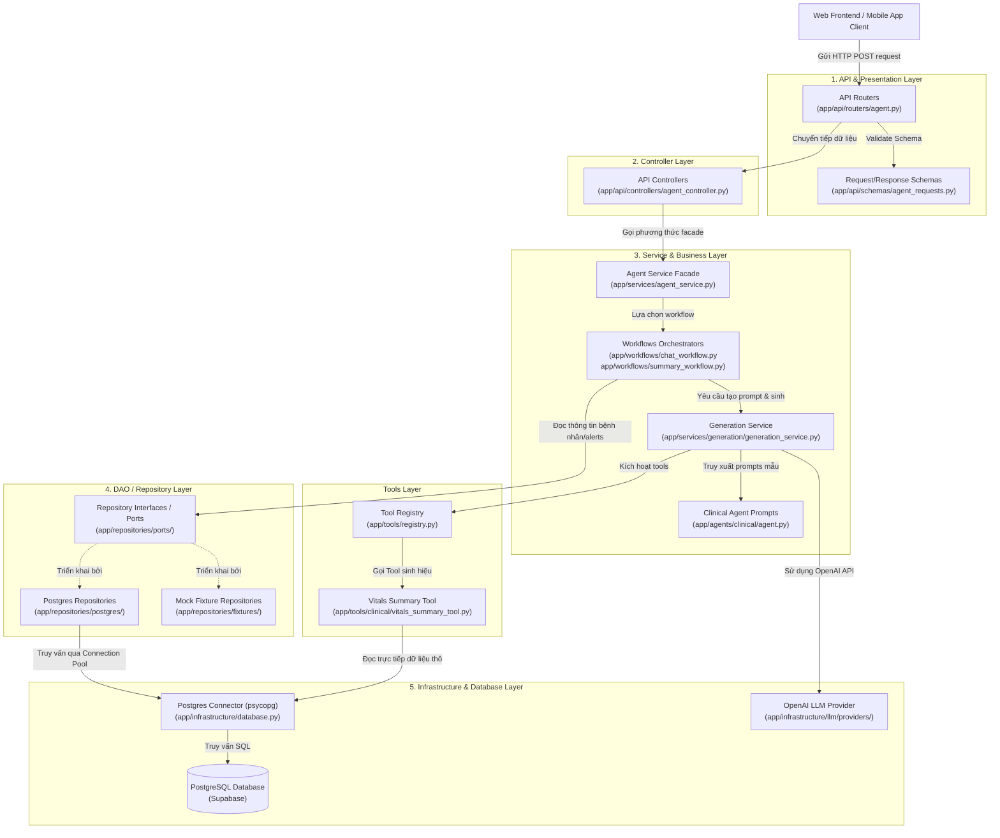

# Sơ đồ Kiến trúc Backend (Backend Architecture Diagram)

Tài liệu này trình bày sơ đồ kiến trúc phân lớp (Layered Architecture) áp dụng cho hệ thống **AI Agent Backend**, mô tả chi tiết luồng nghiệp vụ đi qua các tầng từ API Endpoint, Controller, Service, DAO/Repository cho đến Cơ sở dữ liệu vật lý.

---

## 1. Sơ đồ Kiến trúc Phân lớp (Architecture Diagram)

Sơ đồ dưới đây thể hiện luồng xử lý đồng tâm từ ngoài vào trong (từ Client gửi yêu cầu cho đến khi dữ liệu được truy vấn và xử lý bởi AI):

---

## 2. Mô tả Chi tiết các Tầng Kiến trúc

### Tầng 1: API & Presentation Layer
*   **Mục đích:** Giao tiếp trực tiếp với Client. Tiếp nhận các HTTP Request, thiết lập mã trạng thái HTTP, CORS, bảo mật cơ bản và định tuyến (Routing).
*   **Hiện thực trong code:** `app/api/routers/agent.py`.
*   **Đặc điểm:** Tầng này **không chứa logic nghiệp vụ hay logic AI**. Nó chỉ định tuyến và trả về dữ liệu chuẩn JSON.

### Tầng 2: Controller Layer
*   **Mục đích:** Đóng vai trò cầu nối trung gian giữa định dạng HTTP và ngôn ngữ Python của hệ thống.
*   **Hiện thực trong code:** `app/api/controllers/agent_controller.py`.
*   **Đặc điểm:** Trích xuất thông tin từ HTTP Header, Query Parameter hoặc JSON Body, gọi đúng Service xử lý và trả về DTO (Data Transfer Object) chuẩn.

### Tầng 3: Service & Business Layer (Nghiệp vụ & AI)
*   **Mục đích:** Nơi xử lý nghiệp vụ thông minh chính. Điều phối các tác vụ AI, ghép nối prompts, gọi LLM, thực hiện kiểm tra an toàn y khoa và lưu trữ lịch sử hội thoại.
*   **Hiện thực trong code:**
    *   `app/services/agent_service.py` (Facade điều hướng).
    *   `app/workflows/` (Chứa các kịch bản chạy đa bước).
    *   `app/agents/clinical/agent.py` (Lớp chuyên biệt đóng gói hành vi Prompt Engineering của LLM).
*   **Đặc điểm:** Hoàn toàn tách biệt khỏi các thư viện HTTP hoặc SQL cụ thể.

### Tầng 4: DAO & Repository Layer (Truy cập Dữ liệu)
*   **Mục đích:** Cung cấp giao diện sạch để đọc/ghi dữ liệu từ bộ lưu trữ mà không để lộ cấu trúc bảng hay câu lệnh SQL thô ra các tầng trên.
*   **Hiện thực trong code:**
    *   `app/repositories/ports/` (Khai báo Interface/Protocol).
    *   `app/repositories/postgres/` (Hiện thực truy vấn cơ sở dữ liệu thật).
*   **Đặc điểm:** Nếu hệ thống quyết định chuyển từ PostgreSQL sang MongoDB, chỉ cần viết thêm một implementation mới tại đây mà không cần sửa bất kỳ dòng code nào ở Tầng 3 (Service).

### Tầng 5: Infrastructure & Database Layer (Hạ tầng)
*   **Mục đích:** Giao tiếp trực tiếp với các tài nguyên vật lý ngoài chương trình: Cơ sở dữ liệu SQL, API của OpenAI, RabbitMQ Message Queue.
*   **Hiện thực trong code:** `app/infrastructure/database.py` (Quản lý pool kết nối PostgreSQL thông qua psycopg v3).

---

## 3. Ví dụ Luồng xử lý một Request cụ thể (Chat Request Lifecycle)

Để sếp dễ hình dung, dưới đây là cách dữ liệu dịch chuyển khi người dùng hỏi: *"Hãy tóm tắt sinh hiệu của bệnh nhân P001"*

1.  **Client:** Gửi `POST /api/agent/chat` với JSON body `{"patient_id": "P001", "message": "..."}`.
2.  **API Router:** FastAPI bắt request, so khớp cấu trúc với schema `ChatRequest`. Nếu hợp lệ, chuyển sang Controller.
3.  **Controller:** Gọi `agent_service.handle_chat(...)`.
4.  **Agent Service:** Nhận thấy đây là yêu cầu chat, chuyển sang điều phối cho `ChatWorkflow`.
5.  **Chat Workflow:**
    *   Gọi **Repository** (Tầng DAO) để lấy thông tin bệnh nhân từ cơ sở dữ liệu (Supabase).
    *   Gọi **Tool Registry** để chạy `VitalsSummaryTool` lấy chuỗi sinh hiệu được downsample phù hợp.
    *   Chuyển thông tin bệnh án và sinh hiệu vào `ClinicalAgent` để lắp ghép Prompt hoàn chỉnh.
    *   Gọi **Generation Service** chuyển prompt sang OpenAI sinh văn bản tóm tắt.
6.  **Controller & Router:** Đóng gói kết quả dạng `AgentResponse` trả về Client dạng HTTP `200 OK`.
