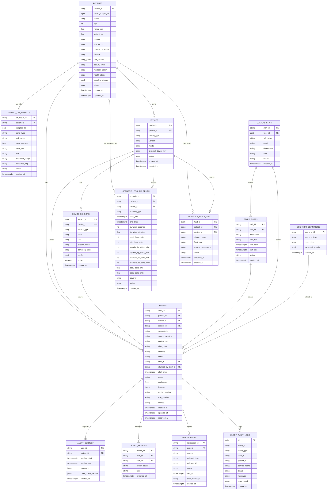

# Supabase ERD

```mermaid
erDiagram
    PATIENTS {
        string patient_id PK
        bigint mimic_subject_id
        string name
        int age
        float height_cm
        float weight_kg
        string gender
        string age_group
        string pregnancy_status
        string lifestyle
        string_array risk_factors
        string activity_level
        string medical_history
        string health_status
        jsonb baseline_signals
        string status
        timestamptz created_at
        timestamptz updated_at
    }

    PATIENT_LAB_RESULTS {
        string lab_result_id PK
        string patient_id FK
        date sampled_at
        string panel_type
        string test_name
        float value_numeric
        string value_text
        string unit
        string reference_range
        string abnormal_flag
        string source
        timestamptz created_at
    }

    CLINICAL_STAFF {
        string staff_id PK
        uuid user_id FK
        string full_name
        string email
        string department
        string role
        string status
        timestamptz created_at
    }

    DEVICES {
        string device_id PK
        string patient_id FK
        string device_type
        string vendor
        string model
        string external_device_key
        string status
        timestamptz created_at
        timestamptz updated_at
    }

    DEVICE_SENSORS {
        string sensor_id PK
        string device_id FK
        string sensor_type
        string label
        string unit
        string stream_name
        string sampling_mode
        jsonb config
        boolean active
        timestamptz created_at
    }

    STAFF_SHIFTS {
        string shift_id PK
        string staff_id FK
        string department
        string shift_role
        timestamptz shift_start
        timestamptz shift_end
        string status
        timestamptz created_at
    }

    ALERTS {
        string alert_id PK
        string patient_id FK
        string device_id FK
        string sensor_id FK
        string scenario_id
        string source_event_id
        string dedup_key
        string alert_type
        string severity
        string status
        string shift_id FK
        string claimed_by_staff_id FK
        timestamptz alert_time
        string reason
        float confidence
        jsonb features
        string model_version
        string rule_version
        string source
        timestamptz created_at
        timestamptz updated_at
        timestamptz resolved_at
    }

    ALERT_CONTEXT {
        string alert_id PK
        string patient_id FK
        timestamptz window_start
        timestamptz window_end
        jsonb summary
        jsonb chart_query_params
        timestamptz created_at
    }

    ALERT_REVIEWS {
        string review_id PK
        string alert_id FK
        string staff_id FK
        string review_status
        string note
        timestamptz reviewed_at
    }

    SCENARIO_DEFINITIONS {
        string scenario_id PK
        string scenario_type
        string description
        jsonb expected_signals
        timestamptz created_at
    }

    SCENARIO_GROUND_TRUTH {
        string episode_id PK
        string patient_id FK
        string device_id FK
        string episode_type
        timestamptz start_time
        timestamptz end_time
        int duration_seconds
        float duration_minutes
        int peak_heart_rate
        int min_heart_rate
        int systolic_bp_delta_min
        int systolic_bp_delta_max
        int diastolic_bp_delta_min
        int diastolic_bp_delta_max
        float spo2_delta_min
        float spo2_delta_max
        string severity
        string status
        timestamptz created_at
    }

    WEARABLE_FAULT_LOG {
        bigint fault_id PK
        string patient_id FK
        string device_id FK
        string stream_name
        string fault_type
        string source_message_id
        string detail
        timestamptz occurred_at
        timestamptz created_at
    }

    NOTIFICATIONS {
        string notification_id PK
        string alert_id FK
        string channel
        string recipient_type
        string recipient_id
        string status
        timestamptz sent_at
        string error_message
        timestamptz created_at
    }

    EVENT_AUDIT_LOGS {
        bigint id PK
        string event_id
        string event_type
        string alert_id
        string patient_id
        string service_name
        string status
        string message
        string error_detail
        timestamptz created_at
    }

    PATIENTS ||--o{ DEVICES : owns
    PATIENTS ||--o{ PATIENT_LAB_RESULTS : has_labs
    DEVICES ||--o{ DEVICE_SENSORS : has
    PATIENTS ||--o{ ALERTS : has
    DEVICES ||--o{ ALERTS : source
    DEVICE_SENSORS ||--o{ ALERTS : source
    CLINICAL_STAFF ||--o{ STAFF_SHIFTS : works
    STAFF_SHIFTS ||--o{ ALERTS : covers
    CLINICAL_STAFF ||--o{ ALERTS : claims
    ALERTS ||--|| ALERT_CONTEXT : explains
    ALERTS ||--o{ ALERT_REVIEWS : reviewed
    ALERTS ||--o{ NOTIFICATIONS : creates
    ALERTS ||--o{ EVENT_AUDIT_LOGS : logs
    PATIENTS ||--o{ SCENARIO_GROUND_TRUTH : has_ground_truth
    DEVICES ||--o{ SCENARIO_GROUND_TRUTH : source
    PATIENTS ||--o{ WEARABLE_FAULT_LOG : has_faults
    DEVICES ||--o{ WEARABLE_FAULT_LOG : source
    SCENARIO_DEFINITIONS ||--o{ ALERTS : related_to
```
