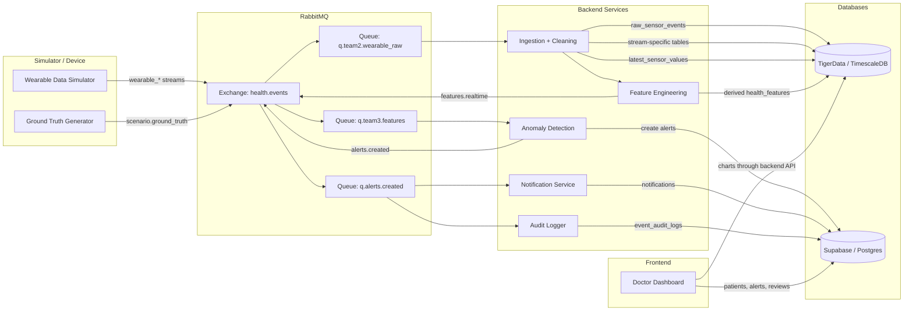

# System Data Flow

```mermaid
flowchart LR
    subgraph SIM[Simulator / Device]
        A[Wearable Data Simulator]
        GT[Ground Truth Generator]
    end

    subgraph MQ[RabbitMQ]
        EX[Exchange: health.events]
        Q1[Queue: q.team2.wearable_raw]
        Q2[Queue: q.team3.features]
        Q3[Queue: q.alerts.created]
    end

    subgraph PROC[Backend Services]
        ING[Ingestion + Cleaning]
        FEAT[Feature Engineering]
        AI[Anomaly Detection]
        NS[Notification Service]
        AUD[Audit Logger]
    end

    subgraph DB[Databases]
        TS[(TigerData / TimescaleDB)]
        SB[(Supabase / Postgres)]
    end

    subgraph UI[Frontend]
        DOC[Doctor Dashboard]
    end

    A -->|wearable_* streams| EX
    GT -->|scenario.ground_truth| EX
    EX --> Q1
    Q1 --> ING

    ING -->|raw_sensor_events| TS
    ING -->|stream-specific tables| TS
    ING -->|latest_sensor_values| TS
    ING --> FEAT

    FEAT -->|derived health_features| TS
    FEAT -->|features.realtime| EX
    EX --> Q2
    Q2 --> AI

    AI -->|create alerts| SB
    AI -->|alerts.created| EX
    EX --> Q3

    Q3 --> NS
    Q3 --> AUD
    NS -->|notifications| SB
    AUD -->|event_audit_logs| SB

    DOC -->|patients, alerts, reviews| SB
    DOC -->|charts through backend API| TS
```
