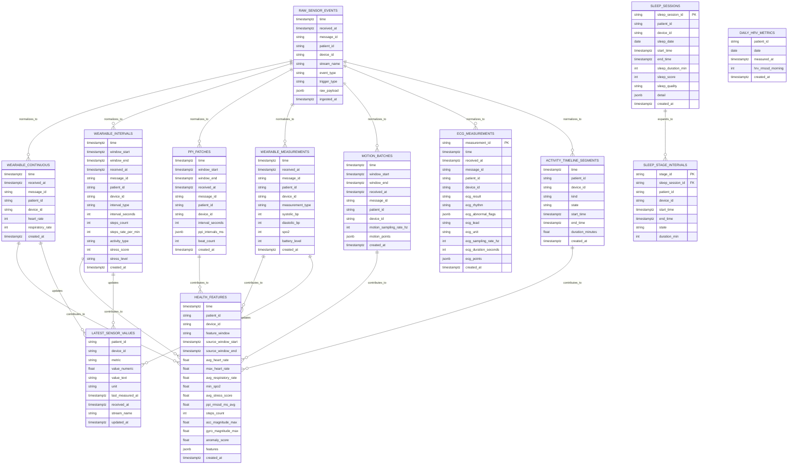

# TigerData / TimescaleDB ERD

Note: arrows from `RAW_SENSOR_EVENTS` to normalized tables show data lineage, not hard foreign keys.

```mermaid
erDiagram
    RAW_SENSOR_EVENTS {
        timestamptz time
        timestamptz received_at
        string message_id
        string patient_id
        string device_id
        string stream_name
        string event_type
        string trigger_type
        jsonb raw_payload
        timestamptz ingested_at
    }

    WEARABLE_CONTINUOUS {
        timestamptz time
        timestamptz received_at
        string message_id
        string patient_id
        string device_id
        int heart_rate
        int respiratory_rate
        timestamptz created_at
    }

    WEARABLE_INTERVALS {
        timestamptz time
        timestamptz window_start
        timestamptz window_end
        timestamptz received_at
        string message_id
        string patient_id
        string device_id
        string interval_type
        int interval_seconds
        int steps_count
        int steps_rate_per_min
        string activity_type
        int stress_score
        string stress_level
        timestamptz created_at
    }

    PPI_PATCHES {
        timestamptz time
        timestamptz window_start
        timestamptz window_end
        timestamptz received_at
        string message_id
        string patient_id
        string device_id
        int interval_seconds
        jsonb ppi_intervals_ms
        int beat_count
        timestamptz created_at
    }

    WEARABLE_MEASUREMENTS {
        timestamptz time
        timestamptz received_at
        string message_id
        string patient_id
        string device_id
        string measurement_type
        int systolic_bp
        int diastolic_bp
        int spo2
        int battery_level
        timestamptz created_at
    }

    MOTION_BATCHES {
        timestamptz time
        timestamptz window_start
        timestamptz window_end
        timestamptz received_at
        string message_id
        string patient_id
        string device_id
        int motion_sampling_rate_hz
        jsonb motion_points
        timestamptz created_at
    }

    ECG_MEASUREMENTS {
        string measurement_id PK
        timestamptz time
        timestamptz received_at
        string message_id
        string patient_id
        string device_id
        string ecg_result
        string ecg_rhythm
        jsonb ecg_abnormal_flags
        string ecg_lead
        string ecg_unit
        int ecg_sampling_rate_hz
        int ecg_duration_seconds
        jsonb ecg_points
        timestamptz created_at
    }

    SLEEP_SESSIONS {
        string sleep_session_id PK
        string patient_id
        string device_id
        date sleep_date
        timestamptz start_time
        timestamptz end_time
        int sleep_duration_min
        int sleep_score
        string sleep_quality
        jsonb detail
        timestamptz created_at
    }

    SLEEP_STAGE_INTERVALS {
        string stage_id PK
        string sleep_session_id FK
        string patient_id
        string device_id
        timestamptz start_time
        timestamptz end_time
        string state
        int duration_min
    }

    DAILY_HRV_METRICS {
        string patient_id
        date date
        timestamptz measured_at
        int hrv_rmssd_morning
        timestamptz created_at
    }

    ACTIVITY_TIMELINE_SEGMENTS {
        timestamptz time
        string patient_id
        string device_id
        string kind
        string state
        timestamptz start_time
        timestamptz end_time
        float duration_minutes
        timestamptz created_at
    }

    HEALTH_FEATURES {
        timestamptz time
        string patient_id
        string device_id
        string feature_window
        timestamptz source_window_start
        timestamptz source_window_end
        float avg_heart_rate
        float max_heart_rate
        float avg_respiratory_rate
        float min_spo2
        float avg_stress_score
        float ppi_rmssd_ms_avg
        int steps_count
        float acc_magnitude_max
        float gyro_magnitude_max
        float anomaly_score
        jsonb features
        timestamptz created_at
    }

    LATEST_SENSOR_VALUES {
        string patient_id
        string device_id
        string metric
        float value_numeric
        string value_text
        string unit
        timestamptz last_measured_at
        timestamptz received_at
        string stream_name
        timestamptz updated_at
    }

    RAW_SENSOR_EVENTS ||--o{ WEARABLE_CONTINUOUS : normalizes_to
    RAW_SENSOR_EVENTS ||--o{ WEARABLE_INTERVALS : normalizes_to
    RAW_SENSOR_EVENTS ||--o{ PPI_PATCHES : normalizes_to
    RAW_SENSOR_EVENTS ||--o{ WEARABLE_MEASUREMENTS : normalizes_to
    RAW_SENSOR_EVENTS ||--o{ MOTION_BATCHES : normalizes_to
    RAW_SENSOR_EVENTS ||--o{ ECG_MEASUREMENTS : normalizes_to
    RAW_SENSOR_EVENTS ||--o{ ACTIVITY_TIMELINE_SEGMENTS : normalizes_to

    WEARABLE_CONTINUOUS ||--o{ HEALTH_FEATURES : contributes_to
    WEARABLE_INTERVALS ||--o{ HEALTH_FEATURES : contributes_to
    PPI_PATCHES ||--o{ HEALTH_FEATURES : contributes_to
    WEARABLE_MEASUREMENTS ||--o{ HEALTH_FEATURES : contributes_to
    MOTION_BATCHES ||--o{ HEALTH_FEATURES : contributes_to
    ACTIVITY_TIMELINE_SEGMENTS ||--o{ HEALTH_FEATURES : contributes_to
    SLEEP_SESSIONS ||--o{ SLEEP_STAGE_INTERVALS : expands_to
    WEARABLE_CONTINUOUS ||--o{ LATEST_SENSOR_VALUES : updates
    WEARABLE_INTERVALS ||--o{ LATEST_SENSOR_VALUES : updates
    WEARABLE_MEASUREMENTS ||--o{ LATEST_SENSOR_VALUES : updates
```
