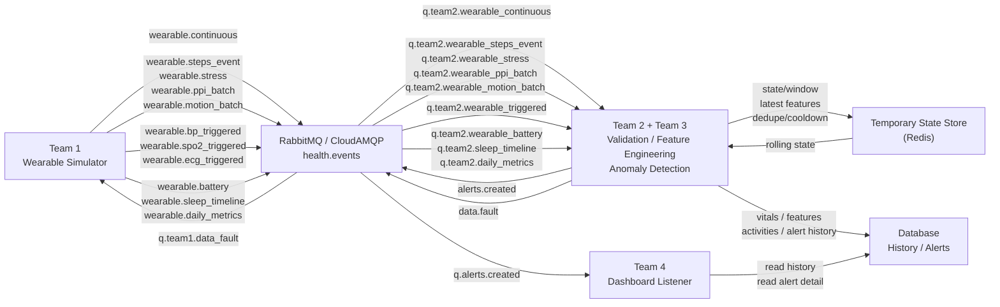

# RabbitMQ Core

Shared RabbitMQ code and topology contract for backend teams.

Keep this package focused on broker primitives that multiple teams can reuse:

- `rabbitmq.py`: environment loading, RabbitMQ connection, topology declaration,
  persistent JSON properties, and consumer QoS helpers.
- `config/topology_config.py`: shared exchange, queue, routing key, publisher,
  connection, and consumer settings.

Team-specific publishers, replay scripts, jobs, and mocks should live with the
owning component. The Team 1 wearable simulator publisher is in:

```text
backend/simulator/pipeline/publisher/
backend/simulator/pipeline/jobs/
backend/simulator/pipeline/tests/
```

## Core Usage

Declare the shared topology from any backend module:

```python
from rabbit_mq.rabbitmq import RabbitMQSettings, connect, declare_topology

settings = RabbitMQSettings.from_env()
connection = connect(settings)
channel = connection.channel()
declare_topology(channel, settings)
```

`RABBITMQ_URL` must be supplied by the calling service environment. Do not commit
real broker URLs.

## Data Flow



Team 2 and Team 3 run together as one realtime alert engine in this flow. The
engine validates/cleans wearable records, computes features, applies anomaly
detection rules/model logic, writes durable history/alert details, and publishes
`alerts.created` for Team 4.

The temporary state store is named by role first because Redis is an
implementation choice. It should only hold short-lived rolling windows, latest
features, dedupe keys, and alert cooldowns. The database is the durable source
for vitals history, feature snapshots, activities, alert decisions, and alert
status history.

## Topology

```text
health.events topic exchange
  q.team2.wearable_continuous      <- wearable.continuous
  q.team2.wearable_steps_event     <- wearable.steps_event
  q.team2.wearable_stress          <- wearable.stress
  q.team2.wearable_ppi_batch       <- wearable.ppi_batch
  q.team2.wearable_motion_batch    <- wearable.motion_batch
  q.team2.wearable_triggered       <- wearable.bp_triggered
  q.team2.wearable_triggered       <- wearable.spo2_triggered
  q.team2.wearable_triggered       <- wearable.ecg_triggered
  q.team2.wearable_battery         <- wearable.battery
  q.team2.sleep_timeline           <- wearable.sleep_timeline
  q.team2.daily_metrics            <- wearable.daily_metrics
  q.alerts.created                 <- alerts.created
  q.team1.data_fault               <- data.fault

health.dlx direct exchange
  q.dead_letter                    <- dead
```

Simulator replay commands are documented in `backend/simulator/README.md`.

## Wearable Stream Mapping

| Simulator output | Routing key | Queue |
|---|---|---|
| `{patient_id}/continuous.jsonl` | `wearable.continuous` | `q.team2.wearable_continuous` |
| `{patient_id}/steps_event.jsonl` | `wearable.steps_event` | `q.team2.wearable_steps_event` |
| `{patient_id}/stress.jsonl` | `wearable.stress` | `q.team2.wearable_stress` |
| `{patient_id}/ppi_batch.jsonl` | `wearable.ppi_batch` | `q.team2.wearable_ppi_batch` |
| `{patient_id}/motion_batch.jsonl` | `wearable.motion_batch` | `q.team2.wearable_motion_batch` |
| `{patient_id}/bp_triggered.jsonl` | `wearable.bp_triggered` | `q.team2.wearable_triggered` |
| `{patient_id}/spo2_triggered.jsonl` | `wearable.spo2_triggered` | `q.team2.wearable_triggered` |
| `{patient_id}/ecg_triggered.jsonl` | `wearable.ecg_triggered` | `q.team2.wearable_triggered` |
| `{patient_id}/battery.jsonl` | `wearable.battery` | `q.team2.wearable_battery` |
| `{patient_id}/sleep_timeline.json` | `wearable.sleep_timeline` | `q.team2.sleep_timeline` |
| `{patient_id}/daily_metrics.json` | `wearable.daily_metrics` | `q.team2.daily_metrics` |

BP, SpO2, and ECG are intentionally bound to the same triggered queue. Their
payloads include `event_type` and `trigger_type`, so Team 2+3 can branch
handling inside one triggered-measurement consumer.

Team 2+3 consumer setup and stream-handling rules are documented in
`backend/rabbit_mq/TEAM2_TEAM3_CONSUMER_GUIDE.md`.
