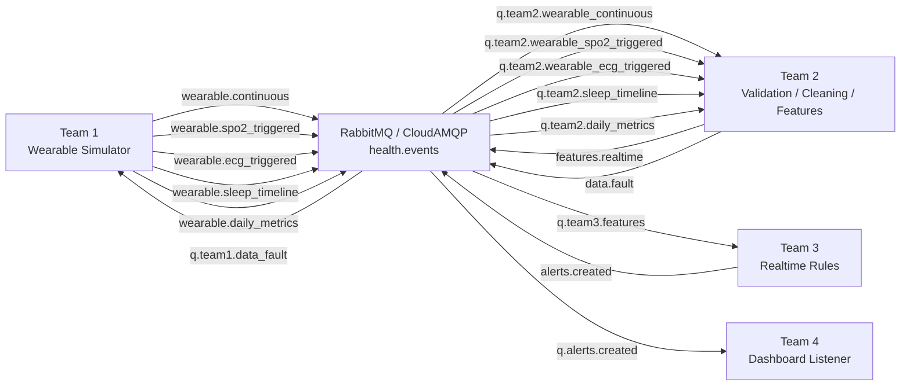

# RabbitMQ / CloudAMQP

Shared RabbitMQ code for replaying wearable simulator v2 outputs.

Team 1 publishes clean wearable streams from `backend/simulator/output`:

- `wearable.continuous` -> `q.team2.wearable_continuous`
- `wearable.spo2_triggered` -> `q.team2.wearable_spo2_triggered`
- `wearable.ecg_triggered` -> `q.team2.wearable_ecg_triggered`
- `wearable.sleep_timeline` -> `q.team2.sleep_timeline`
- `wearable.daily_metrics` -> `q.team2.daily_metrics`

`sleep_metrics` is intentionally not published. Team 2 receives the raw
`sleep_timeline` and derives sleep metrics in its own pipeline.

The wearable v2 contract does not use `schema_version`, `message_type`,
`signals`, or `distance_m`. Queue/file/table names identify the stream type.

## Team Flow



## Setup

Create the local env file:

```bash
cp backend/rabbit_mq/.env.example backend/rabbit_mq/.env
```

Fill in `RABBITMQ_URL` from CloudAMQP. Topology names and consumer defaults live
in:

```text
backend/rabbit_mq/config/topology_config.py
```

Install dependencies with uv:

```bash
uv sync --project backend/rabbit_mq
```

Or with pip:

```bash
pip install -r backend/rabbit_mq/requirements.txt
```

## Generate Then Replay

Generate simulator output first:

```bash
python -m backend.simulator.generate_patient_simulation
```

Preview selected wearable files without connecting to RabbitMQ:

```bash
uv run --project backend/rabbit_mq python -m backend.rabbit_mq.replay_generated_data --dry-run --limit 5
```

Declare exchange, queues, bindings, and DLQ only:

```bash
uv run --project backend/rabbit_mq python -m backend.rabbit_mq.replay_generated_data --declare-only
```

Publish a small continuous smoke batch plus sparse trigger/sleep/daily records:

```bash
uv run --project backend/rabbit_mq python -m backend.rabbit_mq.replay_generated_data --limit 10
```

Publish only sleep timeline for Team 2 sleep processing:

```bash
uv run --project backend/rabbit_mq python -m backend.rabbit_mq.replay_generated_data --streams sleep_timeline
```

Publish faulty wearable JSONL streams for data-quality testing:

```bash
uv run --project backend/rabbit_mq python -m backend.rabbit_mq.replay_generated_data --faulty --streams wearable_continuous wearable_spo2_triggered wearable_ecg_triggered --limit 10
```

For realtime-style continuous replay:

```bash
uv run --project backend/rabbit_mq python -m backend.rabbit_mq.replay_generated_data --streams wearable_continuous --delay-seconds 1 --no-declare
```

Mock Team 2 consumes continuous wearable records and publishes lightweight
features/data faults:

```bash
uv run --project backend/rabbit_mq python -m backend.rabbit_mq.mock_team2_worker --limit 10
```

Mock Team 3 consumes features and publishes simple rule alerts:

```bash
uv run --project backend/rabbit_mq python -m backend.rabbit_mq.mock_team3_worker --limit 10
```

## Topology

```text
health.events topic exchange
  q.team2.wearable_continuous      <- wearable.continuous
  q.team2.wearable_spo2_triggered  <- wearable.spo2_triggered
  q.team2.wearable_ecg_triggered   <- wearable.ecg_triggered
  q.team2.sleep_timeline           <- wearable.sleep_timeline
  q.team2.daily_metrics            <- wearable.daily_metrics
  q.team3.features                 <- features.realtime
  q.alerts.created                 <- alerts.created
  q.team1.data_fault               <- data.fault

health.dlx direct exchange
  q.dead_letter                    <- dead
```

All queues are durable, messages are persistent, and the publisher uses
publisher confirms. Consumers should treat `message_id` as an idempotency key
where the payload has one. Sleep timeline records do not have `message_id` in
the current wearable contract, so Team 2 should key them by `patient_id`,
`date`, and `sleep_start`.
