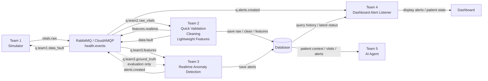
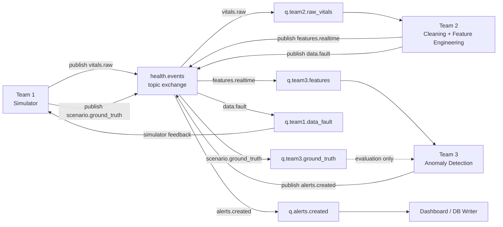
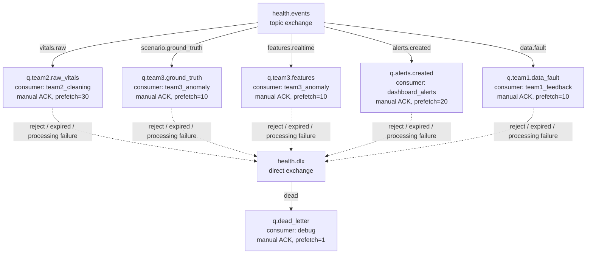

# RabbitMQ / CloudAMQP

Shared RabbitMQ code for all teams:

- Team 1 publishes `vitals.raw` and `scenario.ground_truth`.
- Team 2 consumes `q.team2.raw_vitals`, then publishes features and simulator data-quality feedback.
- Team 3 consumes features and optionally ground truth for evaluation.

During replay, `scenario.ground_truth` is emitted only when the vitals stream
reaches a timestamp inside that scenario window. If you test with `--skip`,
the matching ground-truth scenario for that slice is still sent once at the
first matching vitals message.

## Team Flow

This is the high-level runtime flow between teams:



Main path: Team 1 publishes raw vitals, Team 2 turns raw vitals into cleaned
features, Team 3 turns features into alerts, Team 4 listens for alerts and
updates the dashboard, and Team 5 reads persisted data from the database for AI
reasoning. `scenario.ground_truth` is not shown to users directly; it is for
Team 3 evaluation. `data.fault` goes back to Team 1 as simulator/data-quality
feedback.

## Quick Graph





## Setup

Create the local env file:

```bash
cp backend/rabbit_mq/.env.example backend/rabbit_mq/.env
```

Fill in `RABBITMQ_URL` from CloudAMQP. Database values can live in the same file
for services that need both RabbitMQ and Supabase/Postgres.

Exchange, queue, binding, routing-key names, publisher confirms, `auto_ack`,
and `prefetch_count` are not secrets. They live in:

```text
backend/rabbit_mq/config/topology_config.py
```

Install dependencies with uv:

```bash
uv sync --project backend/rabbit_mq
```

Or with pip:

```bash
pip install -r backend/requirements.txt
```

## Test Order

Validate generated simulator files without connecting to RabbitMQ:

```bash
uv run --project backend/rabbit_mq python -m backend.rabbit_mq.replay_generated_data --dry-run --limit 5
```

The dry-run output shows the actual publish order. For example,
`--skip 3600 --limit 3` should print the vigorous-activity ground truth once,
then three `vitals.raw` messages.

Declare exchange, queues, bindings, and DLQ only:

```bash
uv run --project backend/rabbit_mq python -m backend.rabbit_mq.replay_generated_data --declare-only
```

After topology is declared once, repeated replay tests can skip redeclare:

```bash
uv run --project backend/rabbit_mq python -m backend.rabbit_mq.replay_generated_data --limit 10 --no-declare
```

Publish a small smoke-test batch:

```bash
uv run --project backend/rabbit_mq python -m backend.rabbit_mq.replay_generated_data --limit 10
```

Publish a 10-minute slice from the vigorous-activity segment, which should
trigger mock Team 3 alerts:

```bash
uv run --project backend/rabbit_mq python -m backend.rabbit_mq.replay_generated_data --skip 3600 --limit 600
```

Mock Team 2 consumes raw vitals and publishes features/data faults:

```bash
uv run --project backend/rabbit_mq python -m backend.rabbit_mq.mock_team2_worker --limit 10
```

Mock Team 3 consumes features and publishes alerts if simple rules trigger:

```bash
uv run --project backend/rabbit_mq python -m backend.rabbit_mq.mock_team3_worker --limit 10
```

If topology was already declared and LavinMQ rejects a redeclare because queue
arguments changed during development, use:

```bash
python -m backend.rabbit_mq.mock_team2_worker --limit 10 --no-declare
python -m backend.rabbit_mq.mock_team3_worker --limit 10 --no-declare
```

For a 10-minute realtime-style test, open three terminals:

```bash
# Terminal 1: publish 10 minutes from the vigorous segment, one message/second
uv run --project backend/rabbit_mq python -m backend.rabbit_mq.replay_generated_data --skip 3600 --limit 600 --delay-seconds 1 --no-declare

# Terminal 2: Team 2 waits for raw vitals and publishes features
uv run --project backend/rabbit_mq python -m backend.rabbit_mq.mock_team2_worker --limit 600 --idle-timeout-seconds 700 --no-declare

# Terminal 3: Team 3 waits for features and publishes alerts
uv run --project backend/rabbit_mq python -m backend.rabbit_mq.mock_team3_worker --limit 600 --idle-timeout-seconds 700 --no-declare
```

Publish full generated simulator output:

```bash
uv run --project backend/rabbit_mq python -m backend.rabbit_mq.replay_generated_data
```

## Topology

```text
health.events topic exchange
  q.team2.raw_vitals   <- vitals.raw
  q.team3.ground_truth <- scenario.ground_truth
  q.team3.features     <- features.realtime
  q.alerts.created     <- alerts.created
  q.team1.data_fault   <- data.fault

health.dlx direct exchange
  q.dead_letter        <- dead
```

All queues are durable, messages are persistent, and the publisher uses
publisher confirms. The replay publisher retries and reconnects on connection
loss, so consumers should treat `message_id` and `scenario_id` as idempotency
keys if they need strict duplicate protection.

Consumer defaults:

```text
Team 2 cleaning: auto_ack=false, prefetch_count=30
Team 3 anomaly:  auto_ack=false, prefetch_count=10
Dashboard:       auto_ack=false, prefetch_count=20
Team 1 feedback: auto_ack=false, prefetch_count=10
Debug/DLQ:       auto_ack=false, prefetch_count=1
```
