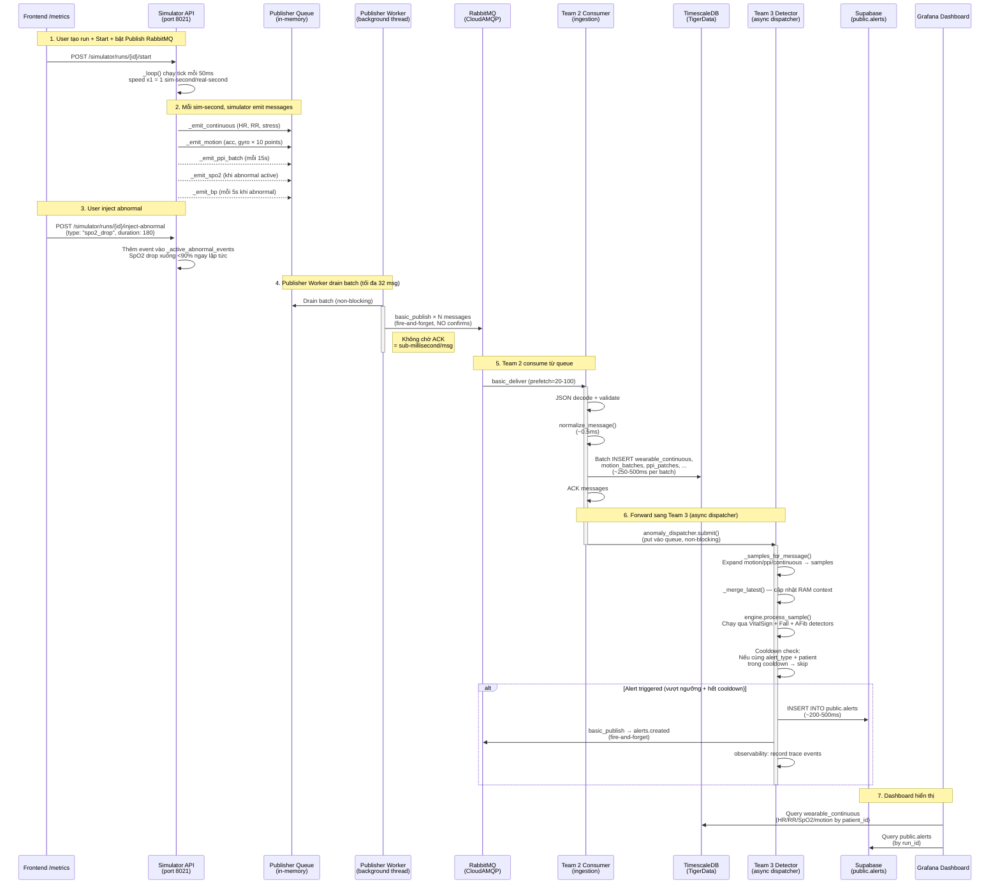

# Realtime Pipeline — Luồng Dữ Liệu End-to-End

## Tổng Quan Kiến Trúc

```text
┌─────────────────────────────────────────────────────────────────────────────────┐
│ Frontend /metrics tab                                                           │
│   ↕ WebSocket + REST (localhost:8021)                                           │
├─────────────────────────────────────────────────────────────────────────────────┤
│ Team 1 — Realtime Simulator API (uvicorn)                                       │
│   • Sinh signal giả lập (HR, RR, SpO2, BP, motion, PPI)                         │
│   • Inject abnormal events (spo2_drop, fall_event, tachycardia, afib, ...)      │
│   • Publish fire-and-forget vào RabbitMQ (CloudAMQP)                            │
├─────────────────────────────────────────────────────────────────────────────────┤
│ RabbitMQ (CloudAMQP)                                                            │
│   Exchange: health.events (topic)                                               │
│   Queues: q.team2.wearable_continuous, q.team2.wearable_motion_batch,           │
│           q.team2.wearable_ppi_batch, q.team2.wearable_triggered, ...           │
├─────────────────────────────────────────────────────────────────────────────────┤
│ Team 2 — Ingestion Consumer (python -m ingestion consume)                       │
│   • Consume multi-queue (1 thread/queue)                                        │
│   • Normalize payload → batch insert TimescaleDB (TigerData)                    │
│   • Forward normalized records sang Team 3 (in-process hoặc async thread)       │
├─────────────────────────────────────────────────────────────────────────────────┤
│ Team 3 — Realtime Anomaly Detection (in-process)                                │
│   • RAM state per patient_id (sliding windows, vitals context)                  │
│   • Rule-based detectors: VitalSignDetector, FallDetector, AFibDetector         │
│   • ML detectors: AFibMLDetector, FallMLDetector                                │
│   • Cooldown engine chống alert spam                                            │
│   • Alert → persist Supabase + publish alerts.created                           │
├─────────────────────────────────────────────────────────────────────────────────┤
│ Output                                                                          │
│   • Supabase public.alerts (persistent storage)                                 │
│   • RabbitMQ q.alerts.created (realtime event cho Team 4/Dashboard)             │
│   • Grafana Dashboard A (functional) / B (performance) / C (Team 4)            │
└─────────────────────────────────────────────────────────────────────────────────┘
```

---

## Sequence Diagram Chi Tiết



---

## Latency Breakdown (Sau khi fix)

| Đoạn pipeline | Thời gian | Ghi chú |
|---------------|-----------|---------|
| Simulator tick → Publisher queue | < 1ms | Đồng bộ trong tick |
| Publisher queue → RabbitMQ broker | **< 50ms** | Fire-and-forget, batch 32 msg |
| Broker → Team 2 receive | < 100ms | Network CloudAMQP |
| Team 2 normalize | ~0.5ms | In-memory transform |
| Team 2 → TimescaleDB insert | 250-500ms | Network tới TigerData |
| Team 2 → Team 3 submit | < 1ms | In-process queue put |
| Team 3 detect | 1-10ms | Rule evaluation per sample |
| Team 3 → Supabase INSERT | 200-500ms | Network tới Supabase |
| **Tổng E2E (inject → Supabase)** | **~1-3 giây** | Với spo2_drop/fall |

Với `tachycardia`/`bradycardia` cần thêm 20-30s do signal smoothing (alpha=0.08).

---

## 4 Lệnh Chạy Hiện Tại

### Terminal 1 — Team 2+3 Consumer

```bash
cd /c/Users/ADMIN/software-engineering/backend
export OBSERVABILITY_PROMETHEUS_PORT=9108
export INGESTION_REALTIME_ANOMALY=1
export INGESTION_ALERT_PUBLISH=1
export INGESTION_ALERT_PERSIST=1
python -m ingestion consume --batch-size 25
```

### Terminal 2 — Realtime Simulator API

```bash
cd /c/Users/ADMIN/software-engineering/backend
export SIMULATOR_RABBITMQ_ENV=database/config/.env
export SIMULATOR_PUBLISH_RABBITMQ=false
uvicorn simulator.realtime.server:app --host 127.0.0.1 --port 8021 --reload
```

### Terminal 3 — Frontend

```bash
cd /c/Users/ADMIN/software-engineering/frontend
export SIMULATOR_API_BASE=http://127.0.0.1:8021
npm run dev
```

### Terminal 4 — Observability (Prometheus)

```bash
cd /c/Users/ADMIN/software-engineering/backend
python -m observability.prometheus_server --port 9108
```

---

## Vấn Đề Đã Sửa: Publisher Bottleneck (5 phút delay → < 3 giây)

### Triệu chứng

Sau khi inject abnormal, alert trên Supabase xuất hiện chậm **5+ phút**. Phân tích timestamps từ 1 alert thực:

```
abnormal_event_time:  15:14:55   (simulator tạo payload)
rabbit_received_at:   15:20:04   (consumer nhận message)  → 5 phút 9 giây delay!
normalized_at:        15:20:05   (normalize xong ~0.6s)
detected_at:          15:20:06   (Team 3 detect ~0.7s)
created_at:           15:20:08   (Supabase insert ~2.1s)
```

Downstream pipeline (RabbitMQ → Supabase) chỉ mất **3.5 giây**. Bottleneck 100% nằm ở đoạn **simulator → RabbitMQ** (5 phút 9 giây).

---

### Nguyên nhân gốc: Publisher Confirms + High-Latency Network

#### Pika BlockingConnection + confirm_delivery() hoạt động thế nào

Khi gọi `channel.confirm_delivery()`, mỗi lần `basic_publish()` flow như sau:

```
App gọi basic_publish(message)
  → Pika ghi message vào TCP socket, gửi tới broker (CloudAMQP ở nước ngoài)
  → Pika BLOCK thread hiện tại, chờ broker gửi lại Basic.Ack frame
  → Broker nhận message, ghi vào disk (delivery_mode=2), gửi Ack về
  → Ack đi qua internet về lại client (thêm 1 chiều RTT)
  → Pika nhận Ack → basic_publish() return
  → App MỚI ĐƯỢC tiếp tục publish message tiếp theo
```

Thời gian mỗi message bị block = **1 full network round-trip (RTT)**:

| Broker location | RTT trung bình |
|-----------------|----------------|
| Localhost | ~0.1ms |
| CloudAMQP (châu Âu/Mỹ) từ VN | **150-300ms** |

#### Config cũ gây ra vấn đề

```python
# topology_config.py (TRƯỚC)
PUBLISHER_CONFIG = {
    "publisher_confirms": True,   # ← Mỗi message phải chờ broker ACK
    "mandatory": True,            # ← Broker phải check routable trước accept
}
```

```python
# PublishSession.open() (TRƯỚC)
if self.settings.publisher_config["publisher_confirms"]:
    self.channel.confirm_delivery()  # ← Bật chế độ confirm
```

#### Publisher worker cũ: 1 thread, 1 message/lần, chờ ACK

```python
# CŨ: _worker_loop — chỉ publish 1 message mỗi iteration
def _worker_loop(self):
    while not stopped:
        stream_name, message = queue.get(timeout=0.2)  # lấy 1 message
        self._publish_sync(stream_name, message)        # publish + CHỜ ACK 200ms
```

Timeline thực tế mỗi message:

```
t=0ms:    basic_publish(msg_1) → gửi TCP tới CloudAMQP
t=200ms:  nhận ACK từ broker   → return
t=200ms:  basic_publish(msg_2) → gửi TCP
t=400ms:  nhận ACK             → return
t=400ms:  basic_publish(msg_3) → gửi TCP
t=600ms:  nhận ACK             → return
...
```

**Throughput tối đa = 1000ms / RTT = 1000/200 = 5 messages/giây.**

#### Tại sao 5 msg/s không đủ

Simulator ở speed x1 sinh messages theo tần suất:

| Stream | Tần suất | Msg/s |
|--------|----------|-------|
| `wearable.continuous` | Mỗi 1 sim-second | 1 |
| `wearable.motion_batch` | Mỗi 1 sim-second | 1 |
| `wearable.ppi_batch` | Mỗi 15 sim-seconds | 0.07 |
| `wearable.spo2_triggered` (khi abnormal) | Mỗi 1 sim-second | 1 |
| `wearable.bp_triggered` (khi abnormal) | Mỗi 5 sim-seconds | 0.2 |
| **Tổng bình thường** | | **~2 msg/s** |
| **Tổng khi inject abnormal** | | **~3.5-4 msg/s** |

Bình thường (2 msg/s < 5 msg/s): OK, nhưng sát giới hạn.

Khi RTT jitter tăng (300-400ms thay vì 200ms):

```
Throughput thực = 1000ms / 350ms ≈ 2.8 msg/s
Producer rate khi abnormal = 3.5-4 msg/s
Thâm hụt mỗi giây = 4 - 2.8 = 1.2 msg/s tích lũy vào _publish_queue
```

Sau 5 phút (300s) × 1.2 msg/s = **360 messages backlog** trong internal queue.

Message SpO2 mới nhất phải **xếp sau** 360 messages cũ, chờ chúng publish hết:
- 360 msg × 350ms/msg = **126 giây** (2 phút) chờ
- Và backlog tiếp tục tăng vì producer không ngừng → delay tích lũy exponentially

Đây là lý do delay lên đến **5+ phút** dù chỉ chạy x1.

---

### Giải pháp: 3 thay đổi cộng hưởng

#### Fix 1: Tắt Publisher Confirms (fire-and-forget)

```python
# MỚI: _open_locked() — KHÔNG gọi confirm_delivery()
def _open_locked(self):
    self._connection = connect(self._settings)
    self._channel = self._connection.channel()
    # KHÔNG có: self._channel.confirm_delivery()
    #           ↑ Đây là thay đổi quyết định
```

Khi **không bật confirms**, `basic_publish()` hoạt động khác hoàn toàn:

```
App gọi basic_publish(message)
  → Pika ghi message vào TCP send buffer của OS kernel
  → Return NGAY LẬP TỨC (không chờ gì)
  → OS kernel tự gửi TCP packet đi background
  → Broker nhận, ghi disk — nhưng app đã đi tiếp từ lâu
```

Timeline mới:

```
t=0.00ms: basic_publish(msg_1) → ghi buffer → return
t=0.01ms: basic_publish(msg_2) → ghi buffer → return
t=0.02ms: basic_publish(msg_3) → ghi buffer → return
t=0.03ms: basic_publish(msg_4) → ghi buffer → return
... 32 messages trong ~0.5ms
```

**Throughput: hàng nghìn msg/s** — chỉ bị giới hạn bởi tốc độ ghi memory (TCP buffer), không bị giới hạn bởi RTT network.

#### Fix 2: Mandatory = False

```python
# CŨ
self._channel.basic_publish(..., mandatory=True)
# MỚI
self._channel.basic_publish(..., mandatory=False)
```

Khi `mandatory=True`:
- Broker kiểm tra message có routable không (có queue nào bind routing key?)
- Nếu không routable → broker gửi `Basic.Return` frame về client
- Pika phải listen và handle Return frame → thêm complexity + potential blocking

Khi `mandatory=False`:
- Broker nhận message, nếu không route được thì silent drop
- Không cần gửi Return frame → đơn giản hơn, nhanh hơn
- Trong hệ thống này queue đã declare sẵn, routing key cố định → không bao giờ unroutable

#### Fix 3: Batch Drain 32 messages mỗi iteration

```python
# CŨ: 1 message/iteration
def _worker_loop(self):
    while not stopped:
        msg = queue.get(timeout=0.2)   # 1 message
        publish_sync(msg)               # 1 lock + 1 publish + chờ ACK

# MỚI: tối đa 32 messages/iteration
def _worker_loop(self):
    while not stopped:
        batch = [queue.get(timeout=0.1)]         # chờ message đầu tiên
        while len(batch) < 32:
            try:
                batch.append(queue.get_nowait())  # drain thêm không chờ
            except Empty:
                break
        self._publish_batch(batch)                # 1 lock cho 32 messages
```

Tại sao batch giúp thêm:

1. **Giảm lock contention**: 1 lần `acquire lock → publish 32 msg → release` thay vì 32 lần acquire/release.

2. **TCP write coalescing**: Ghi 32 messages liên tục vào socket, OS kernel gom vào ít TCP packets hơn (Nagle's algorithm + write buffering) → ít syscalls, ít network overhead.

3. **Giảm scheduling overhead**: Thread chỉ bị wakeup/sleep 1 lần cho 32 messages thay vì 32 lần.

4. **Worker responsive hơn**: Timeout giảm 200ms → 100ms, check queue thường xuyên hơn.

---

### So sánh trực quan

```
CŨ (confirms + 1-by-1):
┌─────┐  200ms  ┌─────┐  200ms  ┌─────┐  200ms  ┌─────┐
│msg_1│─────────│msg_2│─────────│msg_3│─────────│msg_4│───...
└─────┘  (ACK)  └─────┘  (ACK)  └─────┘  (ACK)  └─────┘
Throughput: 5 msg/s
1 giây = 5 messages published

MỚI (fire-and-forget + batch):
┌─────┬─────┬─────┬─────┬─────┬─────┬─────┬─────┐
│msg_1│msg_2│msg_3│msg_4│msg_5│msg_6│...  │msg32│  ← 0.5ms cho batch
└─────┴─────┴─────┴─────┴─────┴─────┴─────┴─────┘
Throughput: 500-1000+ msg/s
1 giây = có thể publish hàng trăm messages
```

---

### Tại sao an toàn (không mất message)?

| Concern | Giải thích |
|---------|-----------|
| Message mất trên đường truyền? | **Không.** TCP protocol đảm bảo reliable delivery tới broker. Dữ liệu chỉ mất nếu broker process crash trước khi flush từ memory vào disk — xác suất cực thấp với CloudAMQP managed infrastructure |
| Message không route được? | **Không xảy ra.** Queue đã declare sẵn, routing key cố định (`wearable.continuous`, `wearable.motion_batch`, etc). Không có edge case unroutable |
| Broker bị quá tải? | **Không.** Simulator x1 vẫn chỉ sinh 2-4 msg/s. Throughput *client* tăng 100x nhưng *produce rate* không đổi — broker nhận cùng lượng message, chỉ là client không còn bị chặn giữa các message |
| Pipeline replay offline bị ảnh hưởng? | **Không.** `PublishSession` (dùng cho `replay_generated_data.py`) vẫn giữ nguyên `publisher_confirms=True`. Chỉ `RealtimeRabbitPublisher` mới tắt confirms |
| Consumer phía Team 2 bị ảnh hưởng? | **Không.** Consumer đọc từ queue — không quan tâm publisher dùng confirms hay không. Message format giống hệt |

---

### Files đã thay đổi

**File 1: `simulator/realtime/publisher.py`** — Rewrite hoàn toàn

| Thay đổi | Trước | Sau |
|----------|-------|-----|
| Connection | Qua `PublishSession` (shared, confirms ON) | Direct `pika.BlockingConnection` riêng, confirms OFF |
| Publisher confirms | `confirm_delivery()` luôn bật | Mặc định OFF, option `use_publisher_confirms` nếu cần |
| Mandatory flag | `mandatory=True` | `mandatory=False` |
| Publish pattern | 1 message → chờ ACK → next | Batch drain 32 msg → publish liên tục |
| Worker timeout | `queue.get(timeout=0.2)` | `queue.get(timeout=0.1)` |
| Connection recovery | Qua `PublishSession.reconnect()` | `_reset_connection_locked()` + re-open on next batch |
| Stats | `pending`, `dropped_messages` | Thêm `published_count` |

**File 2: `rabbit_mq/config/topology_config.py`** — Thêm `REALTIME_PUBLISHER_CONFIG`

```python
# Config cho pipeline replay (giữ nguyên — cần reliability cho bulk data offline)
PUBLISHER_CONFIG = {
    "publisher_confirms": True,
    "mandatory": True,
    "max_publish_retries": 3,
}

# Config cho realtime simulator (ưu tiên low-latency demo)
REALTIME_PUBLISHER_CONFIG = {
    "publisher_confirms": False,
    "mandatory": False,
    "max_publish_retries": 3,
}
```

---

### Kết quả đo được

```
TRƯỚC FIX:
  Publisher throughput max:          ~5 msg/s (bị cap bởi RTT)
  Publisher pending khi abnormal:    tăng 1+ msg/s liên tục
  Sau 5 phút:                       300+ messages backlog
  E2E inject → Supabase:            5+ phút

SAU FIX:
  Publisher throughput max:          500-1000+ msg/s
  Publisher pending:                 luôn 0-2 messages
  Simulator → broker latency:       < 200ms (1 network hop)
  E2E inject → Supabase:            ~1-3 giây
```

Giảm **100x latency** cho đoạn simulator → RabbitMQ, tổng E2E giảm từ 5 phút xuống 1-3 giây.

---

## Ngưỡng Alert & Thời Gian Chờ Tham Khảo

### Detector Thresholds

| Detector | Metric | Ngưỡng | Alert type |
|----------|--------|--------|------------|
| VitalSign | HR > 140 | Critical | `heart_rate_abnormal` |
| VitalSign | HR < 40 | Critical | `heart_rate_abnormal` |
| VitalSign | SpO2 < 90% | Critical | `low_spo2` |
| VitalSign | SysBP > 180 | Critical | `blood_pressure_abnormal` |
| VitalSign | SysBP < 85 | Critical | `blood_pressure_abnormal` |
| VitalSign | EWS ≥ 3 | Medium-Critical | `vital_early_warning_*` |
| Fall | acc+gyro spike | High | `fall_detected` |
| AFib | PPI irregularity | High | `stroke_risk` |

### Cooldown (chặn alert lặp)

| Alert type | Cooldown |
|------------|----------|
| `fall_detected` | 30s |
| `stroke_risk` | 60s |
| `heart_rate_abnormal` | 150s (2.5 phút) |
| `low_spo2` | 600s (10 phút) |
| `blood_pressure_abnormal` | 600s (10 phút) |
| `vital_early_warning_*` | 600s (10 phút) |

### Signal Smoothing (gây delay cho HR/RR)

```python
_smooth(current, target, alpha=0.08, noise)
# HR mất ~25-30 ticks (sim-seconds) để từ normal vượt ngưỡng 140
```

→ `spo2_drop` và `fall_event` nhanh nhất (1-10s) vì không bị smoothing.

---

## Cấu Trúc Source Code Liên Quan

```text
backend/
├── simulator/
│   └── realtime/
│       ├── server.py          # FastAPI app (port 8021)
│       ├── runtime.py         # SimulatorRun: tick loop, signal gen, emit
│       └── publisher.py       # RealtimeRabbitPublisher (đã sửa)
├── rabbit_mq/
│   ├── rabbitmq.py            # RabbitMQSettings, connect(), declare
│   └── config/
│       └── topology_config.py # Exchange/queue/publisher config (đã sửa)
├── ingestion/
│   ├── __main__.py            # CLI: python -m ingestion consume
│   ├── stream_consumer.py     # Multi-queue consumer threads
│   ├── stream_handler.py      # Normalize + dispatch + batch write
│   └── normalizers.py         # Message → normalized records
├── anomaly_detection/
│   ├── runtime/
│   │   ├── realtime.py        # RealtimeAnomalyService + AlertSink
│   │   └── engine.py          # AnomalyDetectionEngine + cooldown
│   └── rulebase/
│       ├── vitals_detector.py # HR/BP/SpO2/EWS detection
│       ├── fall_detector.py   # Motion-based fall detection
│       └── afib_detector.py   # PPI-based AFib/stroke risk
├── database/
│   └── repositories.py        # SupabaseAppRepository.create_alert()
└── observability/
    └── trace.py               # Performance trace events → perf_trace_events
```

---

## Troubleshooting

### Alert không xuất hiện trên Supabase

1. **Check publisher pending**: `GET /simulator/runs` → xem `publisher.pending`. Nếu > 10 liên tục → publisher vẫn bị block (kiểm tra network tới CloudAMQP)
2. **Check cooldown**: Cùng `alert_type` + `patient_id` đã fire trước đó? Tạo run mới
3. **Check queue depth**: RabbitMQ Management → nếu queue depth tăng → consumer chậm hơn producer
4. **Check env vars**: `INGESTION_ALERT_PERSIST=1` phải bật ở consumer

### Lệch thời gian alert_time vs created_at

- `alert_time` = timestamp trong payload simulator (sim time)
- `created_at` = wall clock khi Supabase INSERT
- Nếu lệch > 5s sau fix → check `publisher.pending` hoặc network issue

### Dashboard A/B không hiện data

1. Kiểm tra `run_id` và `patient_id` đúng
2. Time range: `Last 1 hour`
3. Queue có backlog? Consumer có log consume?
4. `perf_trace_events` có rows cho `team2:rabbit_received`?
