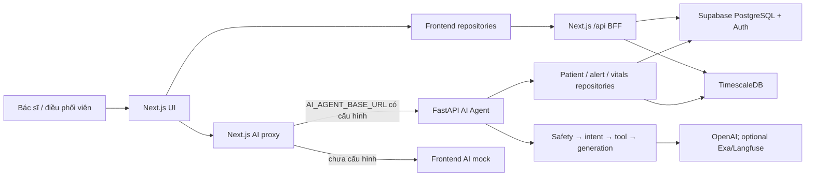

<!-- generated-by: gsd-doc-writer -->
> **Production hardening update (01/07/2026):** implementation from commit `dce961d`
> has been merged into `lpn/fe`, based on `main` commit `0e2c371`. Read
> [`PRODUCTION_IMPLEMENTATION_HANDOVER.md`](./PRODUCTION_IMPLEMENTATION_HANDOVER.md)
> first; it supersedes production-related baseline notes below. Demo/mock fallback is
> forbidden when `CARESIGNAL_ENVIRONMENT=production`. The preserved `lpn/fe` stash remains
> reference-only and must not be popped wholesale.

# Bàn giao kỹ thuật CareSignal AI — nhánh main

Tài liệu này giúp developer mới hiểu nhanh cấu trúc repository, các luồng nghiệp vụ chính, cách chạy local và những rủi ro cần biết trước khi sửa code. Nội dung được đối chiếu với source ngày 30/06/2026.

## 1. Phiên bản source

| Mục | Giá trị |
|---|---|
| Repository | `software-engineering` |
| Nhánh hiện tại | `main` |
| Remote đồng bộ | `production` (`https://github.com/linhhtunn/Dashboard.git`) |
| Commit | `0e2c371` — `Merge pull request #6 from linhhtunn/linhtun` |
| Ngày commit | 23/06/2026 |
| Trạng thái pull | Local bằng `production/main`, divergence `0/0` |
| Working tree trước khi tạo tài liệu | Sạch |

Phần việc chưa commit trước đó trên nhánh `lpn/fe` đã được bảo toàn tại `stash@{0}` với message `codex: preserve lpn-fe work before switching to main 2026-06-30`. Không pop stash này vào `main`; hãy quay lại đúng nhánh `lpn/fe` trước khi khôi phục.

## 2. Tổng quan hệ thống

CareSignal AI là dashboard theo dõi bệnh nhân cho bác sĩ, điều phối viên và đội ngũ y tế. Repository hiện có hai ứng dụng hoạt động chính:

- `frontend/`: Next.js App Router, đồng thời là giao diện và BFF API cho portal.
- `backend/ai_agent/`: FastAPI AI clinical assistant.

Frontend quản lý bệnh nhân, sinh hiệu, cảnh báo, ca trực, báo cáo, phân công bác sĩ và chat AI. Next.js Route Handlers đọc Supabase/TimescaleDB rồi trả DTO ổn định cho UI. Chat được proxy sang FastAPI; nếu chưa cấu hình AI backend, frontend dùng mock response.



## 3. Cấu trúc thư mục

```text
software-engineering/
├── frontend/                         # Next.js 16, React 19, TypeScript, Tailwind
│   ├── app/
│   │   ├── (auth)/                   # Login, register, quên/đặt lại mật khẩu
│   │   ├── (marketing)/              # Landing, privacy, terms
│   │   ├── api/                      # BFF APIs, auth, AI proxy, report
│   │   ├── dashboard/                # AI-first workspace mới
│   │   ├── daily-report/             # Báo cáo ngày của bác sĩ
│   │   ├── patients/                 # Danh sách/chi tiết bệnh nhân
│   │   ├── alerts/                   # Cảnh báo và workflow xử lý
│   │   ├── metrics/                  # Sinh hiệu
│   │   ├── staff/                    # Nhân sự và lịch trực
│   │   ├── report/                   # Báo cáo tổng hợp
│   │   └── admin/users/              # Quản trị user/role
│   ├── components/
│   │   ├── dashboard/                # Workspace, sidebar, AI composer, patient context
│   │   ├── report/                   # Report và daily report UI
│   │   └── auth|alerts|patients|.../ # UI theo domain
│   ├── lib/
│   │   ├── ai/                       # Chat client, adapter, thread store, mock
│   │   ├── api/                      # HTTP client, timeout, request de-duplication
│   │   ├── auth/                     # Demo/Supabase auth
│   │   ├── repositories/             # API-facing repositories cho UI
│   │   ├── server/                   # Supabase/Timescale queries và services
│   │   ├── supabase/                 # Browser/server/admin clients
│   │   ├── mock/                     # Mock AI và một phần alert workflow
│   │   └── i18n/                     # Nội dung Việt/Anh
│   ├── supabase/migrations/          # Role/profile và daily encounter schema
│   ├── scripts/                      # Seed/introspect/probe/migrate DB
│   ├── middleware.ts                 # Session refresh và page protection
│   └── package.json
├── backend/
│   ├── ai_agent/
│   │   ├── app/
│   │   │   ├── api/                  # FastAPI routers/controllers/schemas
│   │   │   ├── contracts/            # AgentResponse và ToolResponse
│   │   │   ├── core/                 # Settings, logging, DI container
│   │   │   ├── repositories/         # Ports + fixture/Postgres/Supabase/Timescale/SQLite
│   │   │   ├── services/             # Intent, chat, safety, clinical, generation
│   │   │   ├── tools/                # Clinical tools và registry
│   │   │   ├── memory/               # Short/long-term memory, checkpointer/store
│   │   │   ├── workflows/            # Chat workflow
│   │   │   ├── observability/        # Optional Langfuse
│   │   │   └── main.py               # FastAPI entrypoint
│   │   ├── rules/                    # YAML rules cho AF, HF, hypertension
│   │   ├── scripts/                  # Seed/migration utilities
│   │   ├── tests/                    # Unit, integration, workflow
│   │   ├── pyproject.toml
│   │   └── uv.lock
│   ├── ingestion/                    # Hiện không có source được track
│   └── tests/                        # Hiện không có test được track
├── docs/                             # Tài liệu thiết kế, sprint và theo thành viên
├── graphify-out/                     # Báo cáo/HTML graph được generate
├── docker-compose.yml                # Chưa chạy được nguyên trạng, xem Known issues
└── README.md                         # Hiện chỉ là placeholder ngắn
```

Không đọc/sửa nghiệp vụ trong `.next/`, `node_modules/`, `.pytest_cache/` hoặc file `.env`.

## 4. Frontend và BFF API

### 4.1 Công nghệ

- Next.js `16.2.6`, React `19.2.4`, TypeScript.
- Tailwind CSS 4, Radix UI/shadcn, Lucide, Motion và Recharts.
- Supabase cho auth, portal data và role/profile.
- `pg` cho TimescaleDB queries ở server side.
- Vercel Analytics và Speed Insights chỉ được mount khi `VERCEL=1`.

`frontend/app/layout.tsx` dựng provider/shell toàn cục. `frontend/middleware.ts` gọi `frontend/lib/supabase/middleware.ts` để refresh Supabase session hoặc kiểm tra demo cookie trước khi mở page private.

### 4.2 Page map

| Route | Mục đích |
|---|---|
| `/` | Marketing/landing page |
| `/login`, `/register` | Đăng nhập và đăng ký |
| `/dashboard` | AI-first workspace: chat, lịch sử hội thoại, patient context |
| `/overview` | Tổng quan vận hành lâm sàng |
| `/patients`, `/patients/[patientId]` | Danh sách và hồ sơ bệnh nhân |
| `/alerts` | Xử lý cảnh báo |
| `/metrics` | Biểu đồ sinh hiệu |
| `/staff` | Nhân sự, ca trực và lịch |
| `/report` | Báo cáo tổng hợp |
| `/daily-report` | Báo cáo ngày dành cho role doctor |
| `/admin/users` | Quản trị user/role |
| `/family/[patientId]` | Góc nhìn người nhà |
| `/vitals-preview` | Preview sinh hiệu |

### 4.3 Dashboard AI-first

`frontend/components/dashboard/DashboardExperience.tsx` là orchestrator của `/dashboard`:

- Quản lý patient hiện tại, issue đang mở và panel ngữ cảnh.
- Đọc thread history từ `frontend/lib/ai/thread-store.ts`.
- Đọc patient/vitals qua repositories.
- Poll thread và patient context mỗi 15 giây.
- Fallback sang `dashboard-demo-data.ts` khi clinical API không trả dữ liệu.
- Ghép `DashboardSidebar`, `AIWorkspacePanel`, `DashboardTopBar` và `PatientContextPanel`.

Đây là workspace mới, tách biệt với các màn hình clinical truyền thống dùng `ClinicalShell`.

### 4.4 Luồng dữ liệu UI

Luồng chuẩn:

1. Component gọi repository trong `frontend/lib/repositories/`.
2. Repository gọi same-origin `/api/*` bằng `clinicalApiGet()` hoặc `clinicalApiSend()`.
3. Route Handler gọi service trong `frontend/lib/server/`.
4. Service đọc Supabase/TimescaleDB và map database row sang DTO.

Nhóm API quan trọng:

- Patient/vitals/alerts: `/api/patients`, `/api/patients/[patientId]`, `/api/patients/[patientId]/vitals`, `/api/patients/[patientId]/alerts`, `/api/alerts`.
- Alert workflow: `/api/alerts/[alertId]/actions`, `/api/alerts/[alertId]/history`.
- Doctor/encounter: `/api/doctors`, `/api/report/daily`.
- Shift/staff: `/api/shifts/current`, `/api/shifts/current/staff`, `/api/shifts/schedule`.
- Report: `/api/report/summary`, `/overview`, `/insights`, `/alert-trend`, `/alert-by-type`, `/heatmap`, `/patient-risk`, `/daily`.
- Auth/admin: `/api/auth/*`, `/api/me/profile`, `/api/roles`, `/api/admin/users`.
- AI: `/api/agent/chat`, `/api/agent/chat/stream`, cùng wrapper `/summary` và `/explain-alert`.

### 4.5 Alert assignment và daily encounter

Migration `frontend/supabase/migrations/20260622_daily_encounters.sql` bổ sung:

- `portal_alert_assignments`: một alert được phân công cho bác sĩ nào.
- `clinical_encounters`: lần bác sĩ xác nhận/xử lý bệnh nhân.

Luồng nghiệp vụ:

1. Coordinator xử lý hoặc đánh dấu alert và chọn bác sĩ; API ghi assignment.
2. Doctor chỉ được confirm alert đã assign cho mình.
3. Khi doctor confirm, API ghi `clinical_encounters` với triệu chứng, clinical notes và kết luận.
4. `/api/report/daily` tổng hợp encounter hoàn tất trong ngày theo bác sĩ đăng nhập.

`/api/doctors` yêu cầu role coordinator; `/api/report/daily` yêu cầu role doctor. Khi Supabase auth bật, RLS và server-side role checks đều tham gia bảo vệ dữ liệu.

### 4.6 Auth hai chế độ

- Không cấu hình Supabase Auth: middleware dùng cookie demo `caresignal-demo-auth`. Có thể vào `/login?demo=1` với email `demo@caresignal.ai` và mật khẩu demo `caresignal`.
- Có cấu hình Supabase Auth: session, role và profile đọc từ Supabase; page/API nhạy cảm kiểm tra role server-side.

Demo cookie chỉ mở portal. FastAPI thật luôn yêu cầu Supabase bearer token; nếu muốn demo không có Supabase, để trống `AI_AGENT_BASE_URL` để dùng AI mock.

## 5. AI Agent backend

### 5.1 Endpoint

FastAPI entrypoint: `backend/ai_agent/app/main.py`.

| Method + path | Mục đích |
|---|---|
| `GET /` | Service metadata |
| `GET /health` | Kiểm tra cấu hình Supabase, Timescale, OpenAI |
| `GET /chat-ui` | UI test tĩnh |
| `POST /api/agent/chat` | Unified chat trả `AgentResponse` |
| `POST /api/agent/chat/stream` | SSE status/token/result |
| `GET /api/agent/patients/{patient_id}/vitals-summary` | Tóm tắt sinh hiệu |
| `GET /api/agent/patients/{patient_id}/alerts` | Alert theo bệnh nhân |

Các endpoint `/api/agent/*` dùng `verify_supabase_jwt`; gọi trực tiếp phải có `Authorization: Bearer <Supabase access token>`.

### 5.2 Chat workflow trên main

1. Router validate request, sanitize input, verify JWT và authorize theo role/patient.
2. Safety gateway chặn prompt injection hoặc nội dung không hợp lệ.
3. Memory workflow nạp conversation state.
4. Intent classifier chọn patient summary, explain alert, medication, vitals trend, doctor overview, patient lookup, general medical QA, general chat hoặc out-of-scope.
5. `ChatIntentRouter` chọn clinical tool tương ứng trong `ToolRegistry`.
6. Tool đọc patient/alert/vitals repository và rule YAML, sau đó đưa tool context vào prompt.
7. Generation service gọi LLM, parse và post-process về Contract 6 `AgentResponse`.
8. Greeting/out-of-scope/missing-patient có fallback riêng; memory được lưu sau response.

Khác với phần đang làm dở ở `lpn/fe`, `main` chưa có `deterministic_responder.py`; data-backed clinical response vẫn đi qua generation service sau khi tool chạy.

### 5.3 Chọn repository

`backend/ai_agent/app/core/container.py` chọn data source theo thứ tự:

1. Có `MEMORY_POSTGRES_DSN` hoặc `SUPABASE_DB_URL`: PostgreSQL repositories.
2. Không có DSN nhưng đủ `SUPABASE_URL` và `SUPABASE_SERVICE_KEY`: Supabase REST repositories.
3. Có `SQLITE_DB_PATH`: SQLite patient repository.
4. Không có cấu hình: fixture repositories.

Timescale bật riêng khi có `TIMESCALE_DB_URL` hoặc đủ host/user/password/db.

## 6. Database chính

- Patient: `patients`, `portal_patients`, `patient_directory`, `hosp_patients`.
- Alert: `health_alerts`, `alerts`, `portal_alerts`, `portal_alert_action_logs`.
- Vitals: `clean_vitals`, `wearable_continuous`, `wearable_measurements`, `latest_sensor_values`, `health_features`, `combined_vitals`, `sleep_stage_intervals`.
- Operations: `portal_shifts`, `portal_staff`, `portal_shift_staff`, `portal_schedule_slots`, `portal_operator_sessions`.
- Encounter: `portal_alert_assignments`, `clinical_encounters`.
- Auth/authorization: Supabase Auth, `roles`, `user_profiles`.
- AI memory: LangGraph checkpointer/store trên PostgreSQL khi được bật.

Frontend ưu tiên TimescaleDB cho vitals khi cấu hình được; nếu không, code đọc các bảng Supabase theo chuỗi fallback trong `frontend/lib/server/vitals-sources.ts` và `vitals-db.ts`.

## 7. Chạy local

### 7.1 Frontend

Next.js đang cài yêu cầu Node.js `>=20.9.0`.

```powershell
cd frontend
npm ci
Copy-Item .env.example .env.local
npm run dev
```

Mở `http://localhost:3000`.

Không cấu hình Supabase Auth vẫn dùng được demo auth và AI mock. Các clinical API thật, doctor assignment và daily report cần Supabase schema/credentials tương ứng.

### 7.2 AI Agent

`pyproject.toml` yêu cầu Python `>=3.10`; dependency lock dùng uv.

```powershell
cd backend/ai_agent
Copy-Item .env.example .env
uv sync
uv run uvicorn app.main:app --reload --port 8005
```

```bash
curl http://127.0.0.1:8005/health
```

Swagger: `http://127.0.0.1:8005/docs`.

### 7.3 Nối frontend với AI Agent local

Trong `frontend/.env.local`:

```text
AI_AGENT_BASE_URL=http://127.0.0.1:8005
AI_AGENT_CHAT_PATH=/api/agent/chat
AI_AGENT_CHAT_STREAM_PATH=/api/agent/chat/stream
```

Frontend lấy Supabase access token, gửi qua Next.js proxy rồi forward header `Authorization` sang FastAPI.

## 8. Biến môi trường quan trọng

Không commit `.env` hoặc ghi secret vào tài liệu.

### Frontend

| Nhóm | Biến |
|---|---|
| AI backend | `AI_AGENT_BASE_URL`, `AI_AGENT_CHAT_PATH`, `AI_AGENT_CHAT_STREAM_PATH` |
| Supabase auth | `NEXT_PUBLIC_SUPABASE_URL`, `NEXT_PUBLIC_SUPABASE_PUBLISHABLE_KEY` |
| Supabase server | `SUPABASE_SERVICE_ROLE_KEY` hoặc `SUPABASE_SECRET_KEY`, `SUPABASE_DATABASE_URL` |
| Clinical API | `NEXT_PUBLIC_CLINICAL_API_BASE` |
| Timescale | `TIMESCALE_DATABASE_URL` hoặc `TIMESCALE_DB_URL` + `TIMESCALE_DB_PASSWORD` |
| Google OAuth | `GOOGLE_CLIENT_ID`, `GOOGLE_CLIENT_SECRET`, `NEXT_PUBLIC_GOOGLE_CLIENT_ID` |

### AI Agent

| Nhóm | Biến |
|---|---|
| API/LLM | `PORT`, `OPENAI_API_KEY`, `OPENAI_MODEL`, `EXA_API_KEY` |
| Supabase | `SUPABASE_URL`, `SUPABASE_SERVICE_KEY`, `SUPABASE_JWT_SECRET`, `SUPABASE_JWKS_URL`, `SUPABASE_DB_URL` |
| Timescale | `TIMESCALE_DB_URL` hoặc `TIMESCALE_HOST`, `TIMESCALE_PORT`, `TIMESCALE_DB`, `TIMESCALE_USER`, `TIMESCALE_PASSWORD` |
| Memory | `MEMORY_CHECKPOINTER`, `MEMORY_STORE`, `MEMORY_POSTGRES_DSN` |
| Runtime | `ALLOWED_ORIGINS`, `MAX_MESSAGE_LENGTH`, `VITALS_QUERY_LIMIT`, `BASELINE_DAYS` |
| Observability | `LANGFUSE_ENABLED`, `LANGFUSE_PUBLIC_KEY`, `LANGFUSE_SECRET_KEY`, `LANGFUSE_BASE_URL`, `LANGFUSE_CAPTURE_CONTENT` |

Giữ `LANGFUSE_CAPTURE_CONTENT=false` với dữ liệu lâm sàng nếu chưa có phê duyệt bảo mật.

## 9. Build và test

Frontend chưa có test suite tự động. Gate tối thiểu:

```bash
cd frontend
npm run lint
npm run build
```

Baseline kiểm tra trên `main` ngày 30/06/2026:

- `npm run build`: pass, compile/TypeScript thành công và generate 53 route/page.
- `npm run lint`: fail với 9 error và 2 warning; phần lớn error thuộc rule `react-hooks/set-state-in-effect`. Đây là nợ kỹ thuật có sẵn trên nhánh, không phát sinh từ tài liệu.

AI Agent:

```bash
cd backend/ai_agent
uv run pytest
```

Targeted chat checks trên main:

```bash
uv run pytest tests/unit/test_intent_classifier.py tests/workflow/test_chat_router.py
```

Baseline targeted checks: `31 passed`.

Một số integration test cần database/service thật; phân biệt lỗi env với lỗi logic.

## 10. Known issues và rủi ro

1. `docker-compose.yml` chưa chạy được nguyên trạng: nó tham chiếu `backend/Dockerfile` và `backend/scripts/init-db.sql`, nhưng hai path này không tồn tại; `backend/ingestion/` cũng không có source được track.
2. `frontend/.env.example` ghi `NEXT_PUBLIC_SUPABASE_ANON_KEY`, trong khi code auth đọc `NEXT_PUBLIC_SUPABASE_PUBLISHABLE_KEY`.
3. Demo auth không tạo Supabase bearer token, nên không gọi được FastAPI thật và không dùng được các API bắt buộc role/encounter.
4. Clinical data mock chưa đầy đủ. Dashboard mới có demo fallback riêng, nhưng các page/API lâm sàng khác vẫn cần Supabase.
5. Root `README.md` chỉ là placeholder; nhiều tài liệu Sprint 1 trong `docs/` đã cũ. Ưu tiên source và tài liệu này khi có xung đột.
6. Frontend còn wrapper `/api/agent/summary` và `/api/agent/explain-alert`; backend primary contract là unified `/api/agent/chat`.
7. Chưa thấy GitHub Actions/CI và chưa có frontend automated tests.
8. `middleware.ts` dùng convention đã bị Next.js deprecate; migration sang `proxy` cần test lại toàn bộ auth redirect/session refresh.
9. `graphify-out/` chứa generated report/HTML; không xem đây là source of truth.
10. Không áp `stash@{0}` trực tiếp lên `main`; stash đó chứa thay đổi AI Agent dành cho `lpn/fe`.

## 11. Bản đồ sửa code

| Muốn thay đổi | Bắt đầu đọc từ |
|---|---|
| Dashboard AI-first | `frontend/components/dashboard/DashboardExperience.tsx` |
| Chat/stream frontend | `frontend/lib/ai/chat-client.ts`, `frontend/app/api/agent/chat/stream/route.ts` |
| Clinical page/API | `frontend/app/`, `frontend/lib/repositories/`, `frontend/lib/server/` |
| Alert assignment/encounter | `frontend/app/api/alerts/[alertId]/actions/route.ts`, `frontend/lib/server/encounter-db.ts` |
| Daily report | `frontend/app/daily-report/page.tsx`, `frontend/lib/server/report-service.ts` |
| Auth/role | `frontend/middleware.ts`, `frontend/lib/auth/`, `frontend/lib/server/authz.ts` |
| Vitals source | `frontend/lib/server/vitals-sources.ts`, `vitals-db.ts`, `timescale-vitals-db.ts` |
| AI intent | `backend/ai_agent/app/services/intent/`, `services/chat/intent_router.py` |
| AI clinical tool | `backend/ai_agent/app/tools/clinical/`, đăng ký trong `app/core/container.py` |
| AI response contract | `backend/ai_agent/app/contracts/agent_response.py` và `frontend/lib/ai/agent-adapter.ts` |
| Clinical rules | YAML trong `backend/ai_agent/rules/` |

## 12. Checklist nhận việc

- Xác nhận `git branch --show-current` trả `main` và `git status` chỉ có thay đổi mình chủ động tạo.
- Không pop stash của `lpn/fe` trên `main`.
- Tạo env local từ sample và sửa đúng tên publishable key; không commit secret.
- Chọn rõ mode: UI + AI mock, Supabase thật, hay full frontend + FastAPI.
- Apply migration daily encounters trước khi test doctor assignment/report.
- Test cả coordinator và doctor role khi sửa alert workflow.
- Chạy lint/build frontend và targeted/full backend tests phù hợp.
- Khi đổi AI contract, cập nhật đồng thời backend model, Next.js adapter/proxy và frontend types.
- Không dựa vào root Docker Compose cho đến khi các path thiếu được khôi phục hoặc compose được sửa.
