# AI Agent Issue 3 Architecture
## FastAPI Endpoints, Fixture-Driven LLM Flow & Frontend Contract

Tai lieu nay mo ta kien truc Issue 3 cua AI Agent Sprint 1: bo sung 3 endpoint FastAPI cho Team 4 Frontend, dung fixture co dinh theo `patient_id` va `alert_id`, goi LLM that cho `summary` va `explain-alert`, va tra ve Contract 6 JSON hop le cho frontend render.

Issue 3 khong phai la database integration, khong phai persistent memory, va khong phai Docker/auth. Trong phase nay, `chat` la stateless, `history` chi la optional input de prompt co them context.

---

## 1. Muc Tieu

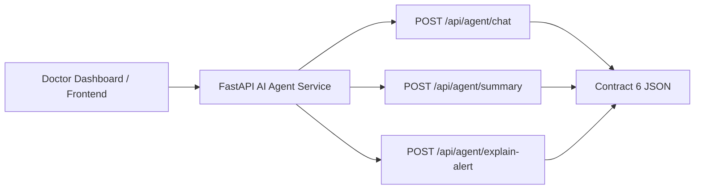

Muc tieu chinh:

- Tao 3 endpoint cong khai cho frontend.
- Bao dam moi response deu co cau truc Contract 6.
- Dung fixture co dinh de chay duoc ngay khong can DB.
- Cho phep goi LLM that khi co `OPENAI_API_KEY`.
- Safe fallback neu fixture, parse, schema, safety, hoac LLM fail.

---

## 2. So Do Tong The

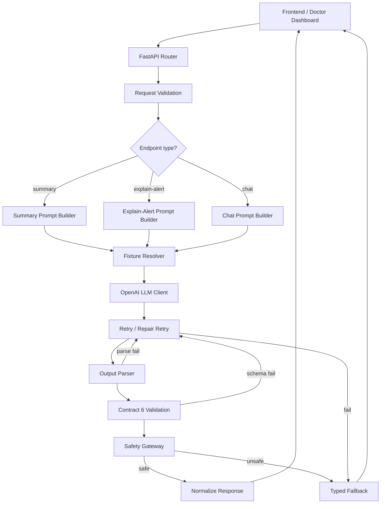

---

## 3. Module Map

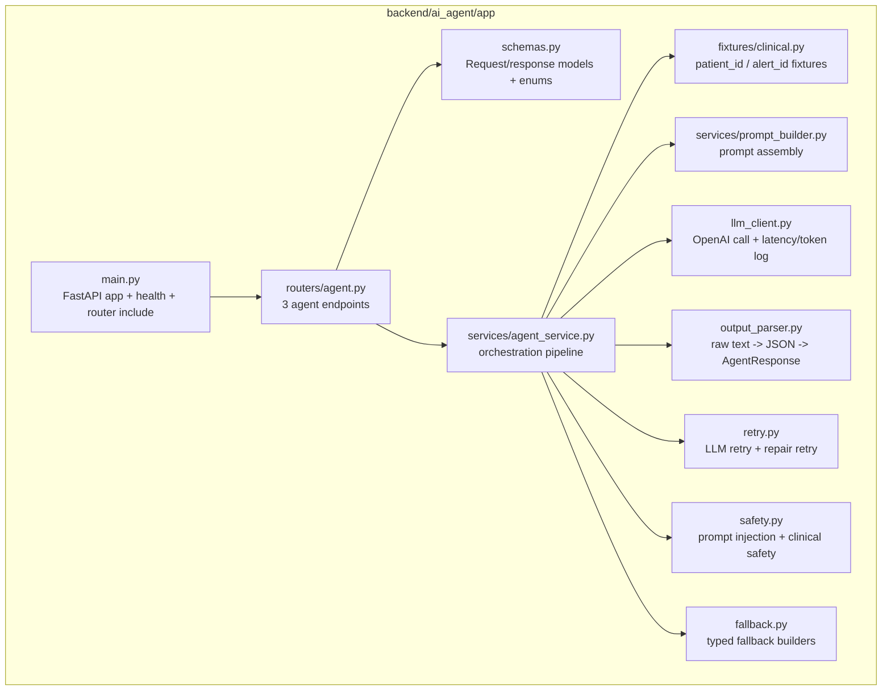

Module responsibilities:

- `schemas.py`: request validation, Contract 6 response model, enum values, `generated_at` overwrite.
- `fixtures/clinical.py`: deterministic mock patient and alert data.
- `prompt_builder.py`: build prompt cho `summary`, `explain-alert`, `chat`.
- `agent_service.py`: coordinate fixture resolution, LLM call, parse, validation, safety, fallback.
- `llm_client.py`: call OpenAI và log token/latency.
- `output_parser.py`: parse raw LLM text thành JSON object va validate schema.
- `retry.py`: retry transient failures va repair retry khi parse/schema fail.
- `safety.py`: classify prompt injection va check clinical safety.
- `fallback.py`: tao response an toan theo tung `response_type`.

---

## 4. Endpoint Behavior

### 4.1 Summary

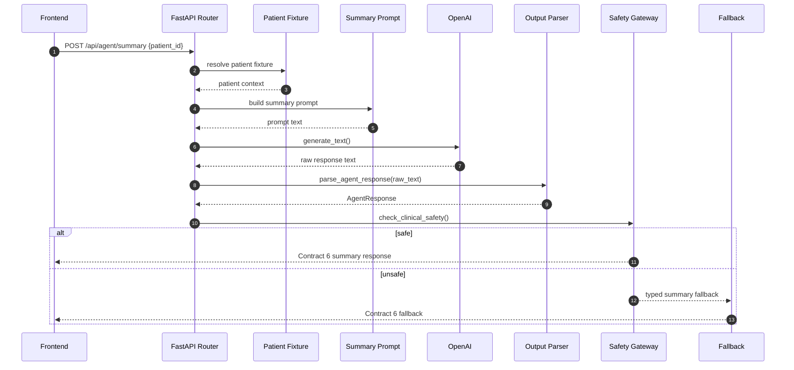

Expected output for frontend:

- `response_type = "summary"`
- `source_id = patient_id`
- `visualizations.has_chart` co the `true` neu co du lieu time-series
- `comparisons.has_comparison` co the `false` hoac `true` tuy prompt/fixture
- `narrative_summary` giai thich xu huong va gioi han du lieu

### 4.2 Explain-Alert

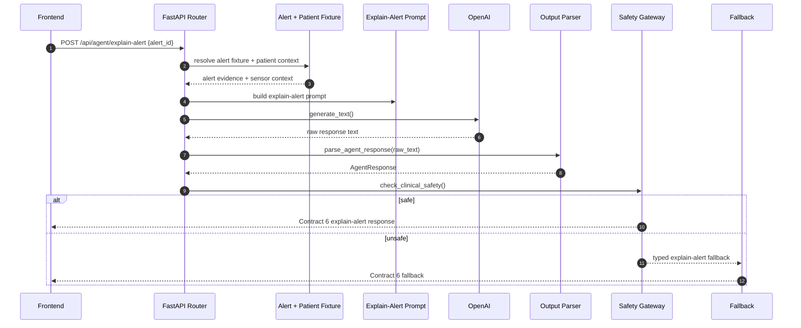

Expected output for frontend:

- `response_type = "explain-alert"`
- `source_id = alert_id`
- `visualizations` thuong la chart quanh thoi diem canh bao
- `comparisons` thuong la bang evidence/diễn giải
- `narrative_summary` nhan manh y nghia canh bao va gioi han lâm sàng

### 4.3 Chat

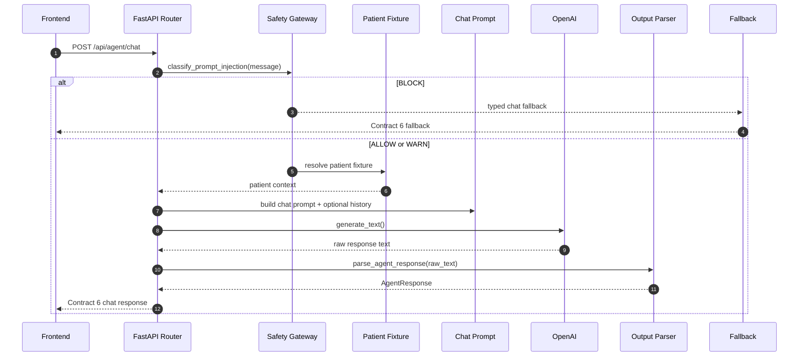

Expected output for frontend:

- `response_type = "chat"`
- `source_id = conversation_id` neu co, nguoc lai `patient_id`
- `history` la optional trong Sprint 1
- `chat` hien tai la stateless, khong co server-side memory

---

## 5. Fixture Strategy

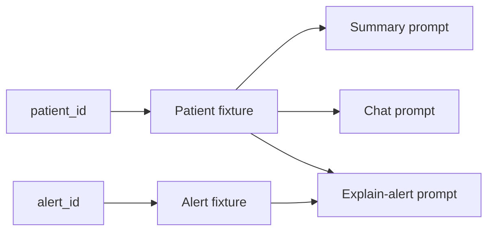

Quy uoc:

- `patient_id` la khoa co dinh cho `summary` va `chat`.
- `alert_id` la khoa co dinh cho `explain-alert`.
- Fixture la du lieu mock Sprint 1, khong phai DB query.
- Khi chuyen sang giai doan sau, layer nay co the thay bang database resolver ma khong can doi router contract.

Sample fixture content:

- Patient profile
- Medical history
- Recent vitals
- Recent alerts
- Alert evidence
- Sensor context quanh thoi diem canh bao

---

## 6. Retry, Parse, Fallback

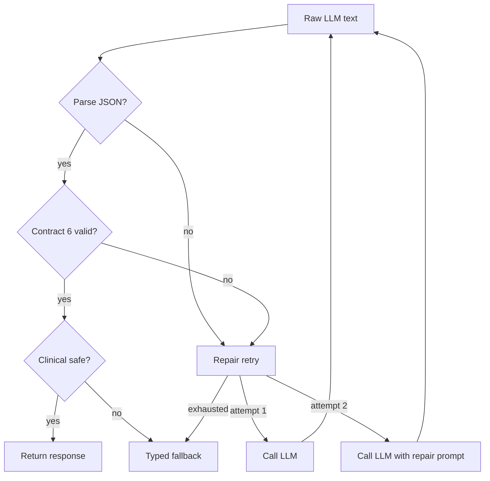

Retry categories:

- Transient OpenAI/network/rate-limit -> `run_with_llm_retry`
- Parse or schema fail -> `run_with_repair_retry`
- Missing config -> no unbounded retry, fallback thang
- Unsafe response -> fallback

Frontend luon nhan:

- JSON hop le
- hoac typed fallback hop le
- khong nhan raw exception

---

## 7. Safety Gateway

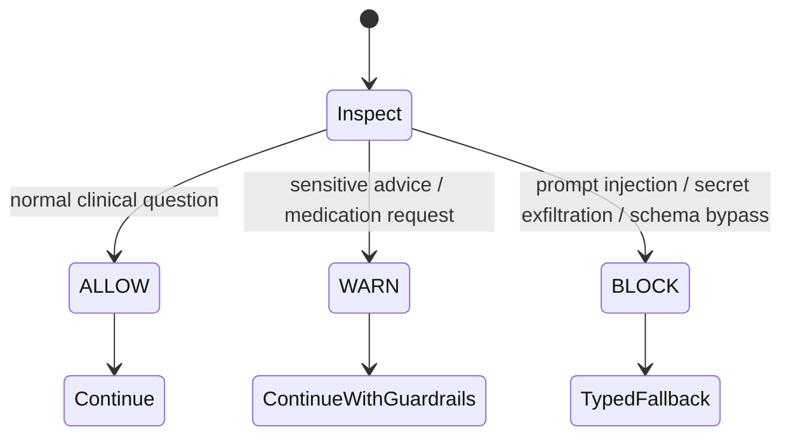

`WARN` trong Sprint 1 la decision noi bo, frontend khong can nhin thay decision nay.

`BLOCK` se:

- khong goi LLM
- tra fallback an toan
- giu response Contract 6

---

## 8. Contract 6 Shape

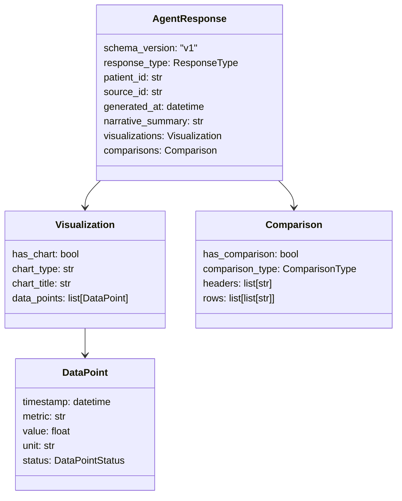

Frontend should interpret:

- `has_chart = true` -> render chart
- `has_chart = false` -> hide chart
- `has_comparison = true` -> render table
- `has_comparison = false` -> hide table

`source_id` rules:

- summary -> `patient_id`
- explain-alert -> `alert_id`
- chat -> `conversation_id` if present, otherwise `patient_id`

---

## 9. Frontend Working Model

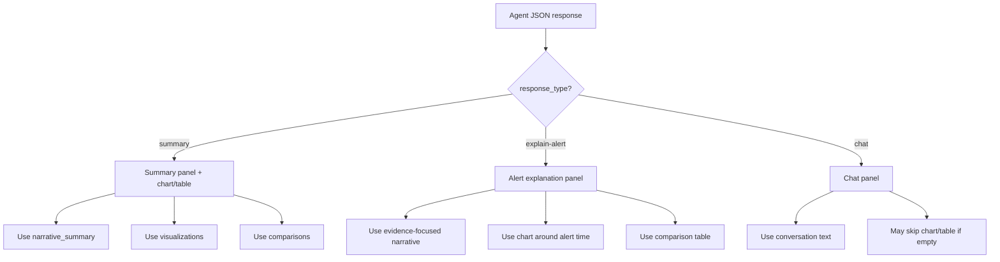

Guidance for frontend:

- Do not parse raw LLM text.
- Only use Contract 6 fields.
- Response fallback vẫn là response hợp lệ để render an toàn.
- Nếu `visualizations.has_chart = false` thì đừng cố vẽ chart rỗng.
- Nếu `comparisons.has_comparison = false` thì đừng render bảng.

---

## 10. Test Coverage

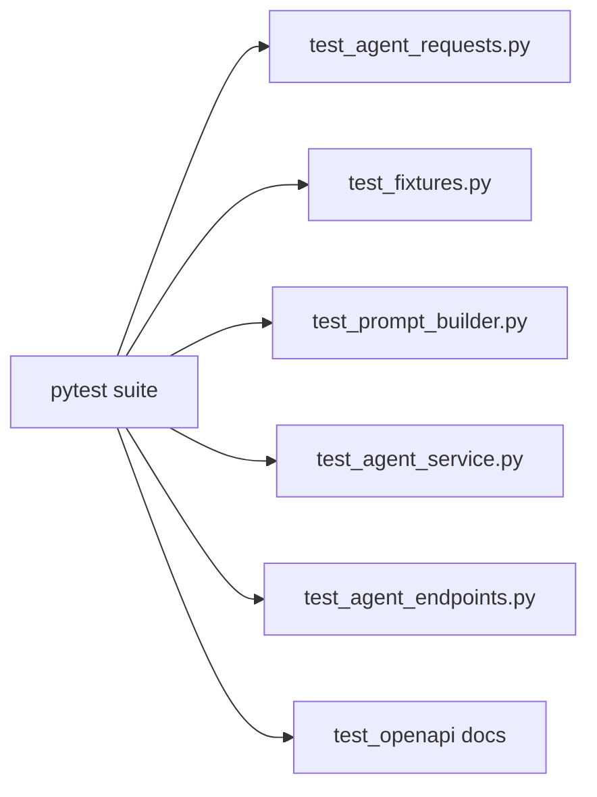

Test should prove:

- request validation works
- fixtures resolve deterministically
- prompt builders include the right contract instructions
- service can parse valid LLM output
- malformed LLM output falls back safely
- missing LLM config falls back safely
- endpoints appear in OpenAPI docs

---

## 11. Ranh Gioi Voi Issue Khac

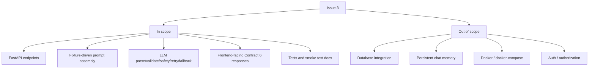

Neu Issue 2 la "response an toan va hop contract", thi Issue 3 la "doi response an toan do thanh API surface de frontend dung duoc ngay".
