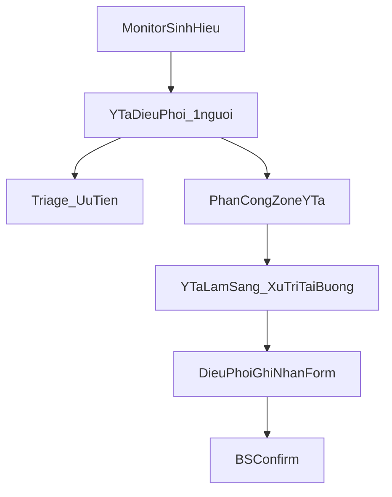
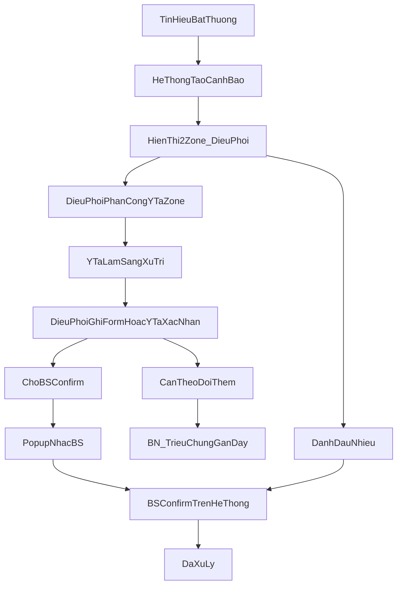
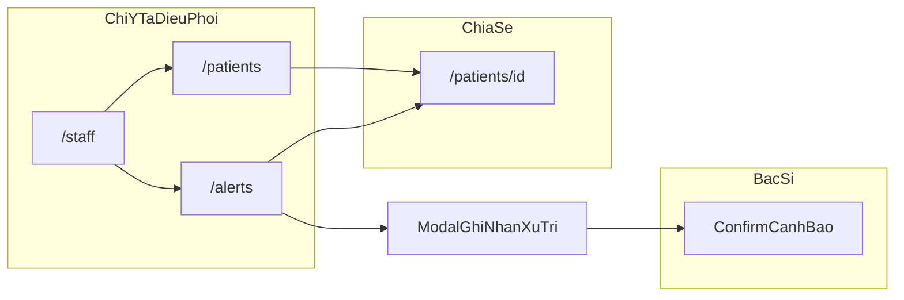

# PRD — Nghiệp vụ Operator & Màn hình CareSignal AI

**Phiên bản:** 0.2  
**Ngày:** 2026-06-09  
**Cập nhật 0.2:** Phân tách **y tá điều phối ca** (người dùng màn operator) vs **y tá lâm sàng**; thêm màn **quản lý nhân sự ca trực**.
**Nguồn:** Buổi advisor ([advisor-meeting-operator-discovery.md](./advisor-meeting-operator-discovery.md))  
**Phạm vi:** Ca trực theo dõi sinh hiệu & xử lý cảnh báo (operator / y tá–điều dưỡng). Module hàng đợi khám (mục 10 advisor) được mô tả ở cuối như track riêng.

---

## 1. Tóm tắt

CareSignal AI hỗ trợ **ca trực** theo dõi bệnh nhân qua dữ liệu sinh hiệu (hiện mô phỏng). Hệ thống **không chẩn đoán**, **không thay thế quyết định lâm sàng**.

**Mục tiêu hệ thống ca trực:**
- **Một y tá điều phối** trên ca nắm toàn cảnh monitor, cảnh báo, ưu tiên và phân công
- **Y tá lâm sàng** tập trung xử trí trực tiếp tại buồng — **không** dùng đầy đủ màn operator
- Ghi nhận xử trí **đúng người, đúng zone**, truy vết được (audit)
- Rút ngắn thời gian từ tín hiệu bất thường đến can thiệp

**Disclaimer bắt buộc trên UI:**  
*Chỉ hỗ trợ tham khảo, không thay thế chẩn đoán. Luôn dùng đánh giá lâm sàng của nhân viên y tế.*

---

## 2. Vai trò người dùng

### 2.1 Ba vai trò chính

| Vai trò | Số lượng / ca | Dùng hệ thống | Mô tả |
|---------|---------------|---------------|--------|
| **Y tá điều phối ca trực** | **1** | **Đầy đủ** màn operator (`/patients`, `/alerts`, `/staff`) | Ngồi trạm y tá / monitor; triage cảnh báo; phân công; ghi nhận hồ sơ; nhắc BS |
| **Y tá lâm sàng** (zone nurse) | Nhiều | **Hạn chế / không** dùng màn chính | Bận xử trí trực tiếp tại buồng; được **gán zone** và **ghi nhận là người xử lý** trên form |
| **Bác sĩ trực** | Nhiều (theo khoa) | Một phần màn chung + màn custom | Xem cảnh báo, **confirm** sau khi y tá xử trí, điền kết luận |

**Nguyên tắc thiết kế:** Màn **Bệnh nhân**, **Cảnh báo**, **Quản lý ca trực** là workspace của **y tá điều phối** — không yêu cầu mọi y tá lâm sàng đăng nhập hay thao tác trên các màn này.

### 2.2 Phân công zone (A2)

- Y tá lâm sàng và bác sĩ được **assign zone / khu vực** theo lịch trực (cấu hình trên màn **Quản lý ca trực**)
- Mọi form xử lý cảnh báo ghi **người xử lý thực tế** (y tá lâm sàng tại zone) + **người ghi nhận** (điều phối, nếu nhập hộ)
- Ca trực gắn `shiftId` để audit

### 2.3 Hiển thị cảnh báo (A1)

- Cảnh báo đồng thời tới **điều phối** và **bác sĩ** (popup / danh sách chờ confirm)
- Y tá lâm sàng nhận việc qua **phân công từ điều phối** (gọi điện / nhắn / in phiếu — ngoài hệ thống) hoặc (phase sau) thông báo tối giản

---

## 3. Nghiệp vụ cốt lõi

### 3.1 Quy trình xử lý cảnh báo (as-is mong muốn)

**Thứ tự xử lý lâm sàng (B3):**
1. Đo lại sinh hiệu  
2. Quan sát triệu chứng  
3. Báo bác sĩ nếu không cải thiện  

**Nguyên tắc:**
- Mỗi cảnh báo xử lý **riêng lẻ** (B5) — không gộp phiên khi nhiều cảnh báo cùng bệnh nhân
- **Không có** loại cảnh báo nào được đóng mà **không qua xác nhận bác sĩ trên hệ thống** (B4)
- Cảnh báo **luôn hiển thị** cho đến khi có xác nhận; mọi thao tác **được log** (B2, D4)

### 3.2 Trạng thái cảnh báo

| Trạng thái (UI) | Mã hệ thống | Ai thao tác | Mô tả |
|-----------------|-------------|-------------|--------|
| Chưa xử lý | `open` | — | Mới phát sinh, chưa có ghi nhận y tá |
| Đã xử trí sơ bộ / chờ BS | `nurse_treated` | Điều phối (thay mặt ghi) | Form đủ; ghi **y tá lâm sàng** là người xử lý; chờ BS |
| Cần theo dõi thêm | `needs_follow_up` | Điều phối | BN → **triệu chứng gần đây** + note |
| Nhiễu thiết bị | `noise` | Điều phối | **Bắt buộc mô tả ngắn** |
| Đã xử lý | `doctor_confirmed` | Bác sĩ | BS confirm trên hệ thống + kết luận |

**Hai vùng hiển thị (B1)** — theo `severity` cảnh báo, không phải trạng thái workflow:

| Zone UI | Điều kiện |
|---------|-----------|
| Cảnh báo nghiêm trọng | `severity = critical` |
| Cảnh báo | `severity = warning` hoặc `info` |

### 3.3 Form xử lý cảnh báo

**Người thao tác form trên hệ thống:** y tá **điều phối** (nhập sau khi y tá lâm sàng xử trí tại buồng, hoặc y tá lâm sàng xác nhận tối giản — phase sau).

**Trường bắt buộc (D1, A3)** — nội dung **ô text**, không dropdown preset (D2):

| Trường | Bắt buộc | Ghi chú |
|--------|----------|---------|
| Thời gian xử lý | Có (hệ thống) | Auto |
| **Y tá lâm sàng xử lý** | Có | Chọn từ **danh sách ca trực** (màn `/staff`) |
| Người ghi nhận | Có | Điều phối đang đăng nhập |
| Zone / khu vực | Có | Theo phân công ca |
| Triệu chứng / trạng thái trước xử trí | Có | |
| Hành động xử trí | Có | |
| Trạng thái sau xử trí | Có | |
| Kết quả: theo dõi thêm / hoàn tất | Có | Nếu theo dõi thêm → D3 |

**Bác sĩ bổ sung:** trường **kết luận** khi confirm.

**Hồ sơ không đạt:** thiếu **toàn bộ** các trường bắt buộc (D1).

### 3.4 Audit & pháp lý (D4)

- Mọi thay đổi trạng thái: `actor`, `role`, `timestamp`, `payload`
- **Không** sửa im lặng; không xóa lịch sử
- Nội dung AI **không** tự động vào hồ sơ (E4 — khi triển khai)

### 3.5 Loại tín hiệu ưu tiên (F3)

Trên màn bệnh nhân, operator cần nhận diện nhanh:
- **Ngã** (fall)
- **Stroke** / đột quỵ nghi ngờ
- **Bất thường đột ngột** trong 4 chỉ số: nhịp tim, nhịp thở, huyết áp, oxy máu

### 3.6 AI trong nghiệp vụ operator (E1)

- **Hỏi AI** theo **từng cảnh báo** (giải thích ngắn + chỉ số cụ thể)
- Không tin nếu: quá dài, thiếu evidence
- Không đề xuất điều trị; không ngôn ngữ giống chẩn đoán

### 3.7 Quy mô vận hành (F1, F2)

- **10–30 bệnh nhân** / ca trực
- **Desktop-first** tại trạm y tá; không yêu cầu mobile trong phase này

---

## 4. Sơ đồ màn hình & điều hướng

**Navbar điều phối (planned):** Ca trực · Bệnh nhân · Cảnh báo · (Mô phỏng — nội bộ)

**Lưu ý:** Bubble chat ca trực trên `/patients` dành cho điều phối; không triển khai chat tự do cho toàn bộ y tá lâm sàng (chờ xác nhận E3).

---

## 5. Mô tả từng màn hình

> **Quyền truy cập:** Các mục **5.1–5.2, 5.4–5.6** và **5.10** dành cho **y tá điều phối** (1 người/ca). Y tá lâm sàng **không** vào các màn này trong MVP.

### 5.10 Màn Quản lý ca trực — `/staff` (planned)

**Mục đích:** Cấu hình nhân sự và phân công trước / trong ca — nền tảng cho ghi nhận đúng người và zone (A2).

**Người dùng:** Chỉ **y tá điều phối**.

| Khu vực | Nội dung |
|---------|----------|
| **Thông tin ca** | Ca trực hiện tại, khoa, thời gian bắt đầu–kết thúc |
| **Danh sách y tá lâm sàng** | Tên, zone phụ trách, trạng thái (đang trực / nghỉ) |
| **Danh sách bác sĩ trực** | Tên, khoa/zone, liên hệ |
| **Phân công zone** | Gán BN hoặc khu vực (buồng/tầng) cho từng y tá |
| **Điều phối viên** | Chỉ định **1 y tá điều phối** đang active (thường là user hiện tại) |

**Hành động:**
- Thêm / gỡ nhân sự khỏi ca (theo lịch trực)
- Đổi zone khi handover giữa ca
- Xem ai đang phụ trách zone nào khi phân công cảnh báo

**Liên kết nghiệp vụ:**
- Form xử lý cảnh báo → dropdown **“Y tá lâm sàng xử lý”** lấy từ danh sách này
- Filter cảnh báo theo zone / y tá phụ trách (planned)

**Trạng thái triển khai:** **Chưa có** — màn mới.

---

### 5.1 Màn Danh sách bệnh nhân — `/patients`

**Mục đích:** **Y tá điều phối** — tổng quan ca; briefing từ monitor; ưu tiên ai cần chú ý (C1, C2).

| Khu vực | Nội dung | Nghiệp vụ |
|---------|----------|-----------|
| **Tóm tắt buổi sáng** (cột trái) | BN cần chú ý / ổn định | Briefing từ **monitor** (C2) |
| **Bảng bệnh nhân** (cột phải) | Danh sách full ca | Sắp theo **mức nghiêm trọng + số cảnh báo mở** |
| **Badge tín hiệu** (planned F3) | Ngã, stroke, spike 4 chỉ số | Nhận diện nhanh trên từng dòng |

**Hành động:**
- Mở chi tiết bệnh nhân
- (Planned C3) Popup giữa ca nhắc rà soát nhóm ổn định

**Trạng thái triển khai:** Có — briefing + bảng; thiếu badge F3, popup C3.

---

### 5.2 Màn Lịch sử cảnh báo — `/alerts`

**Mục đích:** **Y tá điều phối** — rà soát cảnh báo 2 zone, phân công y tá zone, ghi nhận xử trí, nhắc BS.

| Khu vực | Nội dung | Nghiệp vụ |
|---------|----------|-----------|
| **Zone: Cảnh báo nghiêm trọng** | `critical` | Ưu tiên cao |
| **Zone: Cảnh báo** | `warning`, `info` | Theo dõi |
| **Filter / zone** | Tìm kiếm, BN, **mức độ BN**, trạng thái workflow | Lọc độc lập |
| **Dòng cảnh báo** | Thời gian, BN, loại, evidence, trạng thái | Mỗi dòng = 1 cảnh báo (B5) |

**Hành động trên mỗi dòng:**

| Nút | Vai trò | Trạng thái |
|-----|---------|------------|
| Phân công | Gán y tá zone xử lý | **Planned** |
| Hỏi AI | Điều phối (BS có thể xem) | **Có** — panel slider phải |
| Chi tiết | Mở `/patients/[id]` | **Có** |
| Ghi nhận xử trí | Điều phối → form + chọn y tá lâm sàng | **Planned** |
| (Planned) Đánh dấu nhiễu | Y tá + mô tả | Chưa có |
| (Planned) Timer đã chờ | Hiển thị phút từ lúc `open` | Chưa có |

**Panel Hỏi AI (slider phải):**
- Giải thích cảnh báo ngắn + evidence
- Chat tiếp trong ngữ cảnh cảnh báo
- Disclaimer AI

**Trạng thái triển khai:** Layout 2 zone + filter + AI panel **có**; workflow 2 bước y tá→BS **chưa**.

---

### 5.3 Màn Chi tiết bệnh nhân — `/patients/[patientId]`

**Mục đích:** Ngữ cảnh BN cho **điều phối** (và **bác sĩ** khi review). Y tá lâm sàng không bắt buộc mở màn này.

| Khu vực | Nội dung |
|---------|----------|
| Header | Tên, khoa, giường, trạng thái BN |
| Chỉ số / biểu đồ | 4 chỉ số chính (compact) |
| Cảnh báo | Danh sách alert gần đây (cột phải) |
| Panel AI | Tóm tắt / hỏi thêm về BN |

**Liên kết nghiệp vụ:** Từ cảnh báo hoặc briefing → vào đây để xem trend trước khi điền form xử trí.

**Trạng thái triển khai:** **Có** (layout metrics + alerts + AI).

---

### 5.4 Modal / Form xử lý cảnh báo (planned)

**Kích hoạt:** Từ `/alerts` hoặc chi tiết BN — nút **“Bắt đầu xử trí”** / **“Ghi nhận xử trí”**.

| Trường | Loại UI |
|--------|---------|
| Triệu chứng trước xử trí | Textarea bắt buộc |
| Hành động xử trí | Textarea bắt buộc |
| Trạng thái sau xử trí | Textarea bắt buộc |
| Theo dõi thêm / Hoàn tất | Radio hoặc toggle |
| Ghi chú (nếu nhiễu) | Text bắt buộc khi chọn nhiễu |

**Sau submit (điều phối):**
- Trạng thái → `nurse_treated` (hoặc `noise` / `needs_follow_up`)
- Ghi nhận gắn **y tá lâm sàng** đã thực hiện xử trí
- Cảnh báo filter **“Chờ bác sĩ”**; **popup nhắc BS** confirm

---

### 5.5 Luồng Bác sĩ confirm (planned)

**Màn dùng chung:** `/alerts` (filter “Chờ xác nhận”) hoặc widget trên dashboard.

| Hành động | Mô tả |
|-----------|--------|
| Xem form y tá | Read-only |
| Điền kết luận | Text bắt buộc |
| Xác nhận | → `doctor_confirmed` |
| Từ chối / yêu cầu bổ sung | (TBD) — log + trả về y tá |

**Popup nhắc:** Khi y tá submit form → thông báo BS có cảnh báo chờ confirm.

---

### 5.6 Popup giữa ca — BN ổn định (planned, C3)

- Xuất hiện **giữa ca trực** (một lần / configurable)
- Nội dung đơn giản: số BN ổn định, gợi ý rà soát nhanh
- Không chặn workflow; dismiss được

---

### 5.7 Modal cảnh báo toàn cục — `GlobalAlertModal` (nếu bật)

- Popup khi có cảnh báo nghiêm trọng mới (real-time — planned)
- Link nhanh tới BN / alerts

**Trạng thái:** Component **có**; push real-time **chưa** (ngoài scope MVP).

---

### 5.8 Màn Mô phỏng — `/metrics` (nội bộ)

- Dành team kỹ thuật / demo pipeline
- **Không** nằm trong luồng operator hàng ngày

---

### 5.9 Màn Dashboard — `/dashboard` (workspace AI)

- Workspace chat AI đầy đủ (sidebar, thread)
- Dùng chung một phần với BS (G1)
- **Không** thay thế luồng xử lý cảnh báo operator trên `/alerts`

---

## 6. Ma trận màn × vai trò

| Màn | Y tá điều phối | Y tá lâm sàng | Bác sĩ |
|-----|----------------|---------------|--------|
| `/staff` | **Quản lý ca, phân zone** | — | Xem (optional) |
| `/patients` | **Briefing, triage** | — | Tổng quan |
| `/alerts` | **Phân công, ghi form, Hỏi AI** | — | Confirm + kết luận |
| `/patients/[id]` | Review trước khi ghi | — | Review |
| Popup nhắc BS | Kích hoạt nhắc | — | Nhận nhắc |
| `/metrics` | — | — | — (nội bộ) |
| `/dashboard` | Tùy chọn | — | AI workspace |

**Y tá lâm sàng (ngoài hệ thống MVP):** nhận chỉ đạo từ điều phối (miệng / điện thoại); xử trí tại buồng. Phase sau có thể thêm xác nhận mobile tối giản (“đã nhận việc”).

---

## 7. Dữ liệu & API (yêu cầu sản phẩm)

### 7.1 Entities

- `Alert` — mở rộng `workflowStatus`, `assignedZone`, timestamps
- `AlertActionLog` — audit từng bước
- `Patient` — `status` gồm `recent_symptom` khi D3
- `Shift` — ca trực hiện tại (khoa, thời gian)
- `ShiftStaff` — y tá / BS trên ca: `role`, `zone`, `status`
- `ShiftAssignment` — gán zone ↔ nhân sự ↔ (optional) danh sách BN

### 7.2 API tối thiểu (planned)

| Method | Endpoint | Mô tả |
|--------|----------|--------|
| GET | `/api/alerts` | List + filter |
| POST | `/api/alerts/{id}/actions` | `nurse_treat`, `mark_noise`, `needs_follow_up`, `doctor_confirm` |
| GET | `/api/alerts/{id}/history` | Audit log |
| GET/PUT | `/api/shifts/current` | Ca trực hiện tại |
| GET/POST/DELETE | `/api/shifts/current/staff` | Nhân sự ca trực, phân zone |

---

## 8. Ngoài phạm vi PRD này (track riêng)

**Hàng đợi khám đầu ngày** (advisor mục 10) — PRD riêng `clinic-queue-prd.md` (chưa viết):

- Queue + estimate thời gian
- Cảnh báo BN đợi **> 30 phút** so với giờ hẹn
- Log lý do trễ
- Operator điều phối vs BS theo khoa

**Chưa làm rõ với advisor:** E3 (chat tự do ca trực), G2/G3 (checklist cuối ca), bàn giao ca D5.

---

## 9. Lộ trình giao hàng (gợi ý)

| Phase | Nội dung | Màn bị ảnh hưởng |
|-------|----------|------------------|
| **P0** | PRD + spec (tài liệu này) | — |
| **P1a** | Màn `/staff` + API ca trực / phân zone | `/staff` |
| **P1b** | Workflow điều phối ghi form → BS confirm, audit, nhiễu | `/alerts`, API |
| **P2** | AI ngắn + evidence; badge F3; timer chờ | `/alerts`, `/patients` |
| **P3** | Popup giữa ca C3 | `/patients` |
| **P4** | Clinic queue module | Màn mới |

---

## 10. Tiêu chí chấp nhận (operator MVP)

1. Chỉ **y tá điều phối** truy cập `/patients`, `/alerts`, `/staff` (role-based)
2. Trên `/staff`: cấu hình được ≥1 y tá lâm sàng + bác sĩ trực và **zone** tương ứng
3. Điều phối ghi form đủ trường + chọn **y tá lâm sàng xử lý** → cảnh báo **chờ BS**
4. BS confirm + kết luận → **đã xử lý**; audit log đầy đủ
5. **Nhiễu** bắt buộc mô tả
6. Hai zone + filter; quy mô 10–30 BN
7. Hỏi AI ngắn + evidence; disclaimer
8. Y tá lâm sàng **không bắt buộc** đăng nhập hay dùng màn operator chính

---

## 11. Tham chiếu

- [advisor-meeting-operator-discovery.md](./advisor-meeting-operator-discovery.md) — câu hỏi & trả lời advisor
- [mvp-demo-plan.md](./mvp-demo-plan.md) — kịch bản demo kỹ thuật
- Frontend: `ClinicalShell`, `AlertZonePanel`, `AlertAIChatPanel`, `app/patients`, `app/alerts`
