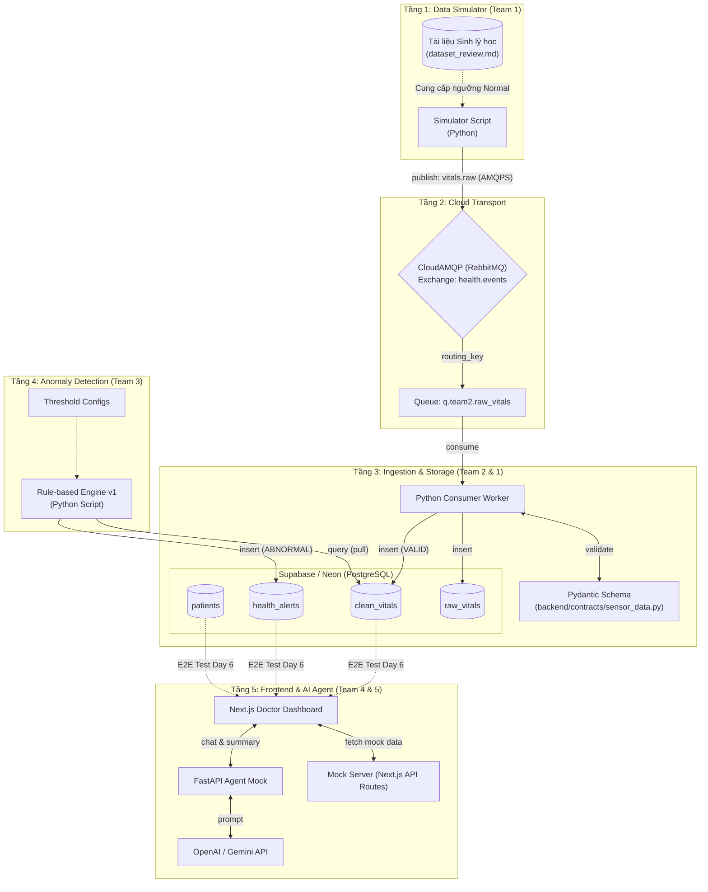

# KIẾN TRÚC HỆ THỐNG - SPRINT 1 (SKELETON & NORMAL STREAM)
## ĐỀ TÀI: E2E SIMULATION FOR AI HEALTH

Tài liệu này mô tả kiến trúc kỹ thuật cụ thể sẽ được triển khai trong **Sprint 1 (6 ngày)**. Mục tiêu của Sprint 1 không phải là xây dựng toàn bộ tính năng phức tạp, mà là **dựng khung xương (Skeleton) cho toàn bộ hệ thống** và đảm bảo **luồng dữ liệu bình thường (Normal Stream)** có thể đi xuyên suốt từ Simulator đến UI.

---

## 1. SƠ ĐỒ KIẾN TRÚC SPRINT 1 (SYSTEM ARCHITECTURE DIAGRAM)

Trong Sprint 1, hệ thống chưa có luồng Machine Learning phức tạp hay RAG Database. Thay vào đó, chúng ta sử dụng Rule-based Engine và các Mock API để đảm bảo luồng E2E được thông suốt.

---

## 2. CHI TIẾT CÁC THÀNH PHẦN KIẾN TRÚC TRONG SPRINT 1

### 2.1. Tầng 1: Data Simulator (Phụ trách: Team 1)
*   **Công nghệ:** Python.
*   **Chức năng Sprint 1:** Sinh dữ liệu sinh hiệu ngẫu nhiên nhưng nằm trong giới hạn sinh lý học bình thường (Normal Stream) dựa trên tài liệu `dataset_review.md`. Không tạo kịch bản té ngã hay lỗi phức tạp.
*   **Giao thức:** Sử dụng thư viện `pika` (Python) để kết nối trực tiếp đến CloudAMQP qua giao thức bảo mật `amqps://`. Định kỳ 1 giây/lần (1 Hz) bắn gói tin JSON.

### 2.2. Tầng 2: Cloud Transport (Phụ trách thiết lập: Team 1)
*   **Dịch vụ:** CloudAMQP (Gói miễn phí Little Lemur).
*   **Cấu trúc Sprint 1:**
    *   **Exchange:** `health.events` (Kiểu: `topic`).
    *   **Queue:** `q.team2.raw_vitals`.
    *   **Routing Key:** `vitals.raw`.

### 2.3. Tầng 3: Ingestion & Storage (Phụ trách: Team 2)
*   **Công nghệ:** Python, Supabase (PostgreSQL), Pydantic.
*   **Chức năng Sprint 1:** 
    *   **Consumer:** Chạy ngầm, đọc tin nhắn liên tục từ `q.team2.raw_vitals`.
    *   **Validation:** Dùng cấu trúc chuẩn tại `backend/contracts/sensor_data.py` để xác thực kiểu dữ liệu. Lọc bỏ các dữ liệu vật lý phi lý (ví dụ: nhịp tim = 0) và gán nhãn trạng thái kỹ thuật `FAULT`.
    *   **Lưu trữ:** Ghi gói tin thô vào bảng `raw_vitals` và dữ liệu đã làm sạch vào bảng `clean_vitals` trên Supabase bằng thư viện `psycopg2` hoặc `SQLAlchemy`.

### 2.4. Tầng 4: Rule-based Anomaly (Phụ trách: Team 3)
*   **Công nghệ:** Python, SQL.
*   **Chức năng Sprint 1:** Khởi tạo một script chạy ngầm (Worker). Thay vì dùng mô hình Machine Learning, script này sẽ thực hiện các câu truy vấn (query) định kỳ vào bảng `clean_vitals` để kiểm tra tĩnh.
*   **Logic:** So sánh chỉ số (Nhịp tim, Huyết áp) với bảng cấu hình ngưỡng tĩnh. Nếu vượt ngưỡng $\rightarrow$ Tạo bản ghi cảnh báo thô và `INSERT` vào bảng `health_alerts`.

### 2.5. Tầng 5: Frontend Dashboard & API Mocking (Phụ trách: Team 4)
*   **Công nghệ:** Next.js, Tailwind CSS, TypeScript, Chart.js / Recharts.
*   **Chức năng Sprint 1:** 
    *   Dựng khung giao diện UI tĩnh.
    *   **Tách biệt logic (Decoupling):** Để không bị kẹt khi chờ Team 2/3 hoàn thiện DB, Team 4 sẽ tự dựng các API Routes ảo bên trong Next.js (`/api/patients`, `/api/vitals`) trả về chuỗi JSON tĩnh. Frontend sẽ fetch dữ liệu từ các API ảo này để vẽ đồ thị thời gian thực.
    *   **Tích hợp E2E (Day 6):** Cuối Sprint 1, thay thế đường dẫn API ảo bằng các câu lệnh truy vấn trực tiếp vào Supabase (hoặc thông qua một Portal Backend đơn giản nếu kịp thời gian) để lấy dữ liệu thật.

### 2.6. Tầng 6: AI Agent Service Mock (Phụ trách: Team 5)
*   **Công nghệ:** FastAPI, OpenAI/Gemini API.
*   **Chức năng Sprint 1:** Dựng RESTful API chạy cục bộ (localhost).
    *   Tạo endpoints `/api/agent/summary` và `/explain-alert`.
    *   Tuy có kết nối với LLM để đảm bảo luồng hoạt động, nhưng trong Sprint 1, Agent sẽ **trả về cấu trúc JSON tĩnh (Mock JSON)** tuân thủ đúng định dạng Hybrid Output (có mảng dữ liệu vẽ đồ thị) đã quy định trong Data Contract.

---

## 3. CÁC QUY ƯỚC KỸ THUẬT QUAN TRỌNG CHO SPRINT 1

1.  **Bảo mật:** Toàn bộ thông tin nhạy cảm (AMQP URL, Supabase Connection String, OpenAI API Key) **BẮT BUỘC** phải được lưu trong file `.env` và thêm vào `.gitignore`. Không ai được push thông tin này lên Github.
2.  **Chia sẻ `.env`:** Team 1 người 1 sẽ tạo một file `sample.env` (chứa các key trống) push lên Git, và chia sẻ riêng file `.env` chứa mật khẩu thật cho các thành viên qua kênh chat nội bộ.
3.  **Tập trung vào E2E:** Trong 5 ngày đầu, các team sử dụng dữ liệu giả (Mocking) để tự hoàn thiện giao diện/logic của mình. Đến ngày thứ 6 (Day 6), toàn bộ các module phải được trỏ vào cùng một nguồn Supabase DB và CloudAMQP để chạy thử nghiệm dòng chảy xuyên suốt.
