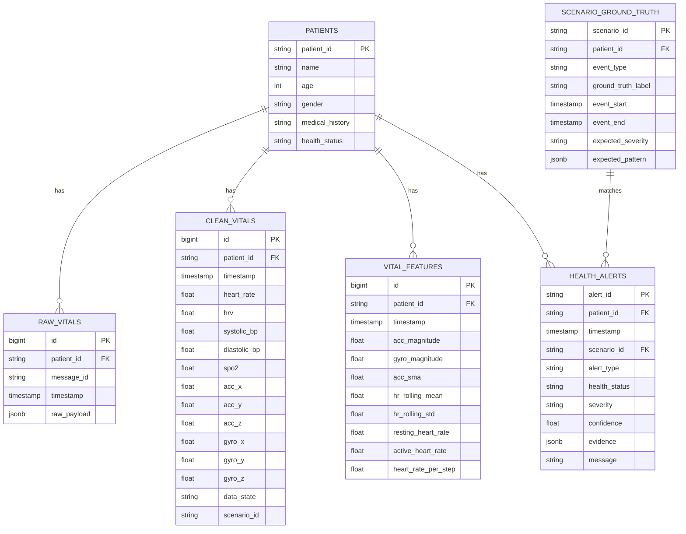

# MASTER DATA CONTRACTS - HỢP ĐỒNG DỮ LIỆU TỔNG THỂ HỆ THỐNG
## DỰ ÁN: E2E SIMULATION FOR AI HEALTH

Tài liệu này định nghĩa tất cả các giao thức, định dạng payload, cấu trúc cơ sở dữ liệu và đặc tả API giao tiếp giữa 5 nhóm nhỏ (Team 1 đến Team 5). Mọi thành viên bắt buộc phải tuân thủ tài liệu này để đảm bảo việc tích hợp (integration) hệ thống diễn ra suôn sẻ và có thể phát triển song song độc lập.

---

## 1. PHẠM VI GIAO TIẾP GIỮA CÁC TEAMS

Hệ thống hoạt động dựa trên các hợp đồng dữ liệu cốt lõi sau:
1.  **Contract 1 (Team 1 → Team 2):** Broker Message Contract (Định dạng dữ liệu thô truyền qua RabbitMQ).
2.  **Contract 2 (Team 2 & Team 3):** Data Quality vs. Health Status Contract (Quy định phân tách nhãn kỹ thuật và nhãn y học).
3.  **Contract 3 (Team 2 → Database):** Database Tables Schema Contract (Thiết kế các bảng lưu trữ raw, clean, features và profiles).
4.  **Contract 4 (Team 3 → Team 4 & 5):** Alert Schema Contract (Cấu trúc bản ghi cảnh báo bất thường).
5.  **Contract 5 (Team 2/3 Backend → Team 4 Frontend):** REST Portal API Contract (Đặc tả các endpoints truy vấn hồ sơ, sinh hiệu và alert).
6.  **Contract 6 (Team 5 AI Agent → Team 4 Frontend):** AI Agent Assistant API Contract (Quy định cấu hình chat, tóm tắt và sinh dữ liệu vẽ đồ thị/so sánh).
7.  **Contract 7 (Team 3/5 Validator → Team 1 Simulator):** Ground-truth & Quality Evaluation Contract (Quy định đối chiếu kiểm chứng dữ liệu giả lập).

---

## 2. CONTRACT 1: BROKER MESSAGE SCHEMA (TEAM 1 → TEAM 2)

Dữ liệu cảm biến thô do Simulator (Team 1) phát sinh và gửi qua CloudAMQP (RabbitMQ) đến Consumer (Team 2) phải tuân thủ định dạng dưới đây.

### 2.1. Đường dẫn tệp Schema dùng chung:
*   `backend/contracts/sensor_data.py` (Lớp Pydantic Model để validate).

### 2.2. Định dạng JSON Payload (Raw Vitals):
```json
{
  "message_id": "msg_000001",
  "schema_version": "v1",
  "patient_id": "P001",
  "device_id": "SIM_WATCH_001",
  "timestamp": "2026-05-28T10:05:02Z",
  "signals": {
    "heart_rate": 112,
    "hrv": 45,
    "systolic_bp": 116,
    "diastolic_bp": 76,
    "spo2": 98,
    "acc_x": 3.5,
    "acc_y": 2.9,
    "acc_z": 0.6,
    "gyro_x": 0.12,
    "gyro_y": 0.05,
    "gyro_z": 0.02
  },
  
}
```

### 2.3. Quy định đơn vị đo lường (Measurement Units):
*   `heart_rate`: Nhịp tim (Đơn vị: **bpm** - Nhịp/phút).
*   `hrv`: Biến thiên nhịp tim (Đơn vị: **ms** - mili-giây).
*   `systolic_bp` / `diastolic_bp`: Huyết áp tâm thu/tâm trương (Đơn vị: **mmHg**).
*   `spo2`: Độ bão hòa oxy trong máu (Đơn vị: **%**, dải từ 0 - 100).
*   `acc_x`, `acc_y`, `acc_z`: Gia tốc trọng trường theo 3 trục X-Y-Z (Đơn vị: **g**).
*   `gyro_x`, `gyro_y`, `gyro_z`: Vận tốc quay theo 3 trục X-Y-Z (Đơn vị: **deg/s** - độ/giây).
*   `timestamp`: Định dạng chuỗi chuẩn ISO 8601 UTC (`YYYY-MM-DDTHH:MM:SSZ`).
*   Tần suất lấy mẫu mẫu (Sampling Rate): **1 Hz** (1 giây gửi 1 gói tin).

---

## 3. CONTRACT 2: PHÂN TÁCH NHÃN TRẠNG THÁI (TEAM 2 & TEAM 3)

Để tránh nhầm lẫn giữa lỗi phần cứng thiết bị và bệnh lý y sinh, hệ thống chia làm 2 tầng gán nhãn:

### 3.1. Nhãn Trạng thái Kỹ thuật (Technical Data State) - Do Team 2 gán:
Ghi vào trường `data_state` trong bảng cơ sở dữ liệu:
*   `VALID`: Dữ liệu sạch, định dạng chuẩn, dải trị số hợp lý.
*   `INVALID`: Sai kiểu dữ liệu, thiếu trường bắt buộc.
*   `DUPLICATE`: Trùng lặp `message_id` hoặc trùng khớp `timestamp` cùng một bệnh nhân.
*   `FAULT` / `SENSOR_FAULT`: Cảm biến hỏng vật lý hoặc rơi ra ngoài (ví dụ: gia tốc phẳng hoàn toàn, nhịp tim = 0 kéo dài khi SpO2 vẫn 98%).

### 3.2. Nhãn Trạng thái Sức khỏe (Health Status) - Do Team 3 gán:
Ghi vào bảng `health_alerts` và cập nhật trường `health_status` của bệnh nhân:
*   `NORMAL`: Các chỉ số sinh hiệu hoàn toàn bình thường.
*   `WARNING`: Có chỉ số mấp mé ngưỡng nguy hiểm (cần theo dõi thêm).
*   `ABNORMAL`: Phát hiện bất thường rõ rệt (ngã, tụt đường huyết, tăng huyết áp).
*   `CRITICAL`: Tình trạng khẩn cấp đe dọa tính mạng (té ngã bất tỉnh, nhịp tim ngưng đập).

---

## 4. CONTRACT 3: DATABASE SCHEMA (TEAM 2 & TEAM 1 → DATABASE)

Cơ sở dữ liệu PostgreSQL trực tuyến (Supabase/Neon) do Team 1 khởi tạo cấu trúc và bàn giao cho Team 2 vận hành ghi dữ liệu phải tuân thủ thiết kế bảng sau:



---

## 5. CONTRACT 4: ALERT SCHEMA (TEAM 3 → DATABASE → TEAM 4 & 5)

Khi Team 3 phát hiện bất thường y tế, bản ghi Alert lưu vào bảng `health_alerts` phải tuân theo cấu trúc sau để Frontend và AI Agent có dữ liệu phân tích:

```json
{
  "alert_id": "ALT_FALL_0092",
  "patient_id": "P001",
  "timestamp": "2026-05-28T10:05:03Z",
  "scenario_id": "SCN_FALL_001",
  "alert_type": "fall_detected",
  "health_status": "ABNORMAL",
  "severity": "HIGH",
  "confidence": 0.94,
  "evidence": {
    "peak_acceleration": 4.8,
    "post_event_movement_level": 0.05,
    "event_window_seconds": 5
  },
  "message": "Phát hiện cú ngã đột ngột của bệnh nhân P001 kèm theo trạng thái bất động sau va chạm."
}
```

*Các loại `alert_type` được quy định:*
*   `fall_detected`: Phát hiện té ngã.
*   `blood_pressure_abnormal`: Cảnh báo huyết áp tăng/giảm đột ngột.
*   `heart_rate_abnormal`: Cảnh báo nhịp tim bất ổn.
*   `low_spo2`: Cảnh báo thiếu oxy máu.

---

## 6. CONTRACT 5: REST PORTAL API (BACKEND → TEAM 4 FRONTEND)

Đặc tả các API endpoints mà Backend API (Portal Backend của Team 2/3) cung cấp cho Frontend Dashboard:

### 6.1. Lấy danh sách bệnh nhân
*   **Endpoint:** `GET /api/patients`
*   **Response (200 OK):**
```json
[
  {
    "patient_id": "P001",
    "name": "Nguyễn Văn A",
    "age": 72,
    "gender": "Nam",
    "health_status": "WARNING"
  }
]
```

### 6.2. Lấy chi tiết sinh hiệu trượt (Real-time chart)
*   **Endpoint:** `GET /api/patients/{patient_id}/vitals`
*   **Query Params:**
    *   `limit`: Số lượng bản ghi gần nhất (mặc định: `100`).
    *   `time_window`: Khoảng thời gian lọc (ví dụ: `10m`, `1h`).
*   **Response (200 OK):**
```json
{
  "patient_id": "P001",
  "vitals_series": [
    {
      "timestamp": "2026-05-28T10:05:00Z",
      "heart_rate": 82,
      "hrv": 48,
      "systolic_bp": 120,
      "diastolic_bp": 80,
      "spo2": 98,
      "data_state": "VALID"
    }
  ]
}
```

### 6.3. Lấy danh sách cảnh báo của bệnh nhân
*   **Endpoint:** `GET /api/patients/{patient_id}/alerts`
*   **Response (200 OK):** Trả về mảng các đối tượng tuân thủ đúng **Alert Schema** tại Mục 5.

---

## 7. CONTRACT 6: AI AGENT CLINICAL ASSISTANT API (TEAM 5 → TEAM 4)

Giao tiếp giữa Doctor Dashboard và AI Agent Service (FastAPI) bắt buộc phải tuân thủ cấu trúc **Hybrid Output (Đầu ra hỗn hợp)**. Agent không chỉ trả về câu trả lời văn bản mà phải xuất cấu trúc JSON chứa dữ liệu vẽ đồ thị hoặc bảng so sánh.

### 7.1. Giao tiếp chat tự nhiên
*   **Endpoint:** `POST /api/agent/chat`
*   **Request Payload:**
```json
{
  "patient_id": "P001",
  "message": "Kích thước hạch của bệnh nhân này có thay đổi gì so với siêu âm tháng trước không?",
  "history": [
    {"role": "user", "content": "Xin chào"},
    {"role": "assistant", "content": "Tôi có thể giúp gì cho bác sĩ?"}
  ]
}
```

### 7.2. Tóm tắt tình trạng bệnh nhân (`/summary`) & Giải thích cảnh báo (`/explain-alert`)
*   **Endpoints:**
    *   `POST /api/agent/summary` (Payload: `{"patient_id": "P001"}`)
    *   `POST /api/agent/explain-alert` (Payload: `{"alert_id": "ALT_FALL_0092"}`)
*   **Response Payload chung (JSON Mode):**
```json
{
  "patient_id": "P001",
  "narrative_summary": "### Tóm tắt lâm sàng\nBệnh nhân P001 vừa kích hoạt cảnh báo té ngã vào lúc 10:05:03. Chỉ số gia tốc cho thấy va đập mạnh...\n\n### Khuyến nghị sơ cứu\nĐặt bệnh nhân nằm nghiêng, kiểm tra phản ứng cơ thể và gọi hỗ trợ.",
  "visualizations": {
    "has_chart": true,
    "chart_type": "time-series",
    "chart_title": "Nhịp tim bệnh nhân xung quanh thời điểm xảy ra sự cố",
    "data_points": [
      {"timestamp": "2026-05-28T10:04:55Z", "heart_rate": 78, "status": "NORMAL"},
      {"timestamp": "2026-05-28T10:05:00Z", "heart_rate": 112, "status": "ABNORMAL"},
      {"timestamp": "2026-05-28T10:05:05Z", "heart_rate": 95, "status": "WARNING"}
    ]
  },
  "comparisons": {
    "has_comparison": true,
    "comparison_type": "lesion-tracking",
    "headers": ["Chỉ tiêu so sánh", "Siêu âm cũ (28/04)", "Siêu âm mới (28/05)", "Đánh giá thay đổi"],
    "rows": [
      ["Hạch nách trái", "Kích thước 5x8mm", "Kích thước 8x12mm", "Tăng kích thước (+3x4mm), có dấu hiệu xơ hóa"],
      ["Hạch nhóm II", "Không phát hiện", "Kích thước 4mm", "Xuất hiện hạch mới ở vùng hố nách"]
    ]
  }
}
```
*Frontend sẽ tự động phân tích thuộc tính `visualizations` và `comparisons` để vẽ biểu đồ đường trượt hoặc bảng bảng so sánh trực quan cho bác sĩ mà không cần hiển thị dạng text thô.*

---

## 8. CONTRACT 7: GROUND-TRUTH & QUALITY EVALUATION (TEAM 3/5 → TEAM 1)

Để phục vụ Luồng B (Simulator Validation Pipeline), dữ liệu so sánh đối chiếu được truyền nhận như sau:

### 8.1. Ground-truth schema của kịch bản (Do Team 1 đẩy lên DB ở table `scenario_ground_truth`):
```json
{
  "scenario_id": "SCN_FALL_001",
  "patient_id": "P001",
  "event_type": "fall",
  "ground_truth_label": "ABNORMAL",
  "event_start": "2026-05-28T10:05:00Z",
  "event_end": "2026-05-28T10:05:05Z",
  "expected_severity": "HIGH",
  "expected_pattern": {
    "acc_spike": true,
    "post_event_low_movement": true,
    "heart_rate_increase": "mild"
  }
}
```

### 8.2. Output đánh giá chất lượng mô phỏng (Do Team 5 viết Validator sinh ra):
```json
{
  "scenario_id": "SCN_FALL_001",
  "quality_score": 0.88,
  "status": "PASS",
  "checks": {
    "label_consistency": "PASS",
    "pattern_validity": "PASS",
    "separability": "PASS",
    "realism_reference": "WARNING"
  },
  "issues": [
    "Biên độ gia tốc spike hơi thấp so với dữ liệu ngã thực tế (chỉ đạt 3.5g thay vì > 4g)."
  ],
  "recommendation": "Team 1 cần tăng cường độ đỉnh (peak magnitude) của gia tốc trục Z khi giả lập va chạm ngã."
}
```
*Thông số chất lượng này được xuất thành file `simulation_quality_report.md` tại cuối mỗi Sprint để feedback trực tiếp cho nhóm làm Simulator nâng cấp thuật toán toán học sinh dữ liệu.*
