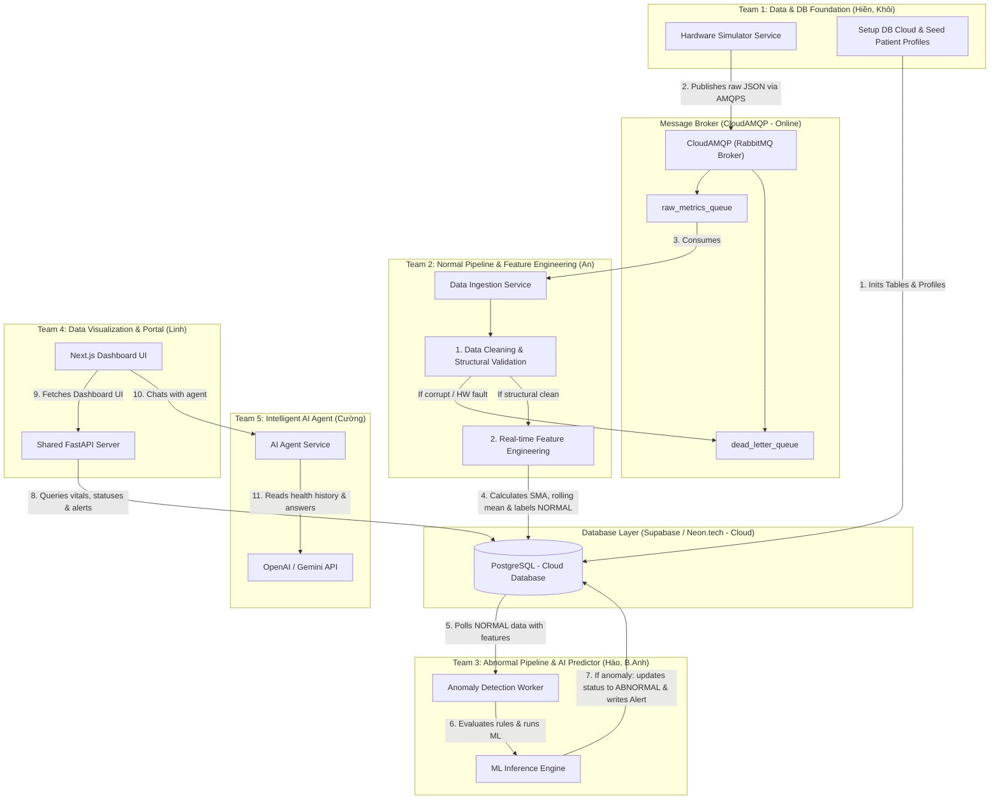
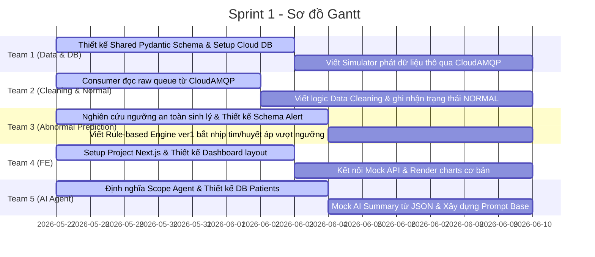
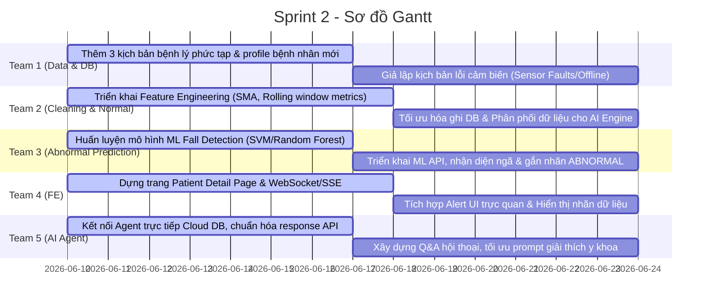
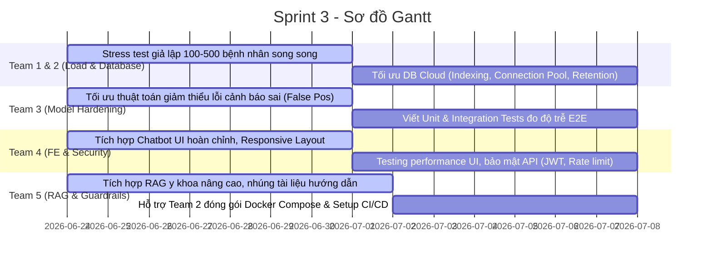

# KẾ HOẠCH TRIỂN KHAI CHI TIẾT DỰ ÁN (6 TUẦN - 3 SPRINTS) - PRODUCTION READY (V3 + DATA STATE PIPELINE)
## ĐỀ TÀI: E2E SIMULATION FOR AI HEALTH (Hệ thống mô phỏng và phân tích dữ liệu sức khỏe toàn diện)

Tài liệu này là phiên bản nâng cấp chính thức (V3), thực hiện **tối ưu hóa luồng công việc theo Trạng thái dữ liệu (Normal vs Abnormal)** để chia sẻ tải trọng và phân định rõ trách nhiệm giữa các nhóm:
1.  **Team 1 (2 người):** Data Creation (Simulator) & Database Infrastructure (Cài đặt Database Cloud, Schema DB, đăng ký CloudAMQP Broker trực tuyến, và đẩy dữ liệu gốc/seeding).
2.  **Team 2 (1 người):** Data Cleaning (Lọc thô, validate cấu trúc) + Feature Engineering + Gắn nhãn dữ liệu sạch là **`NORMAL`**.
3.  **Team 3 (2 người):** AI Model + Predict Anomaly + Gắn nhãn dữ liệu lỗi y tế là **`ABNORMAL`** & tạo Alert.
4.  **Hạ tầng Cloud:** Toàn bộ hệ thống chạy trên **CloudAMQP** (RabbitMQ) và **Supabase / Neon.tech** (PostgreSQL) trực tuyến.

---

## 1. SƠ ĐỒ DÒNG CHẢY DỮ LIỆU THEO TRẠNG THÁI (DATA STATE FLOW)

---

## 2. PHÂN BỔ NHÂN SỰ & VAI TRÒ CHI TIẾT (V3)
*Tổng nhân sự: 7 thành viên (6 Backend, 1 Frontend)*

| Nhóm | Thành viên | Vai trò chính | Nhiệm vụ gánh vác chéo (Cross-functional support) |
| :--- | :--- | :--- | :--- |
| **Team 1** | **Nguyễn Thị Thu Hiền** **Nguyễn Trọng Thiên Khôi** | Backend Developer | **Hạ tầng Dữ liệu:** Giả lập dữ liệu thô (Simulator) và đảm nhận thiết lập, tối ưu hóa Database Cloud (Supabase/Neon), đăng ký và cấu hình CloudAMQP, đẩy dữ liệu bệnh nhân mẫu lên DB. |
| **Team 2** | **Nguyễn Trần Khương An** | Backend Developer | **Đường ống Dữ liệu Sạch:** Viết Ingestor Consumer, làm sạch dữ liệu cấu trúc, tính toán các chỉ số toán học/đặc trưng (Feature Engineering) và ghi DB nhãn `NORMAL`. |
| **Team 3** | **Nguyễn Anh Hào** **Nguyễn Bằng Anh** | Backend & AI Developer | **Đường ống Dự đoán Bất thường:** Viết AI Inference Worker, so khớp luật sinh trắc học, phân loại té ngã, chuyển đổi trạng thái dòng dữ liệu thành `ABNORMAL` & tạo Alerts. |
| **Team 4** | **Nguyễn Phương Linh** | Frontend Developer | **Giao diện Portal:** Hiển thị Dashboard thời gian thực, phân biệt trạng thái dữ liệu (Normal vs Abnormal vs Fault) và khung Chatbot AI. |
| **Team 5** | **Nguyễn Đức Cường** | Backend & AI Developer | **Hỗ trợ Agent & Dockerize:** Tích hợp RAG y khoa cho Agent, phối hợp với Team 2 để viết file `docker-compose.yml` chạy các container ứng dụng. |

---

## 3. LỘ TRÌNH 3 SPRINT (6 TUẦN) CHUYÊN SÂU (V3)

### SPRINT 1: Nền Tảng Cloud, Thiết Kế DB & Khởi Động Luồng Dữ Liệu NORMAL (Tuần 1 - Tuần 2)
> **Mục tiêu của Team (Sprint Goal):** Hoàn thành đăng ký hạ tầng Cloud, thiết kế Database Schema trực tuyến bởi Team 1, thông suốt luồng Simulator (Team 1) phát dữ liệu thô qua CloudAMQP đến Consumer của Team 2 để dọn dẹp, ghi nhận trạng thái `NORMAL` vào Cloud DB, và dựng khung giao diện Next.js Portal.

#### Mục tiêu của từng Team trong Sprint 1 (Sub-team Goals):
*   **Team 1 (Data & DB):** Xác thực các chỉ số cảm biến, thống nhất Pydantic Schema dùng chung và thiết lập hạ tầng đám mây (đăng ký Cloud Database Supabase/Neon và CloudAMQP Broker trực tuyến), đẩy dữ liệu seeding 10 bệnh nhân mẫu.
*   **Team 2 (Ingestion - Normal Pipeline):** Tiếp nhận thông tin kết nối CloudAMQP từ Team 1, viết consumer đọc dữ liệu từ queue trực tuyến, triển khai logic Data Cleaning tự động gán nhãn `NORMAL` và lưu DB.
*   **Team 3 (Anomaly - Abnormal Pipeline):** Xác định ngưỡng an toàn sinh trắc học, viết bộ quy tắc tĩnh phát hiện bất thường y tế và thiết kế bảng ghi nhận sự cố `health_alerts`.
*   **Team 4 (Portal FE):** Khởi tạo khung Next.js Dashboard, thiết kế wireframe và kết nối hiển thị dữ liệu biểu đồ với mock API.
*   **Team 5 (AI Agent):** Thiết lập FastAPI Agent, cấu hình prompt base định hướng y khoa và mock kết quả tóm tắt bệnh án qua JSON.

#### Chi tiết Phân công Nhiệm vụ (Tasks Allocation)

##### **Team 1: Data & DB Foundation (Hiền, Khôi)**
*   **Task 1.1:** Xác thực chỉ số cảm biến giả lập: Accelerometer/Gyroscope, SpO2, Blood Pressure, Heart Rate, Sleep.
*   **Task 1.2:** Định nghĩa file Pydantic Models dùng chung `shared/schemas/sensor_data.py` để thống nhất định dạng dữ liệu đầu vào.
*   **Task 1.3:** **[Hạ tầng Database & Broker Cloud]** Đăng ký các tài khoản Cloud: Supabase/Neon.tech (PostgreSQL) và CloudAMQP (RabbitMQ).
    *   *Database:* Thiết kế Database Schema hoàn chỉnh, tạo các bảng `patients`, `sensor_logs` và `health_alerts`. Viết script seeding để đẩy hồ sơ thông tin 10 bệnh nhân mẫu lên.
    *   *Broker:* Tạo hàng đợi `raw_metrics_queue` và hàng đợi lỗi `dead_letter_queue` trực tuyến trên CloudAMQP.
    *   *Chia sẻ:* Đóng gói toàn bộ thông tin kết nối (Database URL, AMQPS URL) bảo mật và gửi cho cả nhóm.
*   **Task 1.4:** Viết mã Python Async simulator kết nối qua AMQPS phát dữ liệu thô vào `raw_metrics_queue` trực tuyến.

##### **Team 2: Cleaning & Normal Pipeline (An)**
*   **Task 2.1:** Tiếp nhận AMQPS URL kết nối bảo mật từ Team 1 và kiểm thử kết nối mạng đến hàng đợi `raw_metrics_queue` trực tuyến.
*   **Task 2.2:** Xây dựng Ingestor Consumer kết nối tới CloudAMQP đọc gói tin từ `raw_metrics_queue`.
*   **Task 2.3:** **[Data Cleaning]** Sử dụng Pydantic Schema của Team 1 để tự động lọc tin nhắn lỗi cấu trúc. Viết logic lọc nhiễu thô phần cứng (ví dụ: các giá trị phi lý vật lý như nhịp tim = 0 hoặc gia tốc đứng yên tuyệt đối).
*   **Task 2.4:** Ghi gói dữ liệu sạch đầu tiên vào cơ sở dữ liệu Cloud, mặc định gán nhãn trường `data_state = 'NORMAL'`.

##### **Team 3: Abnormal Prediction (Hào, B.Anh)**
*   **Task 3.1:** Nghiên cứu và viết tài liệu định nghĩa bộ ngưỡng (threshold) sinh trắc học y tế an toàn. Thiết kế bảng ghi nhận lỗi `health_alerts`.
*   **Task 3.2:** Viết Rule-based Engine phiên bản 1 (so khớp tĩnh nhịp tim, huyết áp thô lấy trực tiếp từ DB).
*   **Task 3.3:** Viết logic phát hiện vượt ngưỡng $\rightarrow$ Cập nhật bản ghi tương ứng trong `sensor_logs` thành `data_state = 'ABNORMAL'` và chèn bản ghi cảnh báo vào bảng `health_alerts` Cloud DB.

##### **Team 4: Data Visualization & Portal (Linh FE + BE Shared)**
*   **Task 4.1 (FE):** Khởi tạo Next.js, Tailwind CSS, TypeScript. Thiết kế bố cục UI Dashboard bác sĩ.
*   **Task 4.2 (FE):** Dựng trang Dashboard hiển thị danh sách bệnh nhân và trạng thái sinh tồn lấy từ dữ liệu mock.
*   **Task 4.3 (Shared BE):** Thiết kế OpenAPI Spec chung. Viết APIs CRUD cơ bản kết nối trực tiếp Cloud DB để truy vấn thông tin Profile bệnh nhân (`/api/patients`).

##### **Team 5: Intelligent AI Agent (Cường)**
*   **Task 5.1:** Thiết lập API FastAPI cho Agent Node kết nối với OpenAI/Gemini API.
*   **Task 5.2:** Thiết kế System Prompt định hướng vai trò y tế cho Agent.
*   **Task 5.3:** Viết mã mock trả về tóm tắt thông tin bệnh nhân từ cấu trúc dữ liệu JSON để hỗ trợ Frontend tích hợp trước.

---

### SPRINT 2: Tính Toán Đặc Trưng (Feature Engineering) & Huấn Luyện AI Phát Hiện Bất Thường (Tuần 3 - Tuần 4)
> **Mục tiêu của Team (Sprint Goal):** Hoàn thiện đường ống tính toán đặc trưng chuyển động của Team 2, huấn luyện thành công mô hình ML phát hiện ngã của Team 3, và kết nối đồng bộ dữ liệu thời gian thực (WebSockets/SSE) lên Dashboard hiển thị trạng thái NORMAL/ABNORMAL rõ ràng.

#### Mục tiêu của từng Team trong Sprint 2 (Sub-team Goals):
*   **Team 1 (Data & DB):** Mở rộng các kịch bản mô phỏng bệnh lý (đột quỵ, hạ đường huyết, té ngã) và **giả lập các kịch bản lỗi cảm biến** (thiết bị rơi, mất tín hiệu) gửi trực tiếp lên Cloud.
*   **Team 2 (Ingestion - Normal Pipeline):** Triển khai **Feature Engineering** (tính toán SMA, rolling mean) trên stream dữ liệu cảm biến sạch và ghi DB lưu mặc định nhãn `NORMAL`.
*   **Team 3 (Anomaly - Abnormal Pipeline):** Viết module helper kiểm tra sensor lỗi bàn giao cho Team 2, huấn luyện mô hình ML phát hiện ngã, chạy dự đoán trên dữ liệu sạch và gắn nhãn **`ABNORMAL`** / tạo cảnh báo Alert khi có sự cố.
*   **Team 4 (Portal FE):** Hoàn thiện giao diện trang chi tiết bệnh nhân, vẽ biểu đồ sinh lý động và hiển thị trực quan 3 nhãn trạng thái dữ liệu (**NORMAL**, **ABNORMAL**, **FAULT**).
*   **Team 5 (AI Agent):** Kết nối AI Agent trực tiếp với Cloud Database thực để truy xuất lịch sử đo cảm biến/cảnh báo và phản hồi thời gian thực.

#### Chi tiết Phân công Nhiệm vụ (Tasks Allocation)

##### **Team 1: Data & DB Foundation (Hiền, Khôi)**
*   **Task 1.5:** Thiết lập 3 kịch bản bệnh lý hoàn chỉnh (Cú ngã, Hạ đường huyết, Tăng huyết áp).
*   **Task 1.6:** Giả lập các kịch bản lỗi cảm biến (thiết bị rơi, mất tín hiệu tạm thời) phát trực tiếp lên CloudAMQP.

##### **Team 2: Cleaning & Normal Pipeline (An)**
*   **Task 2.5:** Thiết lập hàng đợi Dead Letter Queue (DLQ) trực tuyến trên CloudAMQP để xử lý gói tin lỗi cấu trúc.
*   **Task 2.6:** **[Feature Engineering]** Viết thuật toán tính toán các chỉ số đặc trưng thời gian thực từ dữ liệu thô:
    *   *Gia tốc:* Tính toán độ biến thiên (Variance) và diện tích cường độ tín hiệu (Signal Magnitude Area - SMA).
    *   *Sinh hiệu:* Tính toán các giá trị trung bình trượt (rolling mean) trong cửa sổ 5 giây gần nhất của Nhịp tim, Huyết áp.
*   **Task 2.7:** Ghi nhận toàn bộ dữ liệu kèm các cột đặc trưng mới này vào cơ sở dữ liệu Cloud với nhãn mặc định là `NORMAL`.

##### **Team 3: Abnormal Prediction (Hào, B.Anh)**
*   **Task 3.4:** Đóng gói thư viện phân tích y sinh, viết module `check_sensor_sanity` phát hiện lỗi phần cứng để Ingestor (Team 2) đánh dấu trạng thái dữ liệu là `FAULT` khi cần thiết.
*   **Task 3.5:** Sử dụng tập dữ liệu đặc trưng gia tốc (đã được Team 2 tính toán lưu sẵn trong DB) để huấn luyện mô hình Machine Learning (SVM/Random Forest) phân loại hành vi té ngã (yêu cầu độ chính xác >= 90%).
*   **Task 3.6:** Đóng gói mô hình thành dịch vụ Anomaly Inference Worker. Đọc dữ liệu `NORMAL` từ DB, chạy mô hình dự đoán. Nếu phát hiện té ngã hoặc dấu hiệu nguy cấp $\rightarrow$ Cập nhật cột `data_state = 'ABNORMAL'` và tự động chèn cảnh báo sự cố vào bảng `health_alerts`.

##### **Team 4: Data Visualization & Portal (Linh FE + BE Shared)**
*   **Task 4.4 (FE):** Xây dựng trang chi tiết Patient Detail hiển thị thông tin bệnh án, lịch sử alert và khung chat trợ lý AI.
*   **Task 4.5 (Shared BE):** Triển khai WebSockets hoặc Server-Sent Events (SSE) tại Portal API kết nối với Cloud Database để đẩy dữ liệu thời gian thực lên Dashboard.
*   **Task 4.6 (FE):** Thiết kế UI Dashboard hiển thị rõ nét 3 nhãn trạng thái dữ liệu: **NORMAL** (màu xanh), **ABNORMAL** (màu đỏ - nhấp nháy phát âm thanh nếu critical) và **FAULT** (màu cam - cảnh báo lỗi thiết bị).

##### **Team 5: Intelligent AI Agent (Cường)**
*   **Task 5.4:** Kết nối AI Agent FastAPI trực tiếp với Cloud Database để truy vấn dữ liệu lịch sử và trạng thái sức khỏe thật của bệnh nhân.
*   **Task 5.5:** Triển khai cơ chế Chat có bộ nhớ (Conversational Memory) trên môi trường multi-user để các bác sĩ khác nhau có thể hỏi song song.

---

## 3. SPRINT 3: Stress Test Tải Cao Cloud, Tối Ưu Hóa Query & Đóng Gói Docker (Tuần 5 - Tuần 6)
> **Mục tiêu của Team (Sprint Goal):** Hoàn thiện kết nối E2E toàn hệ thống, stress test mô phỏng 100+ bệnh nhân gửi dữ liệu song song qua Cloud, tối ưu hóa Database Indexing trên Supabase/Neon, đóng gói Docker Compose và bảo mật API.

#### Mục tiêu của từng Team trong Sprint 3 (Sub-team Goals):
*   **Team 1 & 2 (Simulator & Ingestion):** Thực hiện load test giả lập tối thiểu 100-500 bệnh nhân truyền dữ liệu đồng thời qua CloudAMQP. Tối ưu hóa hiệu năng ghi Bulk insert của consumer và cấu hình Connection Pool của database Cloud.
*   **Team 3 (Anomaly):** Tinh chỉnh mô hình ML để giảm lỗi cảnh báo sai (False Positives) và đo lường đảm bảo độ trễ E2E từ lúc xảy ra sự kiện đến lúc báo động trên UI dưới 1.5 giây.
*   **Team 4 (Portal FE):** Hoàn tất giao diện chatbot y tế, tối ưu hóa hiển thị Responsive và cấu hình các lớp bảo mật API (JWT, Rate Limiting).
*   **Team 5 (AI Agent):** Xây dựng RAG y khoa lưu phác đồ sơ cứu chuẩn và **hỗ trợ Team 2 cấu hình Docker Compose** cho các dịch vụ cục bộ kết nối Cloud.

#### Chi tiết Phân công Nhiệm vụ (Tasks Allocation)

##### **Team 1 & Team 2: Simulator & DB Optimization (Hiền, Khôi, An)**
*   **Task 3.7:** **Team 1 (Hiền, Khôi)** chịu trách nhiệm tối ưu hóa mã nguồn Simulator chạy đa luồng để mô phỏng đồng thời 100 - 500 bệnh nhân truyền dữ liệu lên CloudAMQP.
*   **Task 3.8:** **Team 2 (An)** thực hiện Bulk insert tại consumer để ghi dữ liệu chuỗi thời gian lớn và tối ưu hóa cấu hình kết nối (Connection Pooling) trên Cloud DB.
*   **Task 3.9:** Thiết lập chính sách lưu trữ nén dữ liệu cũ (Data Retention Policy) trên Database để bảo vệ bộ nhớ đám mây miễn phí.

##### **Team 3: Anomaly Detection Optimization (Hào, B.Anh)**
*   **Task 3.10:** Tinh chỉnh ngưỡng phân loại để giảm thiểu việc cảnh báo nhầm (False Positives) đối với các chuyển động sinh hoạt thường ngày của bệnh nhân.
*   **Task 3.11:** Viết Unit test và Integration test cho luồng kiểm tra dữ liệu bất thường và đo đạc độ trễ xử lý E2E (đảm bảo độ trễ E2E từ Simulator -> Cloud Broker -> Ingestor -> AI Prediction -> Cloud DB -> UI Dashboard < 1.5 giây).

##### **Team 4: Front-end UI & Security Hardening (Linh FE + BE Shared)**
*   **Task 4.7 (FE):** Tích hợp Chatbot UI hoàn chỉnh vào màn hình Dashboard (hỗ trợ hiển thị Markdown, code block, định dạng câu trả lời gọn đẹp).
*   **Task 4.8 (Shared BE):** Bảo mật API: Cấu hình CORS chặt chẽ, thêm Rate Limiting cho API endpoints và triển khai Middleware JWT xác thực quyền truy cập của bác sĩ.

##### **Team 5: Intelligent AI Agent & RAG Refinement (Cường)**
*   **Task 5.6:** Nhập thêm tài liệu phác đồ y tế chuẩn vào Vector Database (ChromaDB / pgvector). Cấu hình lớp phòng vệ (Guardrails) ngăn chặn AI tư vấn sai lệch.
*   **Task 5.7:** **[Hỗ trợ Team 2]** Đồng hành cùng Khương An xây dựng file `docker-compose.yml` kết nối các dịch vụ ứng dụng nội bộ (Simulator, Ingestor, Anomaly, Portal BE, Agent, FE) và cấu hình biến môi trường (`.env`) chứa thông tin kết nối tới các dịch vụ Cloud trực tuyến.

##### **Hoạt động Chung của Toàn Đội (Tất cả thành viên)**
*   **Task 6.1:** Soạn thảo tài liệu bàn giao sản phẩm, API Document (Swagger), hướng dẫn cấu hình thông số kết nối các Cloud Services.
*   **Task 6.2:** Chạy thử nghiệm kịch bản demo 10 phút trước khi thuyết trình chính thức.

---

## 4. TIÊU CHÍ CHẤT LƯỢNG MÔI TRƯỜNG PRODUCTION (Production Checklist)

Hệ thống phải đáp ứng các tiêu chuẩn kỹ thuật vận hành thực tế:
1.  **Resilience:** Dịch vụ Simulator và Consumer tự động kết nối lại (Auto-reconnect) khi Broker hoặc DB gặp sự cố đột ngột.
2.  **Transaction Reliability:** Message Consumer chỉ gửi tín hiệu `ACK` cho RabbitMQ sau khi dữ liệu đã được commit thành công vào DB để tránh mất dữ liệu.
3.  **Sensor Validation:** Ingestor lọc bỏ ít nhất 95% các gói tin lỗi phần cứng (nhịp tim bằng 0, gia tốc phẳng) và phân biệt rõ ràng với cảnh báo y tế thực tế.
4.  **Database Optimization:** Sử dụng Bulk insert (batching 500 records) để ghi dữ liệu time-series nhằm giảm tải I/O ổ cứng.
5.  **Security:** Toàn bộ API Key, mật khẩu DB, RabbitMQ credentials được cấu hình qua biến môi trường (`.env`), tuyệt đối không hardcode.
6.  **Cloud SSL Connection:** Bắt buộc kết nối tới CloudAMQP qua giao thức bảo mật `amqps://` và cơ sở dữ liệu sử dụng cấu hình SSL bắt buộc để tránh rò rỉ dữ liệu y tế trên đường truyền internet.

---

## 5. RỦI RO & PHƯƠNG ÁN XỬ LÝ (Risks & Mitigations) - ĐÃ CẬP NHẬT V3

| Rủi ro tiềm ẩn | Mức độ | Phương án xử lý phòng ngừa (Mitigation) |
| :--- | :--- | :--- |
| **Team 2 (1 người) bị quá tải khi thiết kế luồng dữ liệu** | **Đã giảm** | Chia sẻ nhiệm vụ định nghĩa Schema cho **Team 1** và viết module kiểm định cảm biến cho **Team 3**. |
| **Vượt ngưỡng giới hạn băng thông/kết nối của Cloud Services miễn phí** | Trung bình | Cấu hình Pool Connection chặt chẽ; giới hạn tần suất gửi tin của Simulator trong ngưỡng cho phép (Little Lemur của CloudAMQP cho tối đa 20 kết nối). |
| **Tải trọng ghi DB sụt giảm khi chạy 100+ bệnh nhân** | Trung bình | Áp dụng cơ chế Bulk Write cho Database. **Team 5** và **Team 1** tham gia tối ưu DB/Simulator ở Sprint 3. |
| **Frontend duy nhất 1 người dễ dẫn tới trễ tiến độ UI** | Cao | Sử dụng component library (như Shadcn/ui) để đẩy nhanh tốc độ dựng giao diện. Frontend phát triển dựa trên mock API từ sớm. |
| **AI Agent tư vấn sai lệch hoặc trả lời quá thẩm quyền y tế** | Trung bình | Cấu hình Prompt Guardrails nghiêm ngặt, giới hạn phạm vi truy xuất thông tin trong database nội bộ và bắt buộc đính kèm disclaimer. |

---

## 6. TIÊU CHÍ ĐÁNH GIÁ THÀNH CÔNG (Success Metrics)

### 1. Trải nghiệm Sản phẩm (Product Metrics)
*   Bác sĩ xem được danh sách bệnh nhân, lọc trạng thái nguy kịch, tìm kiếm theo tên dễ dàng.
*   Bác sĩ truy cập trang chi tiết bệnh nhân xem biểu đồ chỉ số chạy động thời gian thực và lịch sử cảnh báo.
*   Hệ thống hiển thị popup alert nhấp nháy đỏ ngay lập tức khi phát hiện té ngã hoặc nhịp tim bất thường (trạng thái dữ liệu chuyển sang `ABNORMAL`).
*   AI Agent phản hồi nhanh, tóm tắt chính xác chỉ số bệnh nhân trong 30 phút gần nhất và không bị ảo tưởng thông tin.

### 2. Tiêu chuẩn Kỹ thuật (Technical Metrics)
*   Simulator duy trì truyền tải dữ liệu liên tục 24/7 ổn định không bị rò rỉ bộ nhớ (memory leak).
*   Consumer tiêu thụ message mượt mà, ghi bulk insert vào DB thành công, xử lý ngoại lệ và đưa tin nhắn lỗi vào DLQ ổn định.
*   Mô hình AI phát hiện ngã đạt độ chính xác (Accuracy) >= 90% trên tập test.
*   Hệ thống có thể khởi chạy ứng dụng cục bộ hoàn chỉnh kết nối Cloud bằng lệnh `docker compose up --build`.

### 3. Kịch bản Demo thực tế (Demo Performance)
*   Hệ thống chạy demo liên tục ít nhất 10 phút mà không phát sinh lỗi crash hệ thống.
*   Chạy mượt mà 3 kịch bản mô phỏng rõ ràng trên 3 đối tượng đại diện: **Người già** (ngã đột ngột), **Bà bầu** (huyết áp bất ổn), **Thanh niên** (nhịp tim cao khi vận động).
