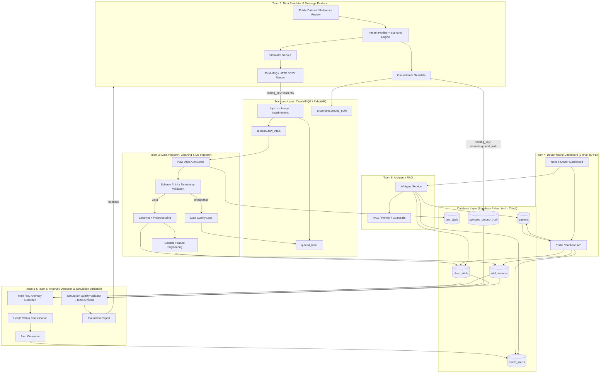
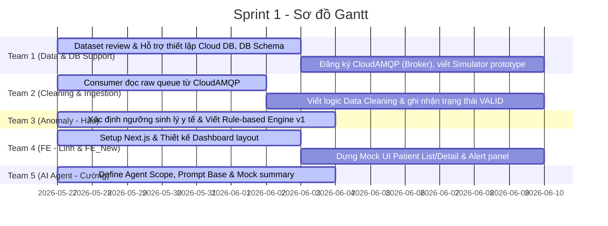
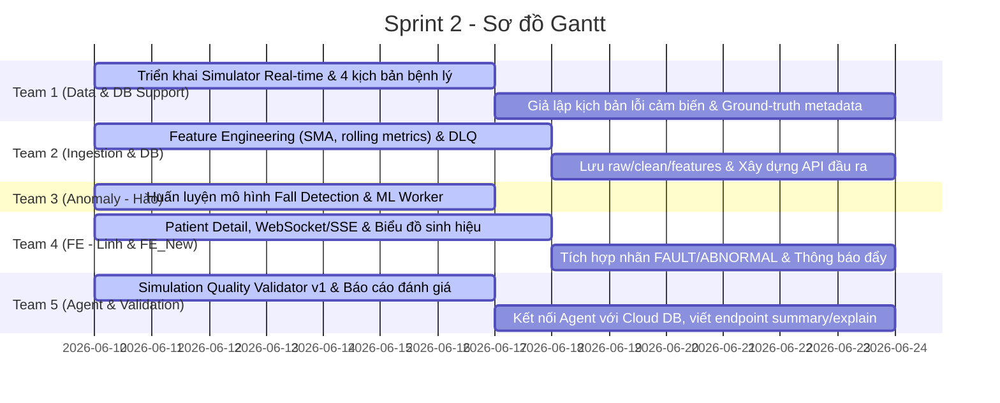
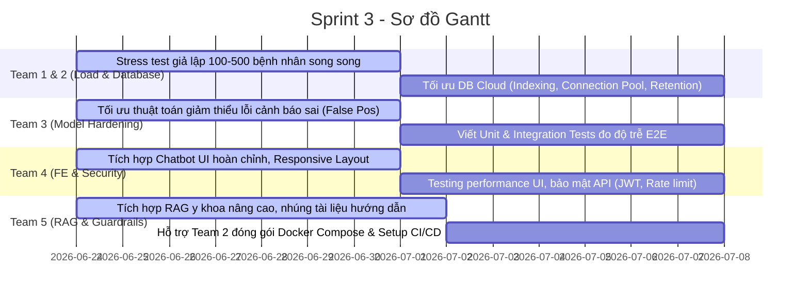

# KẾ HOẠCH TRIỂN KHAI CHI TIẾT DỰ ÁN (6 TUẦN - 3 SPRINTS) - PRODUCTION READY (V3 + DATA STATE PIPELINE)
## ĐỀ TÀI: E2E SIMULATION FOR AI HEALTH (Hệ thống mô phỏng và phân tích dữ liệu sức khỏe toàn diện)

Tài liệu này là phiên bản nâng cấp chính thức (V3), tích hợp triết lý thiết kế **tách biệt trạng thái dữ liệu kỹ thuật và trạng thái sức khỏe y tế** cùng **luồng kiểm chứng chất lượng mô phỏng (Simulation Quality Validation)**. Cơ cấu nhân sự đã được tái phân bổ tối ưu (5 Backend, 2 Frontend) do biến động thành viên, đồng thời áp dụng cơ chế **hỗ trợ hạ tầng chéo** từ Team 1 để giảm tải cho các nhóm nhỏ lẻ.

---

## 1. SƠ ĐỒ DÒNG CHẢY DỮ LIỆU TỔNG THỂ (DATA STATE FLOW)

Hệ thống được vận hành song song 2 luồng chính:
*   **Luồng A (Main Product Pipeline):** Simulator $\rightarrow$ Broker $\rightarrow$ Ingestor/Cleaning/FE $\rightarrow$ Anomaly $\rightarrow$ Dashboard $\rightarrow$ Agent.
*   **Luồng B (Simulator Validation Pipeline):** Simulator data + Ground-truth metadata $\rightarrow$ Team 5 (hỗ trợ Team 3) chạy kiểm chứng đánh giá độ chân thực của dữ liệu mô phỏng $\rightarrow$ Feedback cải tiến Simulator.

---

## 2. PHÂN BỔ NHÂN SỰ & VAI TRÒ CHI TIẾT (CẬP NHẬT MỚI)
*Tổng nhân sự: 7 thành viên (5 Backend, 2 Frontend)*

| Nhóm | Thành viên | Vai trò chính | Phân công chi tiết & Cơ chế điều phối chéo |
| :--- | :--- | :--- | :--- |
| **Team 1** | **Nguyễn Thị Thu Hiền** **Nguyễn Trọng Thiên Khôi** | **Data Simulator / Broker Setup & DB Setup (1 nhân sự phụ trách hạ tầng DB cho Team 2)** | Đóng vai trò sản xuất dữ liệu Simulator và Broker. Cử ra 1 nhân sự phụ trách thiết lập hạ tầng Cloud Database, tạo bảng và seeding dữ liệu bệnh nhân mẫu cho Team 2 tại Sprint 1 để giảm tải. |
| **Team 2** | **Nguyễn Trần Khương An** | **Data Ingestion / Cleaning & DB Ingestion (Hạ tầng DB do 1 nhân sự Team 1 phụ trách hỗ trợ)** | Phụ trách chính Database và đường ống dẫn dữ liệu sạch (nhưng phần hạ tầng DB trực tuyến ở Sprint 1 do 1 nhân sự từ Team 1 được điều động phụ trách tạo lập). Tập trung phát triển consumer, dọn dẹp dữ liệu, tính toán đặc trưng toán học và lưu DB kèm nhãn kỹ thuật (`VALID/FAULT`). |
| **Team 3** | **Nguyễn Anh Hào** | **Anomaly Detection / AI Predictor** | Do chỉ còn 1 nhân sự (sau khi B.Anh rời), Hào tập trung 100% chuyên môn vào việc huấn luyện mô hình ML (Fall Detection), viết Rule-based Engine và đóng gói dịch vụ Anomaly Worker. Nhiệm vụ kiểm chứng simulator được bàn giao chéo sang Team 5. |
| **Team 4** | **Nguyễn Phương Linh** **FE_New (Thành viên mới bổ sung)** | **Doctor-facing Dashboard (Frontend)** | Được tăng cường lên 2 nhân sự. Tự chủ hoàn toàn phần Frontend (biểu đồ động WebSockets/SSE, chatbot panel, responsive UI). Tự dựng Mock server để chạy giao diện trước từ Sprint 1, giải phóng áp lực tích hợp API cho Backend. |
| **Team 5** | **Nguyễn Đức Cường** | **AI Agent / RAG & Simulation Validation Support** | Phát triển AI Agent y tế. **Nhận hỗ trợ chéo Team 3** trong việc lập trình dịch vụ `SimulationValidator` (Luồng B) đối chiếu DB với Ground Truth và xuất báo cáo chất lượng mô phỏng. Đồng hành cùng Team 2 đóng gói Docker Compose. |

---

## 3. LỘ TRÌNH CHI TIẾT 3 SPRINTS (6 TUẦN)

### SPRINT 1: Nền Tảng Cloud, Thiết Kế DB & Khởi Động Luồng Dữ Liệu NORMAL (Tuần 1 - Tuần 2)
> **Mục tiêu của Team (Sprint Goal):** Hoàn thành đăng ký hạ tầng Cloud (Broker & DB), thiết lập DB Schema và alert schema. Team 1 phát triển prototype simulator bắn dữ liệu qua CloudAMQP; Team 2 viết consumer dọn dẹp dữ liệu cấu trúc Pydantic; Team 3 thiết lập quy tắc sinh học rule-based cơ bản; Team 4 dựng khung giao diện Next.js chạy mock dữ liệu và Team 5 mock Agent API.

#### Mục tiêu của từng Team trong Sprint 1 (Sub-team Goals):
*   **Team 1 (Simulator & DB Setup Support):** Lập tài liệu `dataset_review.md`, đăng ký tài khoản Cloud (Supabase/Neon DB và CloudAMQP), **hỗ trợ tạm thời thiết lập cấu trúc Database Schema v1 cùng Team 2** để đẩy seeding dữ liệu 10 bệnh nhân thô mẫu, phát triển simulator thô gửi tin nhắn thử nghiệm.
*   **Team 2 (Ingestion - Normal Pipeline):** Cấu hình consumer đọc dữ liệu từ CloudAMQP, định nghĩa schema validation bằng Pydantic, tiếp nhận DB Schema đã tạo bảng từ Team 1 để viết logic dọn dẹp kỹ thuật và ghi dữ liệu mẫu với nhãn kỹ thuật `VALID`/`INVALID` vào DB.
*   **Team 3 (Anomaly - Hào):** Xác định ngưỡng sinh lý an toàn, chốt alert schema và viết bộ quy tắc rule-based đầu tiên phát hiện nhịp tim/huyết áp vượt ngưỡng.
*   **Team 4 (Portal FE - Linh & FE_New):** Khởi tạo mã nguồn Next.js/Tailwind CSS/TypeScript, dựng wireframe giao diện bác sĩ, tự thiết lập Mock Server/API route để hiển thị dữ liệu và khung chatbot mẫu.
*   **Team 5 (AI Agent - Cường):** Thiết lập FastAPI Agent API, thiết kế system prompt định hướng y tế cho trợ lý ảo và mock kết quả tóm tắt hồ sơ bệnh án qua JSON.

#### Chi tiết Phân công Nhiệm vụ (Tasks Allocation)

##### **Team 1: Data & DB Setup Support (Hiền, Khôi)**
*   **Task 1.1:** Nghiên cứu public datasets và viết tài liệu `dataset_review.md` làm nền tảng sinh lý học cho Simulator.
*   **Task 1.2:** Định nghĩa file Pydantic Models dùng chung `shared/schemas/sensor_data.py` để thống nhất định dạng dữ liệu đầu vào.
*   **Task 1.3:** **[Hạ tầng Cloud & Hỗ trợ DB chéo]** Đăng ký các tài khoản Cloud: Supabase/Neon.tech (PostgreSQL) và CloudAMQP (RabbitMQ).
    *   *Database (Thiết lập hộ Team 2):* Thiết kế Database Schema v1, tạo các bảng `patients`, `raw_vitals`, `clean_vitals`, `vital_features`, `scenario_ground_truth` và `health_alerts`. Viết script seeding đẩy thông tin 10 bệnh nhân mẫu lên.
    *   *Broker:* Tạo exchange `health.events`, các queue `q.team2.raw_vitals` (binding key: `vitals.raw`), và queue lỗi `q.dead_letter` (binding key: `dead.*`).
    *   *Chia sẻ:* Đóng gói toàn bộ thông tin kết nối bảo mật (AMQPS URL, Database Connection String) gửi cho cả nhóm.
*   **Task 1.4:** Viết mã Simulator prototype (đọc dữ liệu từ file CSV mẫu hoặc sinh ngẫu nhiên có kiểm soát) và publish thử nghiệm tin nhắn lên CloudAMQP.

##### **Team 2: Ingestion & Cleaning Pipeline (An)**
*   **Task 2.1:** Tiếp nhận AMQPS URL kết nối bảo mật từ Team 1 và kiểm thử kết nối mạng đến hàng đợi trực tuyến.
*   **Task 2.2:** Xây dựng Consumer kết nối tới CloudAMQP đọc gói tin từ `q.team2.raw_vitals`.
*   **Task 2.3:** **[Data Cleaning]** Sử dụng Pydantic Schema để tự động lọc tin nhắn lỗi cấu trúc. Viết logic lọc nhiễu thô phần cứng (ví dụ: các giá trị phi lý vật lý như nhịp tim = 0 hoặc gia tốc đứng yên tuyệt đối).
*   **Task 2.4:** Ghi nhận gói dữ liệu thô vào bảng `raw_vitals` và dữ liệu sạch vào bảng `clean_vitals` trên Cloud DB (do Team 2 phụ trách chính), mặc định gán trường trạng thái dữ liệu kỹ thuật là `VALID` (hoặc `INVALID` nếu sai định dạng).

##### **Team 3: Anomaly & Rule-based Setup (Hào)**
*   **Task 3.1:** Nghiên cứu ngưỡng sinh lý y tế an toàn, thiết kế định dạng alert schema và health status (`NORMAL`, `WARNING`, `ABNORMAL`, `CRITICAL`).
*   **Task 3.2:** Viết Rule-based Engine phiên bản 1 (so khớp tĩnh nhịp tim, huyết áp thô lấy trực tiếp từ DB). Nếu phát hiện vượt ngưỡng $\rightarrow$ Chèn bản ghi cảnh báo tương ứng vào bảng `health_alerts`.

##### **Team 4: Front-end Skeleton & Mock (Linh FE + FE_New)**
*   **Task 4.1 (FE):** Khởi tạo Next.js, Tailwind CSS, TypeScript. Thiết kế bố cục UI Dashboard bác sĩ.
*   **Task 4.2 (FE):** Dựng trang Dashboard hiển thị danh sách bệnh nhân và chat area lấy từ dữ liệu mock tự sinh.
*   **Task 4.3 (Shared FE/BE):** Thiết kế OpenAPI Spec chung. Viết API CRUD cơ bản kết nối trực tiếp Cloud DB để truy vấn thông tin Profile bệnh nhân (`/api/patients`).

##### **Team 5: Intelligent AI Agent Prototype (Cường)**
*   **Task 5.1:** Thiết lập API FastAPI cho Agent Node kết nối với OpenAI/Gemini API.
*   **Task 5.2:** Thiết kế System Prompt định hướng vai trò y tế cho Agent (chú trọng tính an toàn, bảo mật thông tin, có disclaimer y khoa).
*   **Task 5.3:** Viết mã mock trả về tóm tắt thông tin bệnh nhân từ cấu trúc dữ liệu JSON để hỗ trợ Frontend tích hợp trước.

---

### SPRINT 2: Tính Toán Đặc Trưng (Feature Engineering) & Huấn Luyện AI Phát Hiện Bất Thường (Tuần 3 - Tuần 4)
> **Mục tiêu của Team (Sprint Goal):** Triển khai simulator chạy thời gian thực với các kịch bản bệnh lý phức tạp và lỗi cảm biến vật lý. Team 2 hoàn thành làm sạch dữ liệu, tính toán đặc trưng chuyển động (SMA, rolling window) và gán trạng thái kỹ thuật (VALID/FAULT/MISSING) trên DB. Team 3 huấn luyện mô hình ML phát hiện ngã; Team 5 hỗ trợ chạy pipeline kiểm chứng dữ liệu simulator đối chiếu với Ground Truth; Team 4 kết nối dữ liệu thật và Team 5 kết nối database.

#### Mục tiêu của từng Team trong Sprint 2 (Sub-team Goals):
*   **Team 1 (Simulator & Scenario Engine):** Xây dựng Simulator truyền tải thời gian thực đa kịch bản (normal, fall, hypoglycemia, BP abnormal), tích hợp nhiễu sinh lý và giả lập các lỗi cảm biến vật lý, đẩy ground-truth metadata lên database.
*   **Team 2 (Ingestion - Normal Pipeline & DB):** Cấu hình Manual ACK và hàng đợi DLQ; lập trình bộ tính toán đặc trưng chuyển động và sinh hiệu trượt; lưu dữ liệu kèm nhãn trạng thái kỹ thuật (`VALID/INVALID/FAULT/DUPLICATE`) vào DB do mình quản lý.
*   **Team 3 (Anomaly - Hào):** Huấn luyện mô hình Machine Learning phát hiện ngã (fall detection), đóng gói dịch vụ Anomaly Worker phân loại trạng thái y tế (`NORMAL/WARNING/ABNORMAL/CRITICAL`) và chèn Alert y sinh.
*   **Team 4 (Portal FE - Linh & FE_New):** Hoàn thiện trang chi tiết bệnh nhân, tích hợp WebSockets hoặc Server-Sent Events (SSE) hiển thị sinh hiệu chạy động, hiển thị trực quan các nhãn kỹ thuật (FAULT) và sức khỏe (ABNORMAL).
*   **Team 5 (AI Agent & Validation Support - Cường):** Thiết lập công cụ `SimulationValidator` tự động chấm điểm và báo cáo chất lượng simulator. Kết nối Agent trực tiếp với Database, xây dựng endpoint `/summary` và `/explain-alert`.

#### Chi tiết Phân công Nhiệm vụ (Tasks Allocation)

##### **Team 1: Data Simulator & Scenario Engine (Hiền, Khôi)**
*   **Task 1.5:** Hoàn thiện mã nguồn Simulator chạy chế độ Stream, tích hợp 4 kịch bản bệnh lý hoàn chỉnh (Normal walking, Fall, Hypoglycemia, Hypertension/Hypotension) kèm theo nhiễu sinh lý học ngẫu nhiên.
*   **Task 1.6:** Giả lập các kịch bản lỗi cảm biến vật lý (thiết bị rơi, mất tín hiệu tạm thời) phát trực tiếp lên CloudAMQP để kiểm thử hệ thống.
*   **Task 1.7:** Đẩy thông tin Ground-truth metadata (scenario_id, event_type, ground_truth_label, event_start, event_end) lên bảng `scenario_ground_truth` của Cloud DB phục vụ bước đánh giá của Team 5.

##### **Team 2: Data Cleaning & Feature Engineering (An - Quản lý DB)**
*   **Task 2.5:** Cấu hình Manual Acknowledge (ACK) tại consumer để đảm bảo không mất dữ liệu. Triển khai xử lý lỗi gửi vào Dead Letter Queue (DLQ).
*   **Task 2.6:** **[Feature Engineering]** Viết thuật toán tính toán đặc trưng thời gian thực:
    *   *Gia tốc:* Tính toán độ biến thiên (Variance) và diện tích cường độ tín hiệu (Signal Magnitude Area - SMA) từ trục X, Y, Z để hỗ trợ phát hiện ngã.
    *   *Sinh hiệu:* Tính toán giá trị trung bình trượt (rolling mean) trong cửa sổ 5 giây gần nhất của Nhịp tim, Huyết áp.
*   **Task 2.7:** Ghi nhận toàn bộ dữ liệu kèm các cột đặc trưng mới này vào bảng `clean_vitals` và `vital_features` trong DB (Team 2 chịu trách nhiệm bảo trì). Thiết lập nhãn trạng thái dữ liệu kỹ thuật: `FAULT` khi cảm biến gặp lỗi phần cứng hoặc mất tín hiệu vật lý; `VALID` khi dữ liệu đo đạc bình thường.

##### **Team 3: AI Inference (Hào)**
*   **Task 3.4:** Huấn luyện mô hình Machine Learning (SVM/Random Forest) phân loại hành vi té ngã từ tập đặc trưng gia tốc thô (độ chính xác yêu cầu >= 90%).
*   **Task 3.5:** Đóng gói dịch vụ Anomaly Inference Worker: Đọc dữ liệu sạch có nhãn `VALID` từ DB, kết hợp mô hình ML và Rule-based sinh học để gán nhãn trạng thái sức khỏe (`NORMAL/WARNING/ABNORMAL/CRITICAL`). Nếu phát hiện bất thường $\rightarrow$ Tự động ghi nhận Alert vào bảng `health_alerts` kèm bằng chứng.

##### **Team 4: Data Visualization & Live Dashboard (Linh FE + FE_New)**
*   **Task 4.4 (FE):** Xây dựng trang chi tiết Patient Detail hiển thị thông tin bệnh án, lịch sử alert và khung chat trợ lý AI.
*   **Task 4.5 (Shared FE/BE):** Triển khai WebSockets hoặc Server-Sent Events (SSE) tại Portal API kết nối với Cloud Database để đẩy dữ liệu thời gian thực lên Dashboard.
*   **Task 4.6 (FE):** Thiết kế UI Dashboard hiển thị rõ nét phân biệt: Nhãn y tế **NORMAL** (màu xanh), **ABNORMAL** (màu đỏ - nhấp nháy phát âm thanh nếu critical) và Nhãn kỹ thuật **FAULT** (màu cam - cảnh báo lỗi thiết bị/sensor).

##### **Team 5: Agent API & Simulation Validation Support (Cường)**
*   **Task 5.4:** Kết nối AI Agent FastAPI trực tiếp với Cloud Database để truy vấn dữ liệu lịch sử đo đạc và trạng thái sức khỏe của bệnh nhân.
*   **Task 5.5 (Agent endpoints):** Xây dựng endpoint API `/summary` để tóm tắt nhanh tình trạng bệnh nhân và `/explain-alert` phân tích nguyên nhân tại sao bệnh nhân bị cảnh báo (dựa trên các bằng chứng/evidence mà Team 3 lưu trong bảng Alert).
*   **Task 5.6 (Simulation Quality Validator - Hỗ trợ Team 3):** Viết script tự động đối chiếu dữ liệu trong bảng `clean_vitals`/`vital_features` với bảng `scenario_ground_truth` theo từng `scenario_id`. Đánh giá xem dữ liệu Simulator tạo ra có khớp đúng pattern y sinh học không (ví dụ: cú ngã phải có acc spike đúng thời điểm). Xuất báo cáo chất lượng mô phỏng `simulation_quality_report.md` gửi phản hồi cho Team 1.

---

### SPRINT 3: Stress Test Tải Cao Cloud, Tối Ưu Hóa Query & Đóng Gói Docker (Tuần 5 - Tuần 6)
> **Mục tiêu của Team (Sprint Goal):** Hoàn thiện kết nối E2E toàn hệ thống, stress test mô phỏng 100+ bệnh nhân gửi dữ liệu song song qua Cloud, tối ưu hóa Database Indexing trên Supabase/Neon, đóng gói Docker Compose và bảo mật API.

#### Mục tiêu của từng Team trong Sprint 3 (Sub-team Goals):
*   **Team 1 & 2 (Simulator & Ingestion):** Thực hiện load test giả lập tối thiểu 100-500 bệnh nhân truyền dữ liệu đồng thời qua CloudAMQP. Tối ưu hóa hiệu năng ghi Bulk insert của consumer và cấu hình Connection Pool của database Cloud.
*   **Team 3 (Anomaly):** Tinh chỉnh mô hình ML để giảm lỗi cảnh báo sai (False Positives) và đo lường đảm bảo độ trễ E2E từ lúc xảy ra sự kiện đến lúc báo động trên UI dưới 1.5 giây.
*   **Team 4 (Portal FE):** Hoàn tất giao diện chatbot y tế, tối ưu hóa hiển thị Responsive và cấu hình các lớp bảo mật API (JWT, Rate Limiting).
*   **Team 5 (AI Agent):** Xây dựng RAG y khoa lưu phác đồ sơ cứu chuẩn và **hỗ trợ Team 2 cấu hình Docker Compose** cho các dịch vụ cục bộ kết nối Cloud.

#### Chi tiết Phân công Nhiệm vụ (Tasks Allocation)

##### **Team 1 & Team 2: Simulator & DB Optimization (Hiền, Khôi, An)**
*   **Task 3.7:** **Team 1 (Hiền, Khôi)** chịu trách nhiệm tối ưu hóa mã nguồn Simulator chạy đa luồng để mô phỏng đồng thời 100 - 500 bệnh nhân truyền dữ liệu lên CloudAMQP.
*   **Task 3.8:** **Team 2 (An)** thực hiện Bulk insert tại consumer để ghi dữ liệu chuỗi thời gian lớn và tối ưu hóa cấu hình kết nối (Connection Pooling) trên Cloud DB.
*   **Task 3.9:** Thiết lập chính sách lưu trữ nén dữ liệu cũ (Data Retention Policy) trên Database để bảo vệ bộ nhớ đám mây miễn phí.

##### **Team 3: Anomaly Detection Optimization (Hào)**
*   **Task 3.10:** Tinh chỉnh ngưỡng phân loại để giảm thiểu việc cảnh báo nhầm (False Positives) đối với các chuyển động sinh hoạt thường ngày của bệnh nhân.
*   **Task 3.11:** Viết Unit test và Integration test cho luồng kiểm tra dữ liệu bất thường và đo đạc độ trễ xử lý E2E (đảm bảo độ trễ E2E từ Simulator -> Cloud Broker -> Ingestor -> AI Prediction -> Cloud DB -> UI Dashboard < 1.5 giây).

##### **Team 5: Simulation & AI Evaluation Report (Cường - Hỗ trợ Team 3)**
*   **Task 3.12:** Xuất bản báo cáo đánh giá cuối cùng `evaluation_report.md` thống kê độ chính xác (Precision/Recall), độ trễ nhận diện và tỷ lệ cảnh báo sai của hệ thống AI.

##### **Team 4: Front-end UI & Security Hardening (Linh FE + FE_New)**
*   **Task 4.7 (FE):** Tích hợp Chatbot UI hoàn chỉnh vào màn hình Dashboard (hỗ trợ hiển thị Markdown, code block, định dạng câu trả lời gọn đẹp).
*   **Task 4.8 (Shared FE/BE):** Bảo mật API: Cấu hình CORS chặt chẽ, thêm Rate Limiting cho API endpoints và triển khai Middleware JWT xác thực quyền truy cập của bác sĩ.

##### **Team 5: Intelligent AI Agent & RAG Refinement (Cường)**
*   **Task 5.6:** Nhập thêm tài liệu phác đồ y tế chuẩn vào Vector Database (ChromaDB / pgvector) phục vụ truy vấn RAG cho AI Agent. Cấu hình lớp phòng vệ (Guardrails) ngăn chặn AI tư vấn sai lệch chuyên môn.
*   **Task 5.7:** **[Hỗ trợ Team 2]** Đồng hành cùng Khương An xây dựng file `docker-compose.yml` kết nối các dịch vụ ứng dụng nội bộ (Simulator, Ingestor, Anomaly, Portal BE, Agent, FE) và cấu hình biến môi trường (`.env`) chứa thông tin kết nối tới các dịch vụ Cloud trực tuyến.

##### **Hoạt động Chung của Toàn Đội (Tất cả thành viên)**
*   **Task 6.1:** Soạn thảo tài liệu bàn giao sản phẩm, API Document (Swagger), hướng dẫn cấu hình thông số kết nối các Cloud Services.
*   **Task 6.2:** Chạy thử nghiệm kịch bản demo 10 phút trước khi thuyết trình chính thức.

---

## 4. TIÊU CHÍ CHẤT LƯỢNG MÔI TRƯỜNG PRODUCTION (Production Checklist)

Hệ thống phải đáp ứng các tiêu chuẩn kỹ thuật vận hành thực tế:
1.  **Resilience:** Dịch vụ Simulator và Consumer tự động kết nối lại (Auto-reconnect) khi Broker hoặc DB gặp sự cố đột ngột.
2.  **Transaction Reliability:** Message Consumer chỉ gửi tín hiệu `ACK` cho RabbitMQ sau khi dữ liệu đã được commit thành công vào DB để tránh mất dữ liệu.
3.  **Sensor Validation:** Ingestor lọc bỏ ít nhất 95% các gói tin lỗi phần cứng (nhịp tim bằng 0, gia tốc phẳng) và phân biệt rõ ràng trạng thái kỹ thuật `FAULT` với cảnh báo y tế thực tế.
4.  **Database Optimization:** Sử dụng Bulk insert (batching 500 records) để ghi dữ liệu time-series nhằm giảm tải I/O ổ cứng.
5.  **Security:** Toàn bộ API Key, mật khẩu DB, RabbitMQ credentials được cấu hình qua biến môi trường (`.env`), tuyệt đối không hardcode.
6.  **Cloud SSL Connection:** Bắt buộc kết nối tới CloudAMQP qua giao thức bảo mật `amqps://` và cơ sở dữ liệu sử dụng cấu hình SSL bắt buộc để tránh rò rỉ dữ liệu y tế trên đường truyền internet.
7.  **Simulation Ground Truth Separation:** Ground Truth dùng cho evaluation/validation chất lượng mô phỏng, không dùng trực tiếp làm input cho mô hình phát hiện bất thường y tế.

---

## 5. RỦI RO & PHƯƠNG ÁN XỬ LÝ (Risks & Mitigations) - ĐÃ CẬP NHẬT V3

| Rủi ro tiềm ẩn | Mức độ | Phương án xử lý phòng ngừa (Mitigation) |
| :--- | :--- | :--- |
| **Team 2 (1 người) bị quá tải khi thiết kế luồng dữ liệu** | **Đã giảm** | Chia sẻ nhiệm vụ hạ tầng Cloud cho **Team 1** hỗ trợ tạm thời và viết module kiểm định cảm biến cho **Team 3**. |
| **Vượt ngưỡng giới hạn băng thông/kết nối của Cloud Services miễn phí** | Trung bình | Cấu hình Pool Connection chặt chẽ; giới hạn tần suất gửi tin của Simulator trong ngưỡng cho phép (Little Lemur của CloudAMQP cho tối đa 20 kết nối). |
| **Tải trọng ghi DB sụt giảm khi chạy 100+ bệnh nhân** | Trung bình | Áp dụng cơ chế Bulk Write cho Database. **Team 5** và **Team 1** tham gia tối ưu DB/Simulator ở Sprint 3. |
| **Frontend tiến độ UI có thể bị trễ hoặc lệch giao diện** | **Cực thấp** | Đã được bổ sung thêm 1 nhân sự Frontend (2 người). Đẩy nhanh tốc độ code và tự mock API không cần đợi Backend. |
| **AI Agent tư vấn sai lệch hoặc trả lời quá thẩm quyền y tế** | Trung bình | Cấu hình Prompt Guardrails nghiêm ngặt, giới hạn phạm vi truy xuất thông tin trong database nội bộ và bắt buộc đính kèm disclaimer. |
| **Simulator tạo data quá ngẫu nhiên vô nghĩa hoặc quá phẳng nhàm chán** | Trung bình | Team 1 thiết kế kịch bản dựa trên kịch bản sinh học thực tế và reference dataset; Team 5 thực hiện kiểm chứng chất lượng và phản hồi (Luồng B). |

---

## 6. TIÊU CHÍ ĐÁNH GIÁ THÀNH CÔNG (Success Metrics)

### 1. Trải nghiệm Sản phẩm (Product Metrics)
*   Bác sĩ xem được danh sách bệnh nhân, lọc trạng thái nguy kịch, tìm kiếm theo tên dễ dàng.
*   Bác sĩ truy cập trang chi tiết bệnh nhân xem biểu đồ chỉ số chạy động thời gian thực và lịch sử cảnh báo.
*   Hệ thống hiển thị popup alert nhấp nháy đỏ ngay lập tức khi phát hiện té ngã hoặc nhịp tim bất thường (trạng thái dữ liệu chuyển sang `ABNORMAL`).
*   AI Agent phản hồi nhanh, tóm tắt chính xác chỉ số bệnh nhân trong 30 phút gần nhất và không bị ảo tưởng thông tin.

### 2. Tiêu chuẩn Kỹ thuật (Technical Metrics)
*   Simulator duy trì truyền tải dữ liệu liên tục 24/7 ổn định không bị rò rỉ bộ nhớ (memory leak).
*   Consumer tiêu thụ message mượt mà, ghi bulk insert vào DB thành công, xử lý ngoại lệ và đưa tin nhắn lỗi vào DLQ ổn định.
*   Mô hình AI phát hiện ngã đạt độ chính xác (Accuracy) >= 90% trên tập test.
*   Hệ thống có thể khởi chạy ứng dụng cục bộ hoàn chỉnh kết nối Cloud bằng lệnh `docker compose up --build`.

### 3. Kịch bản Demo thực tế (Demo Performance)
*   Hệ thống chạy demo liên tục ít nhất 10 phút mà không phát sinh lỗi crash hệ thống.
*   Chạy mượt mà 3 kịch bản mô phỏng rõ ràng trên 3 đối tượng đại diện: **Người già** (ngã đột ngột), **Bà bầu** (huyết áp bất ổn), **Thanh niên** (nhịp tim cao khi vận động).
*   Team 5 trình bày được báo cáo chất lượng dữ liệu mô phỏng (`simulation_quality_report.md`) chứng minh tính khoa học và thực tế của Simulator.
