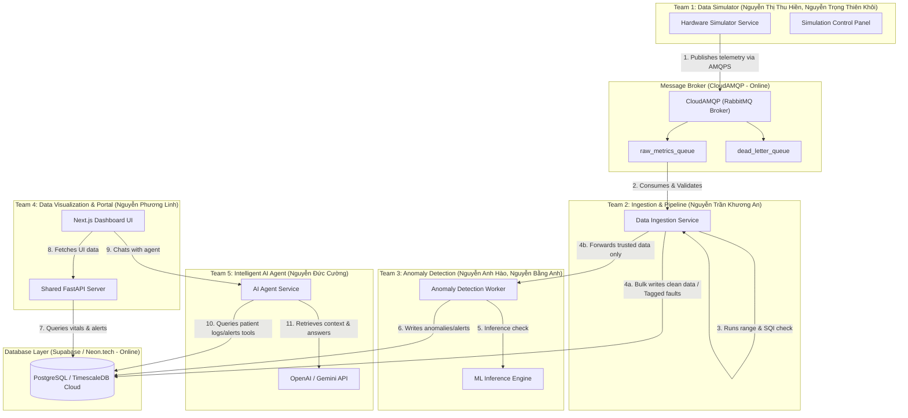
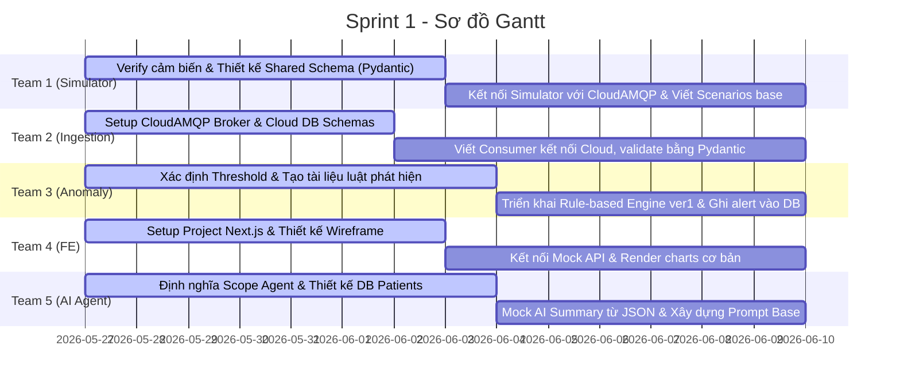
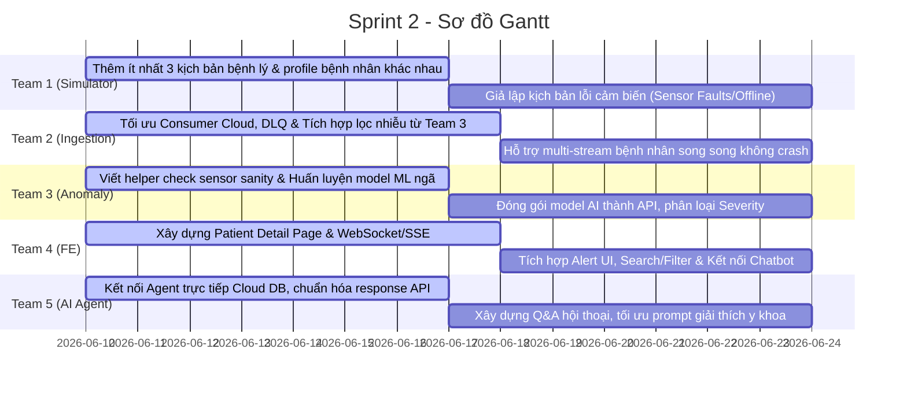

# KẾ HOẠCH TRIỂN KHAI CHI TIẾT DỰ ÁN (6 TUẦN - 3 SPRINTS) - PRODUCTION READY (V2 + CLOUD)
## ĐỀ TÀI: E2E SIMULATION FOR AI HEALTH (Hệ thống mô phỏng và phân tích dữ liệu sức khỏe toàn diện)

Tài liệu này là phiên bản chính thức cuối cùng của Kế hoạch triển khai, đã tích hợp:
1.  **Phối hợp chia sẻ nhiệm vụ (V2):** Tách biệt logic xác thực cảm biến (Team 1 viết Schema, Team 3 viết Quy tắc xác thực vật lý, Team 2 tích hợp vào Pipeline) để giảm tải cho **Team 2 (1 người)**.
2.  **Môi trường Cloud trực tuyến (Cloud Migration):** Chuyển đổi Database từ local sang **Supabase / Neon.tech** (PostgreSQL) và Message Broker sang **CloudAMQP** (RabbitMQ) để toàn bộ 7 thành viên có thể kết nối phát dữ liệu và lập trình đồng thời từ xa.

---

## 1. SƠ ĐỒ KIẾN TRÚC & DÒNG CHẢY DỮ LIỆU ĐÁM MÂY (CLOUD ARCHITECTURE)

Hệ thống hoạt động dưới dạng một luồng xử lý dữ liệu hướng sự kiện (Event-Driven Data Pipeline) kết hợp Trợ lý Trí tuệ nhân tạo (AI Agent).

---

## 2. PHÂN BỔ NHÂN SỰ & VAI TRÒ CHI TIẾT (CLOUD STACK)
*Tổng nhân sự: 7 thành viên (6 Backend, 1 Frontend)*

| Nhóm | Thành viên | Vai trò chính | Nhiệm vụ gánh vác chéo (Cross-functional support) |
| :--- | :--- | :--- | :--- |
| **Team 1** | **Nguyễn Thị Thu Hiền** **Nguyễn Trọng Thiên Khôi** | Backend Developer | **Hỗ trợ Team 2:** Định nghĩa Pydantic Models (JSON schemas) dùng chung. Hỗ trợ chạy Simulator tải trọng cao kết nối qua CloudAMQP trong Sprint 3. |
| **Team 2** | **Nguyễn Trần Khương An** | Backend Developer | **Nhiệm vụ cốt lõi:** Quản lý tài khoản Cloud Services (CloudAMQP, Supabase/Neon.tech). Thiết kế DB, xây dựng Ingestion Consumer kết nối từ xa. |
| **Team 3** | **Nguyễn Anh Hào** **Nguyễn Bằng Anh** | Backend & AI Developer | **Hỗ trợ Team 2:** Viết các module lọc nhiễu tĩnh, kiểm tra ngưỡng vật lý cảm biến lỗi trước khi truyền vào AI Model. |
| **Team 4** | **Nguyễn Phương Linh** | Frontend Developer | Tập trung UI/UX của Portal Dashboard kết nối tới API Server truy vấn dữ liệu từ Cloud Database. |
| **Team 5** | **Nguyễn Đức Cường** | Backend & AI Developer | **Hỗ trợ Team 2:** Đồng hành tối ưu hóa DB Indexing trên Cloud, Dockerize toàn hệ thống ứng dụng ở Sprint 3. |

---

## 3. LỘ TRÌNH 3 SPRINT (6 TUẦN) CHUYÊN SÂU

### SPRINT 1: Thiết Lập Cloud Services, Thống Nhất Schema & Thông Luồng Dữ Liệu (Tuần 1 - Tuần 2)
> **Mục tiêu của Team (Sprint Goal):** Hoàn thành đăng ký và thiết lập hạ tầng Cloud (CloudAMQP và Supabase/Neon.tech), thống nhất cấu trúc dữ liệu cảm biến (Data Schema), thông suốt luồng truyền nhận dữ liệu thô từ Simulator qua Cloud Broker vào Cloud Database, và dựng khung giao diện cơ bản (Layout Base) Next.js Portal.

#### Mục tiêu của từng Team trong Sprint 1 (Sub-team Goals):
*   **Team 1 (Simulator):** Xác thực định dạng cảm biến, tạo hồ sơ bệnh nhân giả lập và **viết thư viện Pydantic Schema dùng chung** để xuất khẩu cho Team 2.
*   **Team 2 (Ingestion):** Đăng ký tài khoản CloudAMQP & Supabase/Neon.tech, cấu hình bảng DB trực tuyến và viết consumer **sử dụng Pydantic Schema của Team 1** kết nối tới các dịch vụ Cloud.
*   **Team 3 (Anomaly):** Định nghĩa bộ quy tắc phát hiện bất thường sinh học (nhịp tim, huyết áp) và ghi bản ghi Alert vào DB Cloud.
*   **Team 4 (Portal FE):** Khởi tạo Next.js, dựng wireframe và kết nối thành công Next.js với mock API để hiển thị dữ liệu thô.
*   **Team 5 (AI Agent):** Thiết lập khung chatbot, thiết kế DB và mock tóm tắt thông tin bệnh nhân từ tệp JSON.

#### Chi tiết Phân công Nhiệm vụ (Tasks Allocation)

##### **Team 1: Data Simulator (Hiền, Khôi)**
*   **Task 1.1:** Xác thực chỉ số cảm biến giả lập: Accelerometer/Gyroscope, SpO2, Blood Pressure, Heart Rate, Sleep.
*   **Task 1.2:** **[Hỗ trợ Team 2]** Viết file module dùng chung `shared/schemas/sensor_data.py` định nghĩa các Pydantic Models để validate gói tin.
*   **Task 1.3:** Viết mã Python Async simulator phát dữ liệu qua **CloudAMQP Broker trực tuyến** sử dụng URL kết nối bảo mật (`amqps://`) được cung cấp bởi Team 2 (Heart Rate 1Hz, Accelerometer 20Hz).

##### **Team 2: Ingestion & Pipeline (An)**
*   **Task 2.1:** Đăng ký tài khoản và thiết lập các dịch vụ Cloud trực tuyến: **CloudAMQP** (RabbitMQ) và **Supabase** hoặc **Neon.tech** (PostgreSQL). Cấu hình các thông số kết nối (AMQPS URL, Database URL) và chia sẻ bảo mật cho toàn nhóm BE.
*   **Task 2.2:** Thiết kế Database Schema: Chạy tập lệnh SQL tạo các bảng `patients`, `sensor_logs` và `health_alerts` trực tiếp trên Cloud Database trực tuyến.
*   **Task 2.3:** Xây dựng Consumer nhận tin từ `raw_metrics_queue` trực tuyến trên CloudAMQP. **Import module Pydantic từ Team 1** để tự động validate cấu trúc JSON.
*   **Task 2.4:** Ghi các bản ghi có cấu trúc hợp lệ trực tiếp vào Cloud Database, đẩy các tin lỗi cấu trúc vào Dead Letter Queue (DLQ) trực tuyến trên CloudAMQP.

##### **Team 3: Anomaly Detection (Hào, B.Anh)**
*   **Task 3.1:** Nghiên cứu và viết tài liệu định nghĩa bộ ngưỡng (threshold) sinh trắc học an toàn.
*   **Task 3.2:** Viết Rule-based Engine phiên bản 1 (so khớp tĩnh theo ngưỡng).
*   **Task 3.3:** Xây dựng logic tự động tạo bản ghi Alert và lưu trực tiếp vào database Cloud khi phát hiện chỉ số vượt ngưỡng.

##### **Team 4: Data Visualization & Portal (Linh FE + BE Shared)**
*   **Task 4.1 (FE):** Khởi tạo Next.js, Tailwind CSS, TypeScript. Thiết kế bố cục UI Dashboard bác sĩ.
*   **Task 4.2 (FE):** Dựng trang Dashboard tổng quan hiển thị danh sách bệnh nhân dựa trên dữ liệu mock.
*   **Task 4.3 (Shared BE):** Thiết kế OpenAPI Spec chung. Viết APIs CRUD cơ bản kết nối Cloud DB để truy vấn thông tin Profile bệnh nhân (`/api/patients`).

##### **Team 5: Intelligent AI Agent (Cường)**
*   **Task 5.1:** Thiết lập API FastAPI cho Agent Node kết nối với OpenAI/Gemini API.
*   **Task 5.2:** Thiết kế System Prompt định hướng vai trò y tế cho Agent.
*   **Task 5.3:** Viết mã mock trả về tóm tắt thông tin bệnh nhân từ cấu trúc dữ liệu JSON để hỗ trợ Frontend tích hợp trước.

---

### SPRINT 2: Xác Thực Cảm Biến Trên Cloud & Hoàn Thiện MVP (Tuần 3 - Tuần 4)
> **Mục tiêu của Team (Sprint Goal):** Huấn luyện và tích hợp thành công mô hình ML phát hiện ngã vào hệ thống, xây dựng cơ chế WebSockets/SSE cập nhật dữ liệu sinh trắc học từ Cloud DB lên Dashboard, và kết nối AI Agent với cơ sở dữ liệu thật trực tuyến.

#### Mục tiêu của từng Team trong Sprint 2 (Sub-team Goals):
*   **Team 1 (Simulator):** Mở rộng các kịch bản bệnh lý, **giả lập các kịch bản lỗi kỹ thuật của cảm biến** (rơi thiết bị, mất tín hiệu) gửi trực tiếp lên Cloud.
*   **Team 2 (Ingestion):** Tích hợp **module lọc nhiễu và kiểm tra chất lượng cảm biến (do Team 3 viết)** vào consumer, gán nhãn lỗi trực tiếp vào Cloud DB.
*   **Team 3 (Anomaly):** **Viết module xác thực cảm biến lỗi (Sanity & SQI check)** bàn giao cho Team 2, đồng thời huấn luyện mô hình ML phát hiện cú ngã từ cảm biến gia tốc.
*   **Team 4 (Portal FE):** Hoàn thiện trang chi tiết bệnh nhân, truyền phát dữ liệu thời gian thực và hiển thị các cảnh báo lỗi cảm biến/y tế trực quan.
*   **Team 5 (AI Agent):** Kết nối AI Agent trực tiếp với Cloud Database thực để trả lời các câu hỏi về bệnh án dựa trên dữ liệu thật.

#### Chi tiết Phân công Nhiệm vụ (Tasks Allocation)

##### **Team 1: Data Simulator (Hiền, Khôi)**
*   **Task 1.4:** Thiết lập 3 kịch bản bệnh lý hoàn chỉnh (Cú ngã, Hạ đường huyết, Tăng huyết áp).
*   **Task 1.5:** **[Mới]** Giả lập kịch bản lỗi cảm biến: Gửi các giá trị tĩnh lặp đi lặp lại hoặc giá trị ngoài phạm vi sinh học (ví dụ: nhịp tim = 0 hoặc gia tốc phẳng tuyệt đối) lên CloudAMQP.
*   **Task 1.6:** Xây dựng API trên Simulator cho phép kích hoạt thủ công kịch bản bệnh lý/lỗi cảm biến để test E2E qua Cloud.

##### **Team 2: Ingestion & Pipeline (An)**
*   **Task 2.5:** Thiết lập Dead Letter Queue (DLQ) trực tuyến trong CloudAMQP cho các gói tin lỗi định dạng.
*   **Task 2.6:** **[Tích hợp chéo]** Tích hợp module `check_sensor_sanity` (đọc từ thư viện Team 3 viết) vào Consumer.
    *   *Xử lý:* Nếu phát hiện thiết bị lỗi $\rightarrow$ Gán nhãn `sensor_status = 'FAULT'` vào cơ sở dữ liệu đám mây và bắn cảnh báo sự cố kỹ thuật về Portal.
    *   *Xử lý:* Nếu dữ liệu sạch $\rightarrow$ Ghi trực tiếp vào Cloud Database và chuyển tiếp luồng dữ liệu tin cậy cho Team 3 chạy mô hình ML.
*   **Task 2.7:** Hỗ trợ xử lý song song nhiều luồng gửi (Multi-stream) từ Simulator của toàn nhóm phát lên CloudAMQP.

##### **Team 3: Anomaly Detection (Hào, B.Anh)**
*   **Task 3.4:** **[Hỗ trợ Team 2]** Viết module helper `check_sensor_sanity(metrics: dict) -> Tuple[bool, str]` chứa các quy tắc lọc nhiễu tĩnh, phát hiện flatline (gia tốc không đổi) và giá trị sinh trắc phi lý, bàn giao cho Team 2.
*   **Task 3.5:** Huấn luyện mô hình phân loại ML (SVM/Random Forest) nhận diện cú ngã dựa trên cảm biến gia tốc (độ chính xác >= 90%).
*   **Task 3.6:** Đóng gói mô hình thành Inference Worker thời gian thực, đọc dữ liệu sạch đã được Ingestor xác thực, phát hiện ngã và ghi Alert kèm mức độ nghiêm trọng (`Critical`, `Warning`) vào Cloud DB.

##### **Team 4: Data Visualization & Portal (Linh FE + BE Shared)**
*   **Task 4.4 (FE):** Xây dựng trang chi tiết Patient Detail hiển thị thông tin bệnh án, lịch sử alert và khung chat trợ lý AI.
*   **Task 4.5 (Shared BE):** Triển khai WebSockets hoặc Server-Sent Events (SSE) tại Portal API kết nối với Cloud Database / CloudAMQP để đẩy dữ liệu thời gian thực lên Dashboard.
*   **Task 4.6 (FE):** Thiết kế giao diện hiển thị 2 loại cảnh báo riêng biệt: Cảnh báo y tế (màu đỏ - nguy kịch) và Cảnh báo sự cố cảm biến (màu cam - lỗi phần cứng).

##### **Team 5: Intelligent AI Agent (Cường)**
*   **Task 5.4:** Kết nối AI Agent FastAPI trực tiếp với **Cloud Database trực tuyến** để truy vấn dữ liệu sinh trắc học và lịch sử cảnh báo y tế/sự cố thiết bị.
*   **Task 5.5:** Triển khai cơ chế Chat có bộ nhớ (Conversational Memory) trên môi trường multi-user để các bác sĩ khác nhau có thể hỏi song song.

---

### SPRINT 3: Stress Test Cloud, Tối Ưu Hóa Tải Trọng & Đóng Gói Docker (Tuần 5 - Tuần 6)
> **Mục tiêu của Team (Sprint Goal):** Hoàn thiện kết nối E2E toàn hệ thống (tích hợp Chatbot vào UI Dashboard), tối ưu hiệu năng truy vấn Database thông qua Stress Test giả lập 100+ bệnh nhân gửi dữ liệu song song qua Cloud, đóng gói Docker Compose và bảo mật API chuẩn Production.

#### Mục tiêu của từng Team trong Sprint 3 (Sub-team Goals):
*   **Team 1 & 2 (Simulator & Ingestion):** Thực hiện load test giả lập tối thiểu 100 bệnh nhân truyền dữ liệu cùng lúc, tối ưu hóa tốc độ ghi cơ sở dữ liệu và thiết lập dọn dẹp dữ liệu cũ. **Team 1 sẽ chịu trách nhiệm chính trong việc scale up mã nguồn Simulator.**
*   **Team 3 (Anomaly):** Tối ưu hóa mô hình AI để loại bỏ cảnh báo té ngã sai lệch và đo lường độ trễ từ lúc xảy ra sự kiện đến lúc báo động trên UI dưới 1.5 giây.
*   **Team 4 (Portal FE):** Hoàn tất giao diện chatbot, kiểm thử tính tương thích trên nhiều màn hình (Responsive layout) và phối hợp tích hợp cơ chế bảo mật khóa API.
*   **Team 5 (AI Agent):** Nhúng thêm tài liệu phác đồ y tế chuẩn vào Vector DB (RAG) và **hỗ trợ Team 2 thiết lập môi trường Docker Compose đa dịch vụ.**

#### Chi tiết Phân công Nhiệm vụ (Tasks Allocation)

##### **Team 1 & Team 2: Simulator & Ingestion Optimization (Hiền, Khôi, An)**
*   **Task 3.7:** **[Hỗ trợ chéo]** **Team 1 (Hiền, Khôi)** chịu trách nhiệm tối ưu hóa mã nguồn Simulator chạy đa luồng để mô phỏng đồng thời 100 - 500 bệnh nhân mà không ngốn tài nguyên máy tính, kết nối tới CloudAMQP.
*   **Task 3.8:** **Team 2 (An)** thực hiện Bulk insert để ghi dữ liệu chuỗi thời gian lớn và tối ưu hóa cấu hình kết nối (Connection Pooling) trên Supabase/Neon.tech.
*   **Task 3.9:** Thiết lập chính sách lưu trữ nén dữ liệu thô cũ hơn 7 ngày (Data Retention Policy) trên Database để bảo vệ dung lượng Cloud miễn phí.

##### **Team 3: Anomaly Detection Optimization (Hào, B.Anh)**
*   **Task 3.10:** Tinh chỉnh ngưỡng phân loại để giảm thiểu việc cảnh báo nhầm (False Positives) đối với các chuyển động sinh hoạt thường ngày.
*   **Task 3.11:** Viết Unit test và Integration test cho luồng kiểm tra dữ liệu bất thường và đo đạc độ trễ xử lý E2E (đảm bảo độ trễ E2E từ Simulator đến UI Dashboard < 1.5 giây).

##### **Team 4: Front-end UI & Security Hardening (Linh FE + BE Shared)**
*   **Task 4.7 (FE):** Tích hợp Chatbot UI hoàn chỉnh vào màn hình Dashboard (hỗ trợ hiển thị Markdown, code block, định dạng câu trả lời gọn đẹp).
*   **Task 4.8 (Shared BE):** Bảo mật API: Cấu hình CORS chặt chẽ, thêm Rate Limiting cho API endpoints và triển khai Middleware JWT xác thực quyền truy cập của bác sĩ.

##### **Team 5: Intelligent AI Agent & RAG Refinement (Cường)**
*   **Task 5.6:** Nhập thêm tài liệu phác đồ y tế chuẩn vào Vector Database (ChromaDB / pgvector). Cấu hình lớp phòng vệ (Guardrails) ngăn chặn AI tư vấn sai lệch.
*   **Task 5.7:** **[Hỗ trợ Team 2]** Đồng hành cùng Khương An xây dựng file `docker-compose.yml` kết nối các dịch vụ ứng dụng nội bộ (Simulator, Ingestor, Anomaly, Portal BE, Agent, FE) và cấu hình biến môi trường (`.env`) chứa thông tin kết nối tới các dịch vụ Cloud trực tuyến.

##### **Hoạt động Chung của Toàn Đội (Tất cả thành viên)**
*   **Task 6.1:** Soạn thảo tài liệu bàn giao sản phẩm, API Document (Swagger), hướng dẫn cấu hình thông số kết nối các Cloud Services.
*   **Task 6.2:** Chạy thử nghiệm kịch bản demo 10 phút trước khi thuyết trình chính thức.

---

## 4. TIÊU CHÍ CHẤT LƯỢNG MÔI TRƯỜNG PRODUCTION (Production Checklist)

Hệ thống phải đáp ứng các tiêu chuẩn kỹ thuật vận hành thực tế:
1.  **Resilience:** Dịch vụ Simulator và Consumer tự động kết nối lại (Auto-reconnect) khi Broker hoặc DB gặp sự cố đột ngột.
2.  **Transaction Reliability:** Message Consumer chỉ gửi tín hiệu `ACK` cho RabbitMQ sau khi dữ liệu đã được commit thành công vào DB để tránh mất dữ liệu.
3.  **Sensor Validation:** Ingestor lọc bỏ ít nhất 95% các gói tin lỗi phần cứng (nhịp tim bằng 0, gia tốc phẳng) và phân biệt rõ ràng với cảnh báo y tế thực tế.
4.  **Database Optimization:** Sử dụng Bulk insert (batching 500 records) để ghi dữ liệu time-series nhằm giảm tải I/O ổ cứng.
5.  **Security:** Toàn bộ API Key, mật khẩu DB, RabbitMQ credentials được cấu hình qua biến môi trường (`.env`), tuyệt đối không hardcode.
6.  **Cloud SSL Connection:** Bắt buộc kết nối tới CloudAMQP qua giao thức bảo mật `amqps://` và cơ sở dữ liệu sử dụng cấu hình SSL bắt buộc để tránh rò rỉ dữ liệu y tế trên đường truyền internet.

---

## 5. RỦI RO & PHƯƠNG ÁN XỬ LÝ (Risks & Mitigations) - ĐÃ CẬP NHẬT V2

| Rủi ro tiềm ẩn | Mức độ | Phương án xử lý phòng ngừa (Mitigation) |
| :--- | :--- | :--- |
| **Team 2 (1 người) bị quá tải khi thiết kế luồng dữ liệu** | **Đã giảm** | Chia sẻ nhiệm vụ định nghĩa Schema cho **Team 1** và viết module kiểm định cảm biến cho **Team 3**. |
| **Vượt ngưỡng giới hạn băng thông/kết nối của Cloud Services miễn phí** | Trung bình | Cấu hình Pool Connection chặt chẽ; giới hạn tần suất gửi tin của Simulator trong ngưỡng cho phép (Little Lemur của CloudAMQP cho tối đa 20 kết nối). |
| **Tải trọng ghi DB sụt giảm khi chạy 100+ bệnh nhân** | Trung bình | Áp dụng cơ chế Bulk Write cho Database. **Team 5** và **Team 1** tham gia tối ưu DB/Simulator ở Sprint 3. |
| **Frontend duy nhất 1 người dễ dẫn tới trễ tiến độ UI** | Cao | Sử dụng component library (như Shadcn/ui) để đẩy nhanh tốc độ dựng giao diện. Frontend phát triển dựa trên mock API từ sớm. |
| **AI Agent tư vấn sai lệch hoặc trả lời quá thẩm quyền y tế** | Trung bình | Cấu hình Prompt Guardrails nghiêm ngặt, giới hạn phạm vi truy xuất thông tin trong database nội bộ và bắt buộc đính kèm disclaimer. |

---

## 6. TIÊU CHÍ ĐÁNH GIÁ THÀNH CÔNG (Success Metrics)

### 1. Trải nghiệm Sản phẩm (Product Metrics)
*   Bác sĩ xem được danh sách bệnh nhân, lọc trạng thái nguy kịch, tìm kiếm theo tên dễ dàng.
*   Bác sĩ truy cập trang chi tiết bệnh nhân xem biểu đồ chỉ số chạy động thời gian thực và lịch sử cảnh báo.
*   Hệ thống hiển thị popup alert nhấp nháy đỏ ngay lập tức khi phát hiện té ngã hoặc nhịp tim bất thường.
*   AI Agent phản hồi nhanh, tóm tắt chính xác chỉ số bệnh nhân trong 30 phút gần nhất và không bị ảo tưởng thông tin.

### 2. Tiêu chuẩn Kỹ thuật (Technical Metrics)
*   Simulator duy trì truyền tải dữ liệu liên tục 24/7 ổn định không bị rò rỉ bộ nhớ (memory leak).
*   Consumer tiêu thụ message mượt mà, ghi bulk insert vào DB thành công, xử lý ngoại lệ và đưa tin nhắn lỗi vào DLQ ổn định.
*   Mô hình AI phát hiện ngã đạt độ chính xác (Accuracy) >= 90% trên tập test.
*   Hệ thống có thể khởi chạy ứng dụng cục bộ hoàn chỉnh kết nối Cloud bằng lệnh `docker compose up --build`.

### 3. Kịch bản Demo thực tế (Demo Performance)
*   Hệ thống chạy demo liên tục ít nhất 10 phút mà không phát sinh lỗi crash hệ thống.
*   Chạy mượt mà 3 kịch bản mô phỏng rõ ràng trên 3 đối tượng đại diện: **Người già** (ngã đột ngột), **Bà bầu** (huyết áp bất ổn), **Thanh niên** (nhịp tim cao khi vận động).
