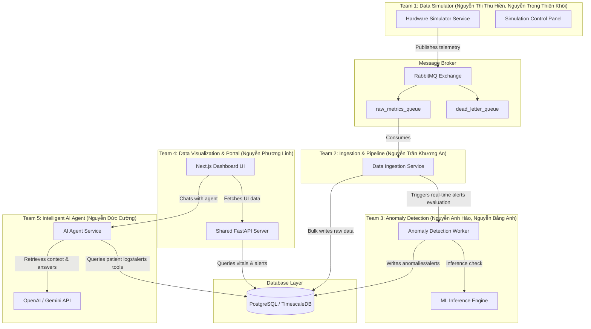
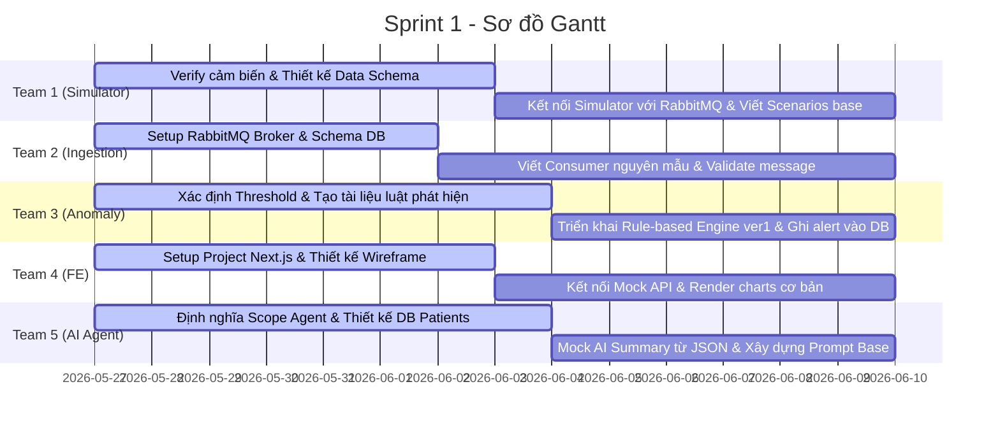
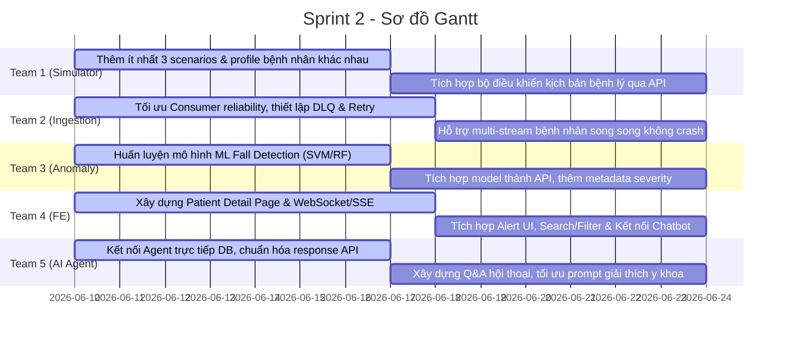

# KẾ HOẠCH TRIỂN KHAI CHI TIẾT DỰ ÁN (6 TUẦN - 3 SPRINTS)
## ĐỀ TÀI: E2E SIMULATION FOR AI HEALTH (Hệ thống mô phỏng và phân tích dữ liệu sức khỏe toàn diện)

Tài liệu này được kế thừa ý tưởng từ bản Đề xuất dự án (`E2E Simulation for AI Health - Proposal.md`) và được chuẩn hóa theo cấu trúc quản trị dự án phần mềm Production của tài liệu `project_sprint_plan.md`.

---

## 1. SƠ ĐỒ KIẾN TRÚC & DÒNG CHẢY DỮ LIỆU PHÂN RÃ

Hệ thống hoạt động dưới dạng một luồng xử lý dữ liệu hướng sự kiện (Event-Driven Data Pipeline) kết hợp Trợ lý Trí tuệ nhân tạo (AI Agent).

---

## 2. PHÂN BỔ NHÂN SỰ & VAI TRÒ CHI TIẾT
*Tổng nhân sự: 7 thành viên (6 Backend, 1 Frontend)*

| Nhóm | Thành viên | Vai trò chính | Nền tảng chuyên môn | Nhiệm vụ chính trong dự án |
| :--- | :--- | :--- | :--- | :--- |
| **Team 1** | **Nguyễn Thị Thu Hiền** **Nguyễn Trọng Thiên Khôi** | Backend Developer | AIoT, Computer Vision, ML, Systems Thinking, LLM App | Phát triển mô-đun giả lập phần cứng (Data Simulator), thiết kế kịch bản bệnh lý và tạo ra dòng chảy dữ liệu thô. |
| **Team 2** | **Nguyễn Trần Khương An** | Backend Developer | Backend Engineering | Thiết lập Message Broker (RabbitMQ), Database Schema và xây dựng dịch vụ Ingestion Pipeline lưu trữ tối ưu. |
| **Team 3** | **Nguyễn Anh Hào** **Nguyễn Bằng Anh** | Backend & AI Developer | Backend, Edge Deploy, Federated Learning, ML | Nghiên cứu, huấn luyện mô hình ML/Rule-based phát hiện các bất thường (té ngã, sinh trắc học biến động nguy hiểm). |
| **Team 4** | **Nguyễn Phương Linh** | Frontend Developer | React.js, Next.js, Node.js, Web Development | Xây dựng giao diện Portal Dashboard theo dõi bệnh nhân thời gian thực, tích hợp Chatbot panel và Alert Center. |
| **Team 5** | **Nguyễn Đức Cường** | Backend & AI Developer | LLM Application, RAG, Web Development | Phát triển Intelligent AI Agent tích hợp RAG hỗ trợ tóm tắt bệnh án và tư vấn y tế sơ cứu ban đầu. |
| **Chung** | **Cả đội Backend** (Team 1, 2, 3, 5) | Shared Backend API | FastAPI, PostgreSQL / TimescaleDB | Cộng tác xây dựng các API endpoint RESTful, WebSockets/SSE phục vụ Dashboard và tích hợp Agent. |

---

## 3. LỘ TRÌNH 3 SPRINT (6 TUẦN) CHUYÊN SÂU

### SPRINT 1: Nền Tảng Hệ Thống & Kiểm Thử Luồng E2E Sơ Khởi (Tuần 1 - Tuần 2)
> **Mục tiêu của Team (Sprint Goal):** Hoàn thành thiết lập toàn bộ hạ tầng Docker (Local Dev), thống nhất cấu trúc dữ liệu cảm biến (Data Schema), thông suốt luồng truyền nhận dữ liệu thô từ Simulator qua RabbitMQ vào Database, và dựng khung giao diện cơ bản (Layout Base) Next.js Portal.

#### Mục tiêu của từng Team trong Sprint 1 (Sub-team Goals):
*   **Team 1 (Simulator):** Xác thực định dạng cảm biến, tạo hồ sơ bệnh nhân giả lập và viết mã nguồn kết nối thành công RabbitMQ để gửi thông điệp thô.
*   **Team 2 (Ingestion):** Cấu hình Broker RabbitMQ và cơ sở dữ liệu TimescaleDB/Postgres, xây dựng bộ tiêu thụ dữ liệu (Consumer) đầu tiên lưu log cảm biến thành công.
*   **Team 3 (Anomaly):** Định nghĩa bộ quy tắc tĩnh (Thresholds) để phát hiện dị thường sinh trắc học và hoàn thành cơ chế ghi cảnh báo (Alert) vào cơ sở dữ liệu.
*   **Team 4 (Portal FE):** Khởi tạo khung ứng dụng Next.js, hoàn thành layout trang Dashboard cơ bản hiển thị biểu đồ vẽ bằng dữ liệu mock.
*   **Team 5 (AI Agent):** Xác lập phạm vi hoạt động của Agent, liên kết cấu trúc dữ liệu bệnh nhân và mock thành công tính năng tóm tắt bệnh án từ file JSON.

#### Chi tiết Phân công Nhiệm vụ (Tasks Allocation)

##### **Team 1: Data Simulator (Hiền, Khôi)**
*   **Task 1.1:** Xác thực các chỉ số cảm biến cần giả lập:
    *   *Gia tốc & Con quay hồi chuyển (Accelerometer/Gyroscope XYZ):* Để phục vụ phát hiện té ngã và trạng thái hoạt động (Walking, Sitting, Lying, Running).
    *   *Chỉ số sinh tồn (SpO2, Blood Pressure, Heart Rate, Sleep-derived features).*
*   **Task 1.2:** Thiết lập Data Schema chuẩn cho các sensor và tạo 3 cấu hình Patient Profile giả lập ban đầu.
*   **Task 1.3:** Kết nối simulator với RabbitMQ sử dụng Python client (`pika`/`aio-pika`), truyền tải dữ liệu thô theo thời gian thực (Heart Rate 1Hz, Accelerometer 20Hz).

##### **Team 2: Ingestion & Pipeline (An)**
*   **Task 2.1:** Dựng Docker Container chứa **RabbitMQ** và **PostgreSQL/TimescaleDB** trên môi trường local.
*   **Task 2.2:** Thiết kế Database Schema: Tạo các bảng `patients`, `sensor_logs` (thông số chuỗi thời gian) và `health_alerts`.
*   **Task 2.3:** Xây dựng Consumer nguyên mẫu để đăng ký nhận tin nhắn từ hàng đợi `raw_metrics_queue`. Thực hiện parse dữ liệu, validate định dạng và ghi log lỗi.
*   **Task 2.4:** Tiến hành lưu trữ các gói dữ liệu hợp lệ vào Database dưới dạng dòng chảy liên tục.

##### **Team 3: Anomaly Detection (Hào, B.Anh)**
*   **Task 3.1:** Nghiên cứu và định nghĩa bộ ngưỡng (threshold) an toàn cho nhịp tim (ví dụ: <40 BPM hoặc >150 BPM), huyết áp và SpO2. Viết tài liệu quy tắc chung.
*   **Task 3.2:** Xây dựng module kiểm tra Rule-based Engine phiên bản 1 (so khớp tĩnh).
*   **Task 3.3:** Xây dựng logic tự động tạo bản ghi Alert và lưu trực tiếp vào database khi phát hiện chỉ số bệnh nhân vượt ngưỡng.

##### **Team 4: Data Visualization & Portal (Linh FE + BE Shared)**
*   **Task 4.1 (FE):** Khởi tạo dự án Next.js với Tailwind CSS và TypeScript. Thiết kế bố cục UI Wireframe cho Dashboard bác sĩ.
*   **Task 4.2 (FE):** Dựng trang Dashboard tổng quan hiển thị danh sách bệnh nhân và kết nối với mock API để hiển thị trạng thái sinh tồn dạng biểu đồ đơn giản.
*   **Task 4.3 (Shared BE):** Định nghĩa OpenAPI Spec chung. Viết APIs CRUD cơ bản để truy vấn thông tin Profile bệnh nhân (`/api/patients`).

##### **Team 5: Intelligent AI Agent (Cường)**
*   **Task 5.1:** Thiết lập API FastAPI cho Agent Node kết nối với OpenAI/Gemini API.
*   **Task 5.2:** Thiết kế System Prompt tối ưu hóa cho tác vụ y khoa, ngăn ngừa hallucination (ảo tưởng).
*   **Task 5.3:** Viết mã mock trả về tóm tắt thông tin bệnh nhân từ cấu trúc dữ liệu JSON để hỗ trợ Frontend tích hợp trước.

---

### SPRINT 2: MVP Feature Completion & Huấn Luyện AI (Tuần 3 - Tuần 4)
> **Mục tiêu của Team (Sprint Goal):** Huấn luyện và tích hợp thành công mô hình ML phát hiện ngã vào hệ thống, xây dựng cơ chế WebSockets/SSE để cập nhật dữ liệu sinh trắc học và cảnh báo thời gian thực lên Dashboard, và kết nối AI Agent với cơ sở dữ liệu thật để trả lời thông tin bệnh nhân.

#### Mục tiêu của từng Team trong Sprint 2 (Sub-team Goals):
*   **Team 1 (Simulator):** Mở rộng các kịch bản mô phỏng bệnh lý (đột quỵ, hạ đường huyết, té ngã) cho các đối tượng bệnh nhân cụ thể (người già, bà bầu, thanh niên).
*   **Team 2 (Ingestion):** Gia cố độ tin cậy của Ingestion Pipeline bằng cách cấu hình Dead Letter Queue (DLQ) và hỗ trợ xử lý song song nhiều nguồn phát sensor.
*   **Team 3 (Anomaly):** Chuyển dịch từ rule-based tĩnh sang mô hình Machine Learning phát hiện hành vi ngã thực tế từ cảm biến gia tốc và trích xuất độ nghiêm trọng (Severity).
*   **Team 4 (Portal FE):** Hoàn thiện trang chi tiết bệnh nhân, truyền phát dữ liệu thời gian thực lên biểu đồ động và hiển thị bảng điều khiển Chatbot.
*   **Team 5 (AI Agent):** Thay thế dữ liệu mock bằng các query SQL thực tế lấy dữ liệu lịch sử đo cảm biến và các cảnh báo để LLM phân tích, phản hồi trực tiếp.

#### Chi tiết Phân công Nhiệm vụ (Tasks Allocation)

##### **Team 1: Data Simulator (Hiền, Khôi)**
*   **Task 1.4:** Thiết lập tối thiểu 3 kịch bản bệnh lý hoàn chỉnh trên simulator:
    *   *Cú ngã đột ngột:* Accelerometer vọt ngưỡng va chạm mạnh, sau đó đứng im.
    *   *Hạ đường huyết:* SpO2 giảm dần, nhịp tim nhanh nhẹ, huyết áp sụt giảm.
    *   *Tăng huyết áp / Đột quỵ:* Nhịp tim đập loạn nhịp kết hợp huyết áp tâm thu vọt lên cao.
*   **Task 1.5:** Xây dựng API trên Simulator cho phép các lập trình viên kích hoạt thủ công kịch bản bệnh lý của bất kỳ bệnh nhân nào để test hệ thống.

##### **Team 2: Ingestion & Pipeline (An)**
*   **Task 2.5:** Thiết lập **Dead Letter Queue (DLQ)** trong RabbitMQ để cô lập các tin nhắn lỗi định dạng mà không gây tắc nghẽn hàng đợi chính.
*   **Task 2.6:** Triển khai cơ chế auto-reconnect với RabbitMQ và PostgreSQL khi kết nối mạng bị gián đoạn.
*   **Task 2.7:** Cải tiến consumer để xử lý nhiều luồng gửi song song (Multi-stream) từ Simulator phát cho 10+ bệnh nhân cùng lúc.

##### **Team 3: Anomaly Detection (Hào, B.Anh)**
*   **Task 3.4:** Lọc nhiễu tín hiệu Accelerometer và trích xuất các đặc trưng toán học (Mean, Variance, Signal Magnitude Area - SMA).
*   **Task 3.5:** Huấn luyện mô hình phân loại ML (như SVM hoặc Random Forest) để nhận diện cú ngã với độ chính xác tối thiểu 90%.
*   **Task 3.6:** Đóng gói mô hình thành dịch vụ Inference Worker thời gian thực, đọc trực tiếp dữ liệu thô truyền đến, phát hiện cú ngã và ghi Alert kèm mức độ nghiêm trọng (`Critical`, `Warning`) vào DB.

##### **Team 4: Data Visualization & Portal (Linh FE + BE Shared)**
*   **Task 4.4 (FE):** Xây dựng trang chi tiết Patient Detail hiển thị thông tin bệnh án, lịch sử alert và khung chat trợ lý AI.
*   **Task 4.5 (Shared BE):** Triển khai WebSockets hoặc Server-Sent Events (SSE) tại FastAPI để đẩy dữ liệu thời gian thực lên biểu đồ Frontend.
*   **Task 4.6 (FE):** Tích hợp thông báo Alert thời gian thực nhấp nháy đỏ trên UI, phát tiếng cảnh báo khi có sự cố té ngã được đẩy từ Backend.

##### **Team 5: Intelligent AI Agent (Cường)**
*   **Task 5.4:** Kết nối AI Agent FastAPI trực tiếp với TimescaleDB/Postgres để truy vấn dữ liệu sinh trắc học và lịch sử cảnh báo theo thời gian thực của bệnh nhân.
*   **Task 5.5:** Triển khai cơ chế Chat có bộ nhớ (Conversational Memory) giúp bác sĩ có thể hỏi tiếp nối các câu hỏi trước mà không mất ngữ cảnh.

---

### SPRINT 3: Tối Ưu Hóa Production, Tải Trọng & Tích Hợp Toàn Diện (Tuần 5 - Tuần 6)
> **Mục tiêu của Team (Sprint Goal):** Hoàn thiện kết nối E2E toàn hệ thống (tích hợp Chatbot vào UI Dashboard), tối ưu hiệu năng truy vấn Database thông qua Stress Test giả lập 100+ bệnh nhân gửi dữ liệu song song, đóng gói Docker Compose và bảo mật API chuẩn Production.

#### Mục tiêu của từng Team trong Sprint 3 (Sub-team Goals):
*   **Team 1 & 2 (Simulator & Ingestion):** Thực hiện load test giả lập tối thiểu 100 bệnh nhân truyền dữ liệu cùng lúc, tối ưu hóa tốc độ ghi cơ sở dữ liệu và thiết lập dọn dẹp dữ liệu cũ (Retention).
*   **Team 3 (Anomaly):** Tối ưu hóa mô hình AI để loại bỏ cảnh báo té ngã sai lệch và đo lường độ trễ từ lúc xảy ra sự kiện đến lúc báo động trên UI dưới 1.5 giây.
*   **Team 4 (Portal FE):** Hoàn tất giao diện chatbot, kiểm thử tính tương thích trên nhiều màn hình (Responsive layout) và phối hợp tích hợp cơ chế bảo mật khóa API.
*   **Team 5 (AI Agent):** Nhúng thêm tài liệu phác đồ y tế chuẩn vào Vector DB (RAG) và cấu hình lớp phòng vệ (Guardrails) ngăn chặn AI tư vấn quá quyền hạn.

#### Chi tiết Phân công Nhiệm vụ (Tasks Allocation)

##### **Team 1 & Team 2: Simulator & Ingestion Optimization (Hiền, Khôi, An)**
*   **Task 3.7:** Chạy stress test hệ thống: Nâng quy mô mô phỏng lên 100 - 500 bệnh nhân truyền tải dữ liệu đồng thời. Khắc phục các điểm nghẽn (bottlenecks) tại RabbitMQ và Ingestor.
*   **Task 3.8:** Tối ưu hóa cơ sở dữ liệu: Thiết lập Indexing hợp lý cho các cột query chính và viết script chạy định kỳ dọn dẹp hoặc lưu trữ nén dữ liệu thô cũ hơn 7 ngày (Data Retention Policy).

##### **Team 3: Anomaly Detection Optimization (Hào, B.Anh)**
*   **Task 3.9:** Đánh giá độ nhạy của mô hình. Giảm thiểu tối đa lỗi nhận diện nhầm khi bệnh nhân thực hiện các động tác cúi gập người, nằm xuống nhanh.
*   **Task 3.10:** Viết Unit test cho module phát hiện bất thường và đo đạc độ trễ E2E (đảm bảo thời gian từ lúc Simulator phát tín hiệu ngã -> Consumer -> Team 3 phân tích -> DB -> UI Alert hiển thị < 1.5 giây).

##### **Team 4: Front-end UI & Security Hardening (Linh FE + BE Shared)**
*   **Task 4.7 (FE):** Tích hợp Chatbot UI hoàn chỉnh vào màn hình Dashboard (hỗ trợ hiển thị Markdown, code block, định dạng câu trả lời gọn đẹp).
*   **Task 4.8 (Shared BE):** Bảo mật API: Cấu hình CORS chặt chẽ, thêm Rate Limiting cho API endpoints và triển khai Middleware JWT xác thực quyền truy cập của bác sĩ.

##### **Team 5: Intelligent AI Agent & RAG Refinement (Cường)**
*   **Task 5.6:** Cài đặt Vector Database (như ChromaDB hoặc pgvector) để lưu trữ tài liệu sơ cứu y tế chuẩn. Nâng cấp RAG giúp Agent có thể trích dẫn nguồn tài liệu chính thống khi tư vấn cho người dùng.
*   **Task 5.7:** Thiết lập Guardrails ngăn chặn prompt injection và bổ sung thông báo miễn trừ trách nhiệm (Disclaimer) hiển thị dưới mỗi câu trả lời của Agent.

##### **Hoạt động Chung của Toàn Đội (Tất cả thành viên)**
*   **Task 6.1:** Đóng gói toàn bộ các service riêng rẽ thành các Dockerfile. Xây dựng file `docker-compose.yml` tổng để khởi chạy toàn bộ hệ thống bằng một dòng lệnh.
*   **Task 6.2:** Soạn thảo tài liệu bàn giao sản phẩm, API Document (Swagger) và chuẩn bị slide demo kết quả hoạt động 10 phút.

---

## 4. TIÊU CHÍ CHẤT LƯỢNG MÔI TRƯỜNG PRODUCTION (Production Checklist)

Hệ thống phải đáp ứng các tiêu chuẩn kỹ thuật vận hành thực tế:
*   [ ] **Resilience:** Dịch vụ Simulator và Consumer tự động kết nối lại (Auto-reconnect) khi Broker hoặc DB gặp sự cố đột ngột.
*   [ ] **Transaction Reliability:** Message Consumer chỉ gửi tín hiệu `ACK` cho RabbitMQ sau khi dữ liệu đã được commit thành công vào DB để tránh mất dữ liệu.
*   [ ] **Database Optimization:** Sử dụng Bulk insert (batching 500 records) để ghi dữ liệu time-series nhằm giảm tải I/O ổ cứng.
*   [ ] **Security:** Toàn bộ API Key, mật khẩu DB, RabbitMQ credentials được cấu hình qua biến môi trường (`.env`), tuyệt đối không hardcode.
*   [ ] **Clean API Contracts:** Không chỉnh sửa định dạng response API mà không thảo luận trước với Frontend. Bắt buộc cập nhật file Swagger khi thay đổi.

---

## 5. RỦI RO & PHƯƠNG ÁN XỬ LÝ (Risks & Mitigations)

| Rủi ro tiềm ẩn | Mức độ | Phương án xử lý phòng ngừa (Mitigation) |
| :--- | :--- | :--- |
| **Các dịch vụ backend làm việc rời rạc, khó tích hợp** | Cao | Thống nhất cổng kết nối, cấu trúc data schema và API contracts bằng file OpenAPI ngay trong tuần đầu tiên. BE Lead tracking code hàng ngày. |
| **Frontend duy nhất 1 người dễ dẫn tới trễ tiến độ UI** | Cao | Sử dụng component library (như Shadcn/ui hoặc Material UI) để đẩy nhanh tốc độ dựng giao diện. Frontend phát triển dựa trên mock API của BE từ sớm. |
| **AI Agent tư vấn sai lệch hoặc trả lời quá thẩm quyền y tế** | Trung bình | Cấu hình Prompt Guardrails nghiêm ngặt, giới hạn phạm vi truy xuất thông tin trong database nội bộ và bắt buộc đính kèm disclaimer. |
| **Thành viên đội nhóm nghỉ giữa chừng** | Trung bình | Yêu cầu commit code thường xuyên lên Git, viết tài liệu README chi tiết cho mỗi thư mục con để thành viên khác có thể tiếp quản ngay lập tức. |

---

## 6. TIÊU CHÍ ĐÁNH GIÁ THÀNH CÔNG (Success Metrics)

### 1. Trải nghiệm Sản phẩm (Product Metrics)
*   Bác sĩ xem được danh sách bệnh nhân, lọc trạng thái nguy kịch, tìm kiếm theo tên dễ dàng.
*   Bác sĩ truy cập trang chi tiết bệnh nhân xem biểu đồ chỉ số chạy động thời gian thực và lịch sử cảnh báo.
*   Hệ thống hiển thị popup alert nhấp nháy đỏ ngay lập tức khi phát hiện té ngã hoặc nhịp tim bất thường.
*   AI Agent phản hồi nhanh, tóm tắt chính xác chỉ số bệnh nhân trong 30 phút gần nhất và không bị ảo tưởng thông tin.

### 2. Tiêu chuẩn Kỹ thuật (Technical Metrics)
*   Simulator duy trì truyền tải dữ liệu liên tục 24/7 ổn định không bị rò rỉ bộ nhớ (memory leak).
*   Consumer tiêu thụ message mượt mà, ghi bulk insert vào DB thành công, xử lý ngoại lệ và đưa tin nhắn lỗi vào DLQ ổn định.
*   Mô hình AI phát hiện ngã đạt độ chính xác (Accuracy) >= 90% trên tập test.
*   Hệ thống có thể khởi chạy hoàn chỉnh chỉ bằng lệnh `docker compose up --build`.

### 3. Kịch bản Demo thực tế (Demo Performance)
*   Hệ thống chạy demo liên tục ít nhất 10 phút mà không phát sinh lỗi crash hệ thống.
*   Chạy mượt mà 3 kịch bản mô phỏng rõ ràng trên 3 đối tượng đại diện: **Người già** (ngã đột ngột), **Bà bầu** (huyết áp bất ổn), **Thanh niên** (nhịp tim cao khi vận động).
